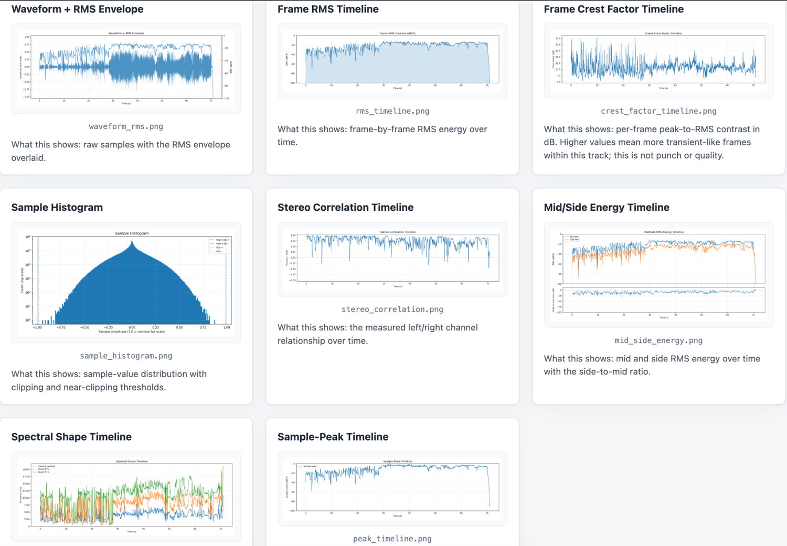
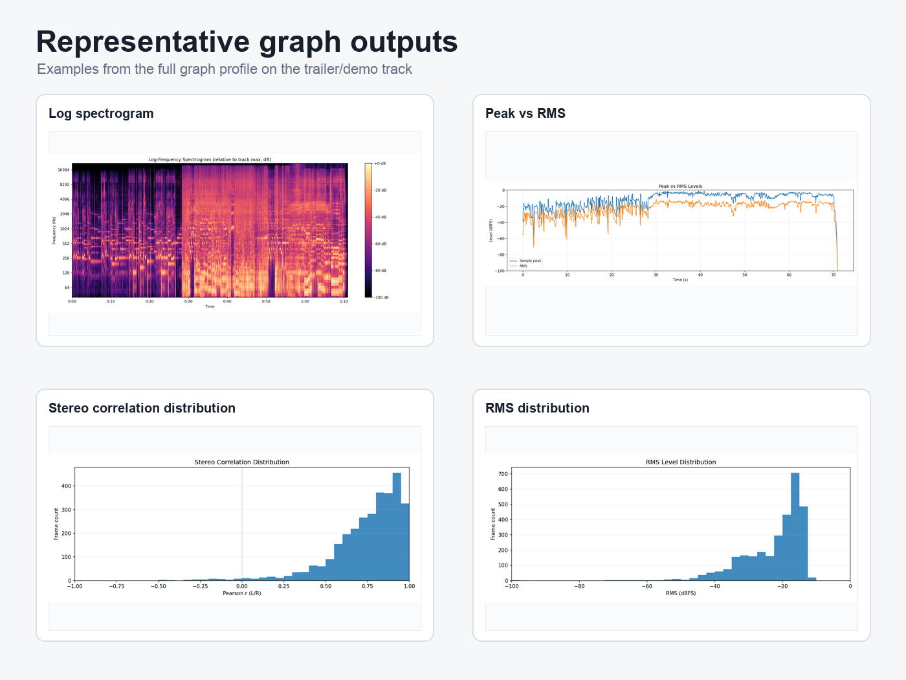
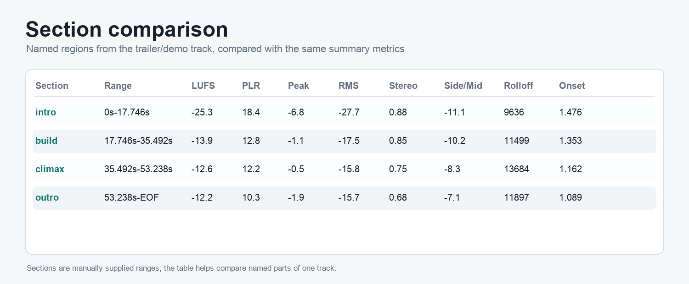

# AudioAtlas

AudioAtlas is a local, single-track audio analysis tool for music production,
mix review, mastering checks, and deep listening. It turns an audio file into
measurement-based reports: level metrics, stereo context, spectral shape,
activity maps, PNG plots, `summary.json`, `findings.json`, `report.md`, and a
static offline `report.html`.

## Status: v0.2-alpha

This is a public early-alpha release target. The core reports are usable, but findings
are heuristic, wording and thresholds may change, and the project is not a
mastering system. Treat reports as structured listening prompts and technical
context, not final decisions.

## What AudioAtlas Does

- Preserves original levels; it does not normalize input audio.
- Analyzes one file with scalar level metrics, approximate true peak, clipping
  and near-clipping counts, RMS timeline, stereo correlation, mid/side energy,
  spectral shape, band energy, and onset/activity density.
- Writes local static reports that work without a server, CDN, external CSS, or
  external JavaScript.
- Provides factual findings such as true-peak overs, clipping, substantial
  near-clipping, and grouped stereo observations.
- Supports batch/catalog reports for folders of supported files.

## What AudioAtlas Does Not Do

- No mix score, loudness score, or automated pass/fail verdict.
- No automated mastering advice.
- No reference-track comparison.
- No source separation, instrument detection, or section segmentation.
- No real-time playback cursor or DAW integration.
- No claim that a finding is audible, bad, or musically wrong.

## What the Reports Look Like

AudioAtlas writes local static HTML/Markdown reports plus JSON summaries and PNG
plots. The generated files can be opened directly from disk; they do not require
a server or hosted dashboard.



Graph depth is selectable: minimal renders 4 plots for a quick pass, standard
renders the default 14-plot report, and full renders 17 plots with additional
distribution/detail views.



Sections are optional named time ranges. They can be used to compare regions of
one track with the same summary metrics.



## Install

With `uv` from a source checkout:

```bash
uv sync --extra dev
```

With `pip`:

```bash
python -m venv .venv
source .venv/bin/activate     # Windows: .venv\Scripts\activate
pip install -e ".[dev]"
```

## Run

With `uv`:

```bash
uv run audioatlas analyze /path/to/song.wav --out reports/song
uv run audioatlas analyze /path/to/song.wav --out reports/verse --start 30 --end 62
uv run audioatlas sections /path/to/song.wav --out reports/song_sections \
  --section intro:0:30 \
  --section verse:30:62 \
  --section ending:62:
uv run audioatlas sections /path/to/song.wav --out reports/song_sections \
  --config sections.yaml
uv run audioatlas batch /path/to/folder --out reports/catalog
uv run audioatlas themes
```

With an activated virtualenv:

```bash
audioatlas analyze /path/to/song.wav --out reports/song
audioatlas analyze /path/to/song.wav --out reports/verse --start 30 --end 62
audioatlas sections /path/to/song.wav --out reports/song_sections \
  --section intro:0:30 \
  --section verse:30:62 \
  --section ending:62:
audioatlas sections /path/to/song.wav --out reports/song_sections \
  --config sections.yaml
audioatlas batch /path/to/folder --out reports/catalog
audioatlas analyze /path/to/song.wav --out reports/song_dark --theme midnight_studio
audioatlas themes
```

From a checkout without installing the console script:

```bash
python -m audioatlas analyze /path/to/song.wav --out reports/song
```

CLI flags:

| Flag | Default | Meaning |
|---|---|---|
| `--out PATH` | required | Output directory. |
| `--max-duration FLOAT` | none | Truncate input for quick dev runs. |
| `--start FLOAT` | none | Start analysis at this source time in seconds. |
| `--end FLOAT` | none | End analysis at this source time in seconds. |
| `--n-fft INT` | 4096 | FFT size for spectrogram. |
| `--hop-length INT` | 1024 | Hop size for time-axis analyses. |
| `--rms-frame-length INT` | = `--n-fft` | RMS window length. |
| `--db-floor FLOAT` | -100 | Floor for displayed dBFS / dBTP / dB metrics. |
| `--true-peak-oversample INT` | 4 | Polyphase factor; 1 disables oversampling. |
| `--theme THEME` | `default` | Built-in static HTML theme. |
| `--graphs-profile minimal\|standard\|full` | `standard` | Select which graph set to render. `standard` renders the current 13 core graphs plus `peak_timeline`; `full` renders all 17 registered graphs; `minimal` renders the first-read subset. |
| `--enable KEYS` | none | Comma-separated graph keys to add to the selected profile. May be repeated. |
| `--disable KEYS` | none | Comma-separated graph keys to remove from the selected profile. May be repeated. |
| `--graphs-config PATH` | none | YAML file with a top-level `graphs:` block. |

Graph selection controls rendered PNGs only. `summary.json`, findings, catalog
summaries, and section comparisons still include the full analysis data. The
minimal profile renders `waveform_rms`, `rms_timeline`, `log_spectrogram`, and
`sample_histogram`; `full` also includes `peak_vs_rms`, `rms_histogram`, and
`stereo_correlation_histogram`.

Example graph-selection YAML:

```yaml
graphs:
  profile: minimal
  enable: [chroma_cqt]
  disable: []
```

## Example Output

Single-track output:

```text
reports/song/
├── summary.json
├── findings.json
├── report.md
├── report.html
├── waveform_rms.png
├── rms_timeline.png
├── crest_factor_timeline.png
├── log_spectrogram.png
├── average_spectrum.png
├── sample_histogram.png
├── stereo_correlation.png
├── mid_side_energy.png
├── spectral_shape.png
├── band_energy_timeline.png
├── onset_density.png
├── chroma_cqt.png
├── short_term_lufs.png
└── peak_timeline.png
```

Open `report.html` in a browser. Start with the short workflow near the top,
review Delivery & headroom context, scan Findings, then inspect plots and listen
to the referenced regions.

Manual section output:

```text
reports/song_sections/
├── section_index.md
├── 000p000_030p000_intro/
│   ├── report.html
│   └── ...
├── 030p000_062p000_verse/
│   ├── report.html
│   └── ...
└── 062p000_EOF_ending/
    └── ...
```

Section scans are manual. AudioAtlas does not detect song parts; it analyzes
the source ranges you provide. This is useful when a whole-song average hides
distinct intros, drops, bridges, endings, or other intentional changes.

Save section ranges in YAML and pass `--config sections.yaml` to
`audioatlas sections`, or repeat `--section name:start:end` on the command
line. Omit `end` in YAML (or leave the end blank in `--section`) to analyze
through EOF. Both forms use the same parser and produce identical folder names.

Batch mode writes the same per-track folders plus:

```text
reports/catalog/
├── catalog_summary.json
├── catalog.md
├── catalog.html
├── track_a/
│   └── report.html
└── track_b/
    └── report.html
```

## Interpretation Cautions

- Findings are heuristic prompts derived from measured thresholds and time
  ranges. They are not proof of audible problems.
- Relative dB in spectrum and band-energy plots is not dBFS. It shows shape
  within the analyzed track and should not be compared directly to meter levels
  or other songs.
- Onset density means measured attack/activity over time. It is not punch,
  groove quality, drum-hit count, or production quality.
- Integrated loudness above -10 LUFS is shown as Delivery & headroom context,
  not as a Finding.
- AudioAtlas does not produce a mix score and does not give automated mastering
  advice.
- Manual section scans require user-supplied ranges. They are not automatic
  song-section detection.

## Docs

- [Alpha limitations](docs/ALPHA_LIMITATIONS.md)
- [Summary schema](docs/SUMMARY_SCHEMA.md)
- [Architecture](docs/ARCHITECTURE.md)
- [Changelog](docs/CHANGELOG.md)
- [Examples](examples/README.md)

## Roadmap

- Batch/catalog mode refinements.
- Report UX improvements.
- Optional interactive report view.
- Optional simple editor workflow for saved section definitions.
- More calibration testing across formats and musical material.

## Tests

```bash
PATH=.venv/bin:$PATH make check
```

Equivalent direct commands:

```bash
pytest
ruff check .
```

## Design Principles

1. Preserve original levels. Do not normalize unless the user explicitly asks.
2. Use internal audio shape `(n_samples, n_channels)` everywhere.
3. Keep analysis and visualization separate.
4. Analysis functions are pure: arrays in, dataclasses out.
5. Visualization functions never re-run analysis.
6. Use measured facts and visualizations, not automated judgment.
7. Add features one slice at a time: dataclass -> analysis function -> test ->
   plot -> summary entry -> report entry -> pipeline wiring.

## License

MIT.
