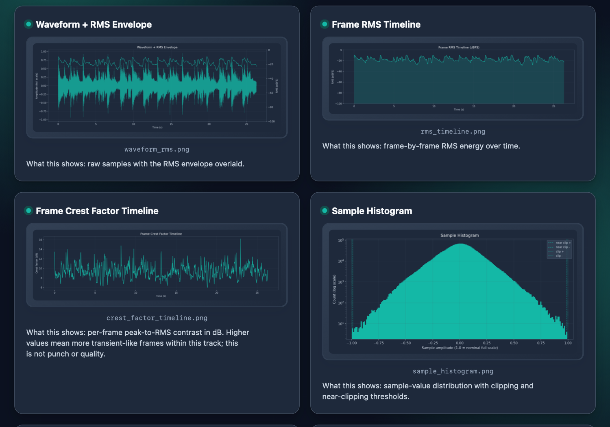

# AudioAtlas

## See your track. Keep the judgment yours.

AudioAtlas turns one audio file into a private, portable listening map: key
measurements, clear plots, and a short list of places that may be worth checking
by ear.

It runs on your computer. There is no account, upload, server, telemetry, or
quality score. The result is a folder you can open in any browser and keep with
the track.


This is the regular no-theme output: AudioAtlas uses the polished light default
theme and opens the finished report in Studio.

## Try it, then make your first report

Open the [live Midnight Studio report](https://charlesmish.github.io/AudioAtlas/)
to see the complete local-first experience before installing anything. It is
generated from the 70.98-second project demo track. The hosted sample contains
the static report only; AudioAtlas itself does not upload user audio or
generated reports.

### Easiest path: Apple Silicon Mac app

The friend-facing macOS beta needs no Python, Terminal, account, or installer.
Download `AudioAtlas-<version>-macOS-arm64.dmg` from the matching
[GitHub prerelease](https://github.com/CharlesMish/AudioAtlas/releases), drag
AudioAtlas into Applications, and open it. Drop one track or choose a file;
AudioAtlas writes `AudioAtlas Report – <track>` beside the audio and opens the
finished themed HTML report automatically.

The signed/notarized DMG is the supported low-setup path. Workflow artifacts
labeled `beta` are ad-hoc owner-test builds, not substitutes for that release.
The first app beta supports Apple Silicon and macOS 14 or newer.

### CLI and advanced workflows

The Python CLI supports Python 3.11 or newer and exposes themes, graph profiles,
batch reports, manual sections, revision diffs, and song projects.

```bash
python -m pip install audioatlas
audioatlas analyze song.wav
```

When `--out` is omitted, AudioAtlas creates a friendly folder such as:

```text
audioatlas-report-song/
```

Open `report.html` inside that folder.

From a source checkout using `uv`:

```bash
uv sync
uv run audioatlas analyze song.wav
```

The first analysis in a fresh environment may take a little longer while the
scientific libraries initialize. Lightweight commands such as `--version`,
`--help`, and `themes` start without loading the analysis stack.

## Try the real demo recordings

The repository includes three intentionally public musical demos: the complete
AudioAtlas trailer/demo track, a short solo-guitar recording, and a fuller
guitar, koto, cello, and drums arrangement.

```bash
# Reproduce the standard Midnight Studio report used by the live site
uv run audioatlas analyze examples/demo_audio/audioatlas_demo.wav \
  --out reports/audioatlas-demo \
  --graphs-profile standard \
  --theme midnight_studio

# Make a clean audio-only input folder, then build an exact three-track catalog
rm -rf reports/demo-audio-input
mkdir -p reports/demo-audio-input
cp examples/demo_audio/*.wav reports/demo-audio-input/
uv run audioatlas batch reports/demo-audio-input \
  --out reports/demo-catalog \
  --graphs-profile full

# Open the live-demo-style report, catalog, and arrangement report
python -m webbrowser reports/audioatlas-demo/report.html
python -m webbrowser reports/demo-catalog/catalog.html
python -m webbrowser reports/demo-catalog/guitar_koto_cello_drums/report.html
```

See the [recording notes](examples/demo_audio/README.md) and
[audio rights notice](AUDIO_RIGHTS.md). These musical demos are not golden test
fixtures or threshold-calibration evidence.

## Choose how much you want to see

AudioAtlas has one analysis engine. The choices below change report depth and
presentation, not the underlying measurements.

| Experience | Command | What changes |
|---|---|---|
| **Compact** | `--graphs-profile compact` | Four essential plots; complete JSON remains available |
| **Standard** | no extra flag | Fourteen plots and the normal first-read experience |
| **Full** | `--graphs-profile full` | All seventeen registered plots |

Every HTML report opens in **Studio** and includes a **Focus / Studio** switch:

- **Studio** is the polished default, with richer framing, hierarchy, and atmosphere.
- **Focus** is restrained and information-first.

Both views wrap the same report content and plot pixels. The presentation switch
changes framing only.

The polished light theme shown above is the no-flag default. Theme selection
styles both the report shell and generated PNG canvases at report-generation
time. Midnight Studio is an optional built-in alternative:

```bash
audioatlas analyze song.wav --theme midnight_studio
```



Choose the restrained opening view when generating a report:

```bash
audioatlas analyze song.wav --presentation focus
```

The switch remains available inside the finished report, works offline, and
never changes the measured plot content or pixels.

A separate “lite” build is intentionally not maintained. Compact reports use
the same trusted analysis engine, which avoids two editions slowly disagreeing
about the same track.

## Useful recipes

```bash
# Pick an output folder
audioatlas analyze song.wav --out reports/song

# Compact first read
audioatlas analyze song.wav --graphs-profile compact

# Restrained opening presentation
audioatlas analyze song.wav --presentation focus

# All plots with a built-in theme
audioatlas analyze song.wav --graphs-profile full --theme midnight_studio

# Analyze one source range
audioatlas analyze song.wav --start 30 --end 62 --out reports/verse

# List themes
audioatlas themes
```

## What you receive

A normal report folder contains:

- `report.html` — the friendly browser report;
- `report.md` — a portable text version;
- `summary.json` — the complete measurement summary;
- `findings.json` — bounded review prompts and their evidence;
- PNG plots;
- `.audioatlas-output.json` — a manifest that lets AudioAtlas update its own
  files without deleting unrelated files.

Local absolute paths are excluded by default, so shared reports do not normally
reveal usernames or folder structures.

The HTML report also provides keyboard-accessible plot zoom, direct links between
review prompts and their plots, and private Human notes. Notes autosave in local
browser storage for that report path and can be copied or exported as text; they
are never written into report JSON or sent over a network.

## Compare two revisions of the same track

Give related exports the same private revision token when you analyze them:

```bash
audioatlas analyze mix-v3.wav --out reports/mix-v3 --track-id "unique-private-token"
audioatlas analyze mix-v4.wav --out reports/mix-v4 --track-id "unique-private-token"
audioatlas diff reports/mix-v3 reports/mix-v4 --out reports/v3-to-v4
```

The diff reports descriptive `B - A` changes and which review prompts appeared,
disappeared, or changed. It does not choose a winner. AudioAtlas stores only the
token's SHA-256 digest; matching digests mean the same token was supplied, not
that AudioAtlas recognized the music.

## Keep a song's revisions together

For recurring work, create a private local song workspace and add each export
in order:

```bash
audioatlas project init projects/my-song --name "My Song"
audioatlas project add projects/my-song mix-v1.wav --label "Mix 1"
audioatlas project add projects/my-song mix-v2.wav --label "Mix 2"
```

Open `projects/my-song/project.html`. The workspace keeps per-revision reports
and guarded adjacent diffs together. Its YAML configuration records local
source paths for repeatable owner-side use, while generated JSON, Markdown, and
HTML expose only portable filenames and the hashed project identity.

## Analyze sections or a folder

Manual sections:

```bash
audioatlas sections song.wav --out reports/sections \
  --section intro:0:30 \
  --section verse:30:62 \
  --section ending:62:
```

Folder catalog:

```bash
audioatlas batch /path/to/audio --out reports/catalog
```

AudioAtlas does not infer song structure. Folder catalogs remain descriptive
and do not rank tracks.

## What AudioAtlas measures

AudioAtlas currently includes level and loudness context, approximate true
peak, clipping and near-clipping counts, RMS and crest timelines, short-term
LUFS, stereo correlation, mid/side energy, spectral shape, relative mean band
power, onset activity, and chroma pitch-class energy.

Review prompts are checks worth making, not diagnoses. A report may correctly
surface no prioritized prompts at all.

## What it does not do

- No mix, mastering, loudness, or quality score.
- No automatic EQ, compression, or mastering prescription.
- No cross-track ranking or reference-track winner.
- No genre, instrument, source, key, or automatic section detection.
- No source separation, cloud dashboard, playback engine, or DAW integration.
- No claim that a threshold crossing is audible, bad, or musically wrong.

## Alpha status

AudioAtlas `0.2.0a7` is a public alpha. The report pipeline, macOS app,
comparison tools, and local song-project workflow are usable, but the default
review prompts are still being calibrated on real music. The first app release
is Apple Silicon-only. The older `.command` and `.bat` launchers remain
convenience wrappers for an already installed CLI, not desktop installers.

The temporary Numba compatibility range is documented in
[Compatibility](docs/COMPATIBILITY.md).

## Learn more

- [Friendly user guide](docs/USER_GUIDE.md)
- [Desktop app and legacy launchers](README_EASY_RUN.md)
- [Examples](examples/README.md)
- [Finding rules](docs/FINDING_RULES.md)
- [Alpha limitations](docs/ALPHA_LIMITATIONS.md)
- [Compatibility](docs/COMPATIBILITY.md)
- [Schemas](docs/SUMMARY_SCHEMA.md)
- [Song-project schema](docs/PROJECT_SCHEMA.md)
- [Architecture](docs/ARCHITECTURE.md)
- [macOS app release and clean-machine gate](docs/MACOS_APP_RELEASE.md)
- [Changelog](docs/CHANGELOG.md)
- [Security policy](SECURITY.md)

## License

AudioAtlas software and software documentation use the [MIT License](LICENSE).
The published demo recordings have a separate [audio rights notice](AUDIO_RIGHTS.md),
including recording-specific CC BY 4.0 terms, an AI-assisted demo-only track,
and third-party sound exceptions.
