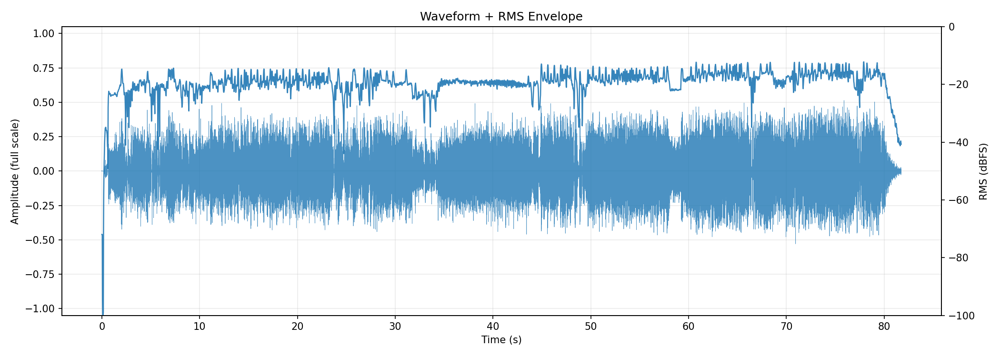
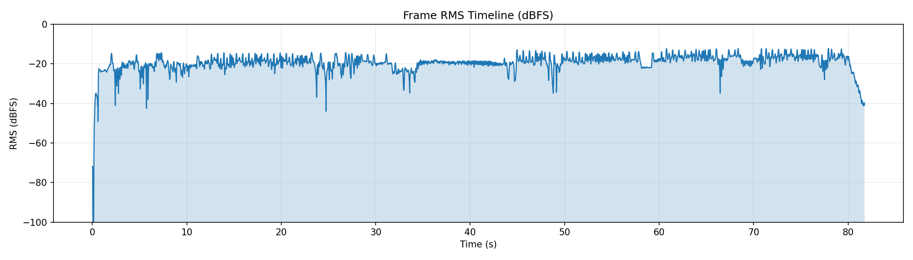
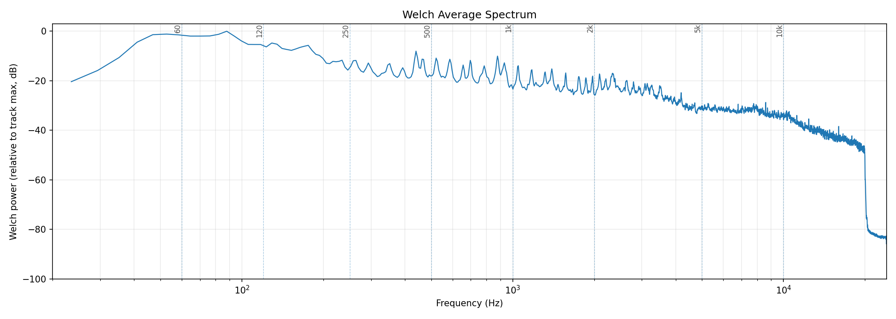
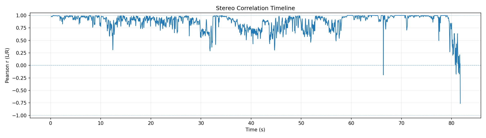
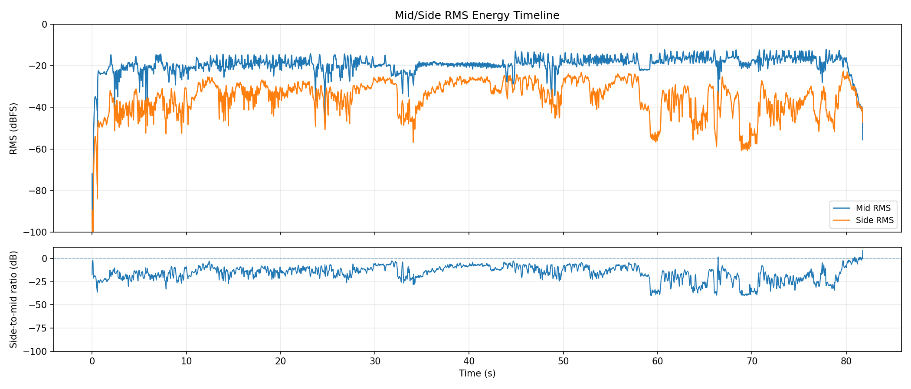
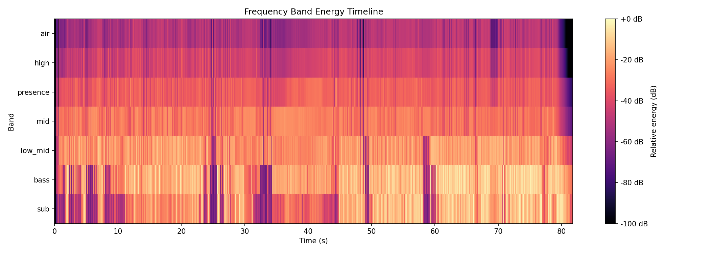
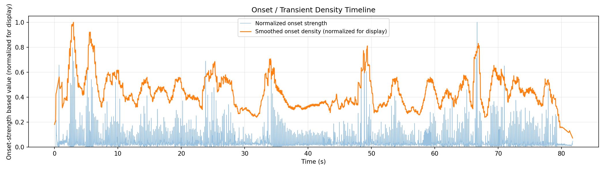

# AudioAtlas Report: aster.wav

## File

- Duration: 81.76s (1:22)
- Sample rate: 48000 Hz
- Channels: 2
- Format: WAV / PCM_16

## Level metrics

| Metric | Value | Unit |
|---|---|---|
| Sample peak | -5.203 | dBFS |
| True-peak (approx.) | -5.099 | dBTP |
| RMS | -17.879 | dBFS |
| Crest factor | 12.677 | dB |
| Integrated loudness | -15.194 | LUFS |
| PLR (peak - LUFS) | 10.095 | dB |
| Clipped samples | 0 |  |
| Near-clipping | 0 |  |

## Per-channel breakdown

| Metric | ch 0 | ch 1 | Unit |
|---|---|---|---|
| Sample peak | -5.267 | -5.203 | dBFS |
| True-peak (approx.) | -5.213 | -5.099 | dBTP |
| RMS | -17.956 | -17.804 | dBFS |
| DC offset | 0.000 | 0.000 |  |

## Frame RMS envelope summary

- frame_length: 4096
- hop_length: 1024
- frames: 3833
- rms_dbfs_min: -100.000
- rms_dbfs_max: -12.182
- rms_dbfs_mean: -19.457

## Average spectrum summary

Relative dB plots use track max = 0 dB and are not calibrated dBFS.

- nperseg: 8192
- bins: 4097
- strongest_bin_hz: 87.891
- strongest_bin_db: 0.000
- strongest_band: bass

## Band energy summary

| Band | Range | Energy |
|---|---|---|
| sub | 20.000-60.000 Hz | -4.152 dB relative |
| bass | 60.000-120.000 Hz | -2.523 dB relative |
| low_mid | 120.000-350.000 Hz | -10.129 dB relative |
| mid | 350.000-2000.000 Hz | -18.171 dB relative |
| presence | 2000.000-5000.000 Hz | -24.559 dB relative |
| high | 5000.000-10000.000 Hz | -32.153 dB relative |
| air | 10000.000-20000.000 Hz | -40.064 dB relative |

## Spectral shape summary

- n_fft: 4096
- hop_length: 1024
- frames: 3833
- valid_frames: 3833
- undefined_frames: 0
- centroid_mean_hz: 4325.123
- centroid_median_hz: 4455.316
- centroid_min_hz: 333.712
- centroid_max_hz: 12538.116
- rolloff_85_median_hz: 9667.969
- rolloff_95_median_hz: 14648.438
- bandwidth_median_hz: 4614.440
- centroid_elevated_threshold_hz: 6682.974
- centroid_reduced_threshold_hz: 2227.658
- centroid_large_shift_threshold_hz: 3341.487

## Band energy timeline summary

Relative dB values use this analysis view's maximum as 0 dB and are not calibrated dBFS.

- frames: 3833
- valid_frames: 3833
- strongest_band_by_median: bass

| Band | Median | Mean | Min | Max |
|---|---|---|---|---|
| sub | -24.078 | -27.823 | -100.000 | -0.611 |
| bass | -16.969 | -21.489 | -100.000 | 0.000 |
| low_mid | -21.881 | -23.474 | -100.000 | -7.617 |
| mid | -27.625 | -29.819 | -100.000 | -19.725 |
| presence | -34.131 | -36.119 | -100.000 | -24.440 |
| high | -42.683 | -44.696 | -100.000 | -30.533 |
| air | -50.739 | -53.009 | -100.000 | -39.775 |

## Onset / transient density summary

- hop_length: 1024
- frames: 3833
- smoothing_window_seconds: 1.000
- smoothing_window_frames: 47
- onset_strength_mean: 1.477
- onset_strength_median: 0.709
- onset_strength_max: 29.076
- onset_density_mean: 1.475
- onset_density_median: 1.414
- onset_density_max: 3.417
- high_onset_density_threshold: 2.121
- strongest_onset_density_time: 2.987

## Stereo correlation summary

- frame_length: 4096
- hop_length: 1024
- frames: 3833
- defined_frames: 3828
- undefined_frames: 5
- correlation_min: -0.760
- correlation_max: 1.000
- correlation_mean: 0.872
- correlation_median: 0.933
- overall_correlation: 0.900
- correlation_below_0_time_ranges: [{'start': 66.41066666666667, 'end': 66.432, 'duration': 0.021333333333330984}, {'start': 80.896, 'end': 80.93866666666666, 'duration': 0.04266666666666197}, {'start': 81.36533333333334, 'end': 81.408, 'duration': 0.04266666666666197}, {'start': 81.49333333333334, 'end': 81.62133333333333, 'duration': 0.1279999999999859}, {'start': 81.728, 'end': 81.77066666666667, 'duration': 0.04266666666667618}]
- correlation_below_0_3_time_ranges: [{'start': 31.808, 'end': 31.82933333333333, 'duration': 0.021333333333330984}, {'start': 66.41066666666667, 'end': 66.432, 'duration': 0.021333333333330984}, {'start': 79.65866666666666, 'end': 79.70133333333334, 'duration': 0.04266666666667618}, {'start': 80.256, 'end': 80.29866666666666, 'duration': 0.04266666666666197}, {'start': 80.32, 'end': 80.40533333333333, 'duration': 0.08533333333333815}, {'start': 80.704, 'end': 80.81066666666666, 'duration': 0.10666666666666913}, {'start': 80.85333333333334, 'end': 80.98133333333332, 'duration': 0.1279999999999859}, {'start': 81.00266666666667, 'end': 81.13066666666667, 'duration': 0.1280000000000001}, {'start': 81.25866666666667, 'end': 81.77066666666667, 'duration': 0.5120000000000005}]
- warning: one or more frames are below correlation_min_rms_dbfs; correlation is undefined

## Mid/side energy summary

- frame_length: 4096
- hop_length: 1024
- frames: 3833
- mid_rms_dbfs_min: -100.000
- mid_rms_dbfs_max: -12.182
- mid_rms_dbfs_mean: -19.446
- side_rms_dbfs_min: -100.000
- side_rms_dbfs_max: -22.609
- side_rms_dbfs_mean: -35.252
- side_to_mid_ratio_db_median: -14.521
- side_to_mid_ratio_db_mean: -15.809
- undefined_ratio_frames: 0
- side_to_mid_ratio_above_minus_6_time_ranges: [{'start': 0.021333333333333333, 'end': 0.12799999999999767, 'duration': 0.10666666666666434}, {'start': 11.733333333333333, 'end': 11.754666666666663, 'duration': 0.021333333333330984}, {'start': 11.776, 'end': 11.818666666666664, 'duration': 0.042666666666663744}, {'start': 12.288, 'end': 12.309333333333331, 'duration': 0.021333333333330984}, {'start': 12.373333333333333, 'end': 12.501333333333331, 'duration': 0.12799999999999834}, {'start': 27.669333333333334, 'end': 27.690666666666665, 'duration': 0.021333333333330984}, {'start': 29.888, 'end': 29.930666666666664, 'duration': 0.04266666666666197}, {'start': 30.037333333333333, 'end': 30.058666666666664, 'duration': 0.021333333333330984}, {'start': 30.378666666666668, 'end': 30.4, 'duration': 0.021333333333330984}, {'start': 30.869333333333334, 'end': 30.890666666666664, 'duration': 0.021333333333330984}, {'start': 31.573333333333334, 'end': 31.594666666666665, 'duration': 0.021333333333330984}, {'start': 31.701333333333334, 'end': 31.978666666666665, 'duration': 0.2773333333333312}, {'start': 32.128, 'end': 32.34133333333333, 'duration': 0.21333333333333115}, {'start': 32.896, 'end': 32.98133333333333, 'duration': 0.08533333333333104}, {'start': 38.72, 'end': 38.76266666666666, 'duration': 0.04266666666666197}, {'start': 38.99733333333333, 'end': 39.12533333333333, 'duration': 0.1280000000000001}, {'start': 40.064, 'end': 40.10666666666666, 'duration': 0.04266666666666197}, {'start': 40.34133333333333, 'end': 40.42666666666666, 'duration': 0.08533333333333104}, {'start': 41.32266666666667, 'end': 41.38666666666666, 'duration': 0.06399999999999295}, {'start': 41.856, 'end': 41.919999999999995, 'duration': 0.06399999999999295}, {'start': 43.648, 'end': 43.797333333333334, 'duration': 0.1493333333333311}, {'start': 43.84, 'end': 43.903999999999996, 'duration': 0.06399999999999295}, {'start': 43.946666666666665, 'end': 43.967999999999996, 'duration': 0.021333333333330984}, {'start': 44.202666666666666, 'end': 44.24533333333333, 'duration': 0.04266666666666197}, {'start': 44.309333333333335, 'end': 44.394666666666666, 'duration': 0.08533333333333104}, {'start': 44.650666666666666, 'end': 44.8, 'duration': 0.1493333333333311}, {'start': 45.056, 'end': 45.09866666666667, 'duration': 0.04266666666666907}, {'start': 46.35733333333334, 'end': 46.42133333333333, 'duration': 0.06399999999999295}, {'start': 50.64533333333333, 'end': 50.70933333333333, 'duration': 0.06400000000000006}, {'start': 51.242666666666665, 'end': 51.263999999999996, 'duration': 0.021333333333330984}, {'start': 51.733333333333334, 'end': 51.775999999999996, 'duration': 0.04266666666666197}, {'start': 51.882666666666665, 'end': 52.032, 'duration': 0.1493333333333311}, {'start': 56.896, 'end': 57.00266666666666, 'duration': 0.10666666666666202}, {'start': 57.55733333333333, 'end': 57.64266666666666, 'duration': 0.08533333333333104}, {'start': 66.41066666666667, 'end': 66.432, 'duration': 0.021333333333330984}, {'start': 77.46133333333333, 'end': 77.48266666666666, 'duration': 0.021333333333330984}, {'start': 79.616, 'end': 79.72266666666667, 'duration': 0.10666666666666913}, {'start': 80.08533333333334, 'end': 80.53333333333333, 'duration': 0.4479999999999933}, {'start': 80.55466666666666, 'end': 80.576, 'duration': 0.021333333333330984}, {'start': 80.59733333333334, 'end': 81.19466666666666, 'duration': 0.5973333333333244}, {'start': 81.216, 'end': 81.77066666666667, 'duration': 0.5546666666666766}]

## Findings

Findings are prioritized factual observations. Some lower-priority observations may be omitted from this report.

### Minimum L/R correlation is below 0

- Severity: warning
- Category: stereo
- Measured value: -0.760 Pearson r
- Threshold: 0.000
- Evidence: correlation_min measured -0.760.
- Why it matters: Negative L/R correlation can indicate phase-inverted content in at least part of the measured timeline.
- Suggested checks:
  - Inspect the stereo correlation plot around the low-correlation region.
  - Listen in mono around these regions if mono compatibility matters.
- Time ranges:
  - 66.411s-66.432s (0.021s)
  - 80.896s-80.939s (0.043s)
  - 81.365s-81.408s (0.043s)
  - 81.493s-81.621s (0.128s)
  - 81.728s-81.771s (0.043s)
- Confidence: medium

### L/R correlation falls below 0.3 in some regions

- Severity: info
- Category: stereo
- Measured value: 9 regions
- Threshold: 0.300
- Evidence: 9 time range(s) have frame correlation below 0.3.
- Why it matters: Low L/R correlation marks regions where the two channels are less similar by this measurement.
- Suggested checks:
  - Inspect the stereo correlation plot around these regions.
  - Listen in mono around these regions if mono compatibility matters.
- Time ranges:
  - 31.808s-31.829s (0.021s)
  - 66.411s-66.432s (0.021s)
  - 79.659s-79.701s (0.043s)
  - 80.256s-80.299s (0.043s)
  - 80.320s-80.405s (0.085s)
  - 80.704s-80.811s (0.107s)
  - 80.853s-80.981s (0.128s)
  - 81.003s-81.131s (0.128s)
  - 81.259s-81.771s (0.512s)
- Confidence: medium

### Spectral centroid is elevated relative to this track's median

- Severity: info
- Category: spectrum
- Measured value: 4455.316 Hz
- Threshold: 6682.974
- Evidence: centroid_median_hz measured 4455.316 Hz; 28 time range(s) exceed the relative threshold.
- Why it matters: Spectral centroid is a frequency-distribution statistic; elevated regions indicate the centroid is higher than this track's median by the configured heuristic.
- Suggested checks:
  - Inspect EQ, arrangement density, cymbals, distortion, or vocal presence in these regions.
  - Check whether these sections sound brighter or denser; centroid is only a proxy.
- Time ranges:
  - 0.043s-0.171s (0.128s)
  - 2.261s-2.283s (0.021s)
  - 8.427s-8.448s (0.021s)
  - 8.725s-8.789s (0.064s)
  - 8.875s-8.917s (0.043s)
  - 9.408s-9.429s (0.021s)
  - 11.712s-11.755s (0.043s)
  - 11.840s-11.925s (0.085s)
  - 12.437s-12.565s (0.128s)
  - 14.059s-14.080s (0.021s)
  - 17.045s-17.067s (0.021s)
  - 17.835s-17.856s (0.021s)
  - 19.349s-19.371s (0.021s)
  - 19.499s-19.520s (0.021s)
  - 19.947s-20.011s (0.064s)
  - 24.875s-24.960s (0.085s)
  - 25.280s-25.301s (0.021s)
  - 25.344s-25.451s (0.107s)
  - 26.368s-26.432s (0.064s)
  - 27.712s-27.776s (0.064s)
  - 31.829s-31.872s (0.043s)
  - 32.917s-33.045s (0.128s)
  - 33.536s-33.579s (0.043s)
  - 44.011s-44.032s (0.021s)
  - 48.341s-48.363s (0.021s)
  - 48.832s-48.875s (0.043s)
  - 49.387s-49.515s (0.128s)
  - 71.723s-71.765s (0.043s)
- Confidence: medium

### Spectral centroid is reduced relative to this track's median

- Severity: info
- Category: spectrum
- Measured value: 4455.316 Hz
- Threshold: 2227.658
- Evidence: centroid_median_hz measured 4455.316 Hz; 30 time range(s) fall below the relative threshold.
- Why it matters: Spectral centroid is a frequency-distribution statistic; reduced regions indicate the centroid is lower than this track's median by the configured heuristic.
- Suggested checks:
  - Inspect EQ, arrangement density, instrumentation, or source changes in these regions.
  - Check whether these sections sound less high-frequency-weighted; centroid is only a proxy.
- Time ranges:
  - 0.512s-0.619s (0.107s)
  - 3.093s-3.115s (0.021s)
  - 7.851s-7.936s (0.085s)
  - 9.045s-9.088s (0.043s)
  - 9.536s-9.579s (0.043s)
  - 10.219s-10.240s (0.021s)
  - 14.507s-14.528s (0.021s)
  - 32.811s-32.832s (0.021s)
  - 34.091s-34.155s (0.064s)
  - 47.787s-47.851s (0.064s)
  - 48.277s-48.320s (0.043s)
  - 48.640s-48.811s (0.171s)
  - 53.611s-53.632s (0.021s)
  - 62.336s-62.357s (0.021s)
  - 62.677s-62.699s (0.021s)
  - 64.981s-65.003s (0.021s)
  - 66.453s-66.475s (0.021s)
  - 66.624s-66.645s (0.021s)
  - 68.715s-68.800s (0.085s)
  - 68.885s-68.949s (0.064s)
  - 69.056s-69.120s (0.064s)
  - 69.205s-69.291s (0.085s)
  - 69.376s-69.440s (0.064s)
  - 69.547s-69.611s (0.064s)
  - 69.717s-69.781s (0.064s)
  - 69.888s-69.952s (0.064s)
  - 70.379s-70.443s (0.064s)
  - 70.549s-70.592s (0.043s)
  - 72.725s-72.747s (0.021s)
  - 79.531s-81.771s (2.240s)
- Confidence: medium

### Spectral centroid changes sharply in some regions

- Severity: info
- Category: spectrum
- Measured value: 9 regions
- Threshold: 3341.487
- Evidence: 9 time range(s) exceed the relative centroid-change heuristic.
- Why it matters: Sharp centroid changes can mark transitions in arrangement, instrumentation, or processing by this frequency-distribution measurement.
- Suggested checks:
  - Inspect the spectral shape timeline around these regions.
  - Check whether arrangement or source changes align with the measured shifts.
- Time ranges:
  - 0.064s-0.085s (0.021s)
  - 0.171s-0.192s (0.021s)
  - 8.725s-8.747s (0.021s)
  - 9.579s-9.600s (0.021s)
  - 19.157s-19.179s (0.021s)
  - 32.917s-32.939s (0.021s)
  - 34.155s-34.176s (0.021s)
  - 48.341s-48.363s (0.021s)
  - 48.832s-48.853s (0.021s)
- Confidence: medium

### Multiple band-energy changes detected

- Severity: info
- Category: spectrum
- Measured value: 4 band observations
- Threshold: 1
- Evidence: Affected bands after duration and energy filters: sub elevated, bass elevated, high reduced, air reduced.
- Why it matters: This groups broad frequency-band changes that crossed relative track-level thresholds.
- Suggested checks:
  - Inspect the frequency band energy timeline around the listed regions.
  - Check whether arrangement, source content, or processing changes align with these regions.
- Time ranges:
  - 29.141s-29.781s (0.640s)
  - 47.595s-48.256s (0.661s)
  - 54.101s-54.741s (0.640s)
  - 56.640s-58.112s (1.472s)
  - 61.803s-62.400s (0.597s)
  - 62.464s-63.061s (0.597s)
  - 67.243s-67.947s (0.704s)
  - 68.011s-68.651s (0.640s)
  - 73.003s-73.579s (0.576s)
  - 73.749s-74.261s (0.512s)
  - 74.325s-74.923s (0.597s)
  - 74.987s-75.584s (0.597s)
  - 77.909s-78.549s (0.640s)
  - 79.104s-80.747s (1.643s)
  - 67.499s-68.053s (0.555s)
  - 79.595s-81.771s (2.176s)
  - 0.000s-0.661s (0.661s)
  - 79.531s-81.771s (2.240s)
- Confidence: medium

### Onset density is elevated relative to this track's median

- Severity: info
- Category: dynamics
- Measured value: 1.414 onset strength
- Threshold: 2.121
- Evidence: onset_density_median measured 1.414; 17 time range(s) exceed the relative threshold.
- Why it matters: This marks regions with higher onset-strength activity by a relative track-level heuristic.
- Suggested checks:
  - Check whether these sections feel rhythmically dense or transient-heavy.
  - Inspect drums, strums, plucks, consonants, or percussive elements in these regions.
- Time ranges:
  - 2.197s-3.520s (1.323s)
  - 5.141s-5.291s (0.149s)
  - 5.312s-6.485s (1.173s)
  - 25.003s-25.344s (0.341s)
  - 33.728s-33.813s (0.085s)
  - 33.899s-34.176s (0.277s)
  - 34.411s-34.453s (0.043s)
  - 34.581s-34.709s (0.128s)
  - 48.405s-48.427s (0.021s)
  - 48.640s-48.683s (0.043s)
  - 48.704s-48.917s (0.213s)
  - 49.045s-49.728s (0.683s)
  - 66.197s-67.072s (0.875s)
  - 69.333s-69.376s (0.043s)
  - 69.483s-69.525s (0.043s)
  - 69.589s-69.675s (0.085s)
  - 70.485s-70.507s (0.021s)
- Confidence: medium

## Plots

### Waveform + RMS Envelope

### Frame RMS Timeline

### Log-Frequency Spectrogram

### Welch Average Spectrum

### Sample Histogram

### Stereo Correlation Timeline

### Mid/Side Energy Timeline

### Spectral Shape Timeline

### Frequency Band Energy Timeline

### Onset / Transient Density Timeline

## Human notes

- Observations:
- EQ ideas:
- Dynamics notes:
- Stereo/image notes: