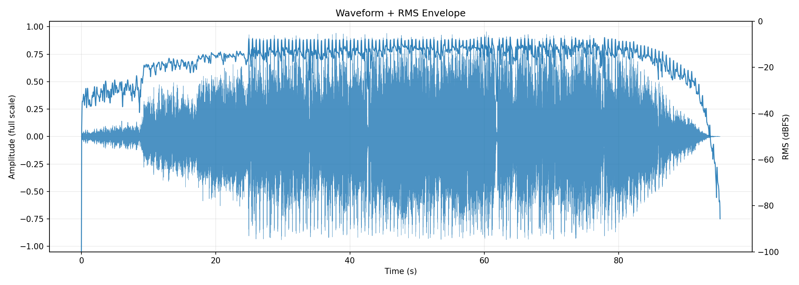
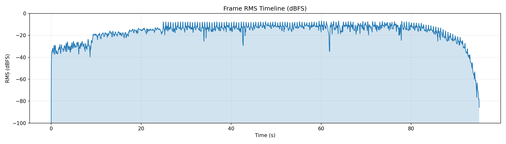
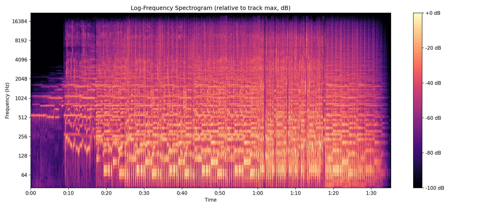
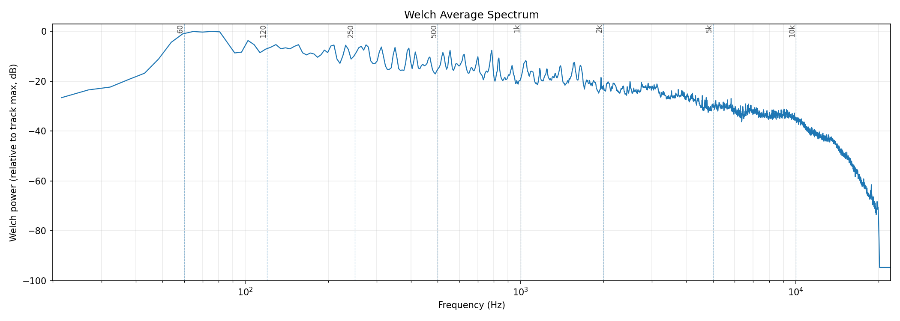
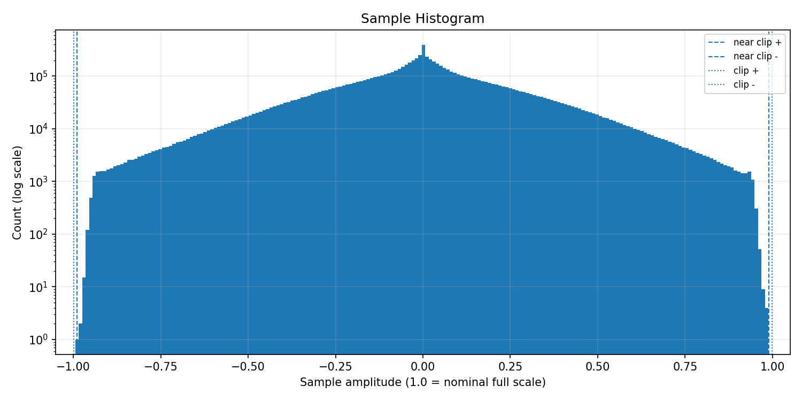
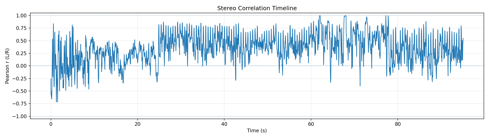
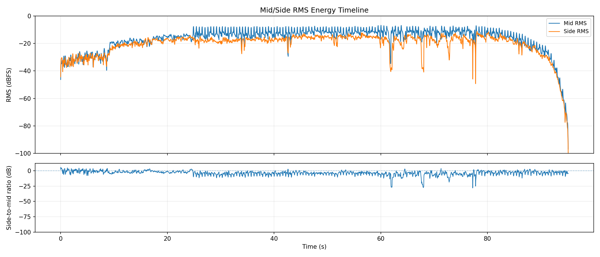
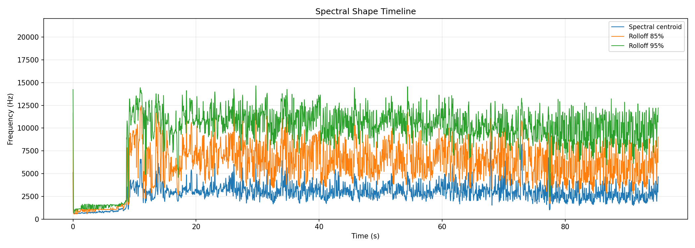
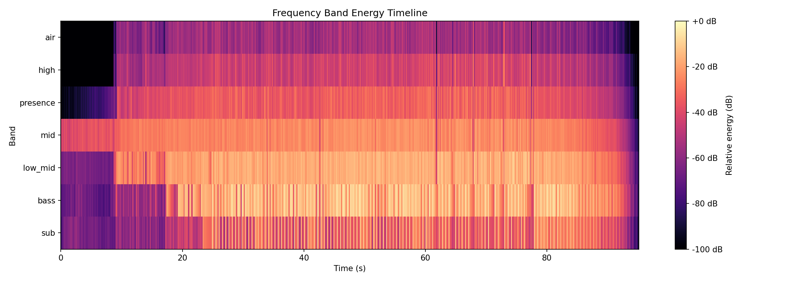
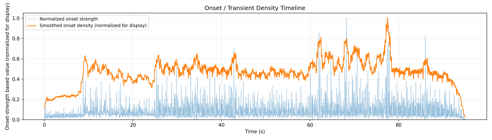

# AudioAtlas Report: DC_kMM_Censored.mp3

## File

- Duration: 95.14s (1:35)
- Sample rate: 44100 Hz
- Channels: 2
- Format: MP3 / MPEG_LAYER_III

## Level metrics

| Metric | Value | Unit |
|---|---|---|
| Sample peak | -0.046 | dBFS |
| True-peak (approx.) | 0.053 | dBTP |
| RMS | -11.801 | dBFS |
| Crest factor | 11.755 | dB |
| Integrated loudness | -8.196 | LUFS |
| PLR (peak - LUFS) | 8.249 | dB |
| Clipped samples | 0 |  |
| Near-clipping | 1 |  |

## Per-channel breakdown

| Metric | ch 0 | ch 1 | Unit |
|---|---|---|---|
| Sample peak | -0.046 | -0.141 | dBFS |
| True-peak (approx.) | 0.053 | -0.009 | dBTP |
| RMS | -11.888 | -11.716 | dBFS |
| DC offset | 0.000 | -0.000 |  |

## Frame RMS envelope summary

- frame_length: 4096
- hop_length: 1024
- frames: 4098
- rms_dbfs_min: -100.000
- rms_dbfs_max: -6.780
- rms_dbfs_mean: -16.929

## Average spectrum summary

Relative dB plots use track max = 0 dB and are not calibrated dBFS.

- nperseg: 8192
- bins: 4097
- strongest_bin_hz: 75.366
- strongest_bin_db: 0.000
- strongest_band: bass

## Band energy summary

| Band | Range | Energy |
|---|---|---|
| sub | 20.000-60.000 Hz | -7.922 dB relative |
| bass | 60.000-120.000 Hz | -2.931 dB relative |
| low_mid | 120.000-350.000 Hz | -8.074 dB relative |
| mid | 350.000-2000.000 Hz | -15.585 dB relative |
| presence | 2000.000-5000.000 Hz | -24.765 dB relative |
| high | 5000.000-10000.000 Hz | -32.283 dB relative |
| air | 10000.000-20000.000 Hz | -43.516 dB relative |

## Spectral shape summary

- n_fft: 4096
- hop_length: 1024
- frames: 4098
- valid_frames: 4098
- undefined_frames: 0
- centroid_mean_hz: 2865.817
- centroid_median_hz: 2869.453
- centroid_min_hz: 573.534
- centroid_max_hz: 8500.169
- rolloff_85_median_hz: 6136.963
- rolloff_95_median_hz: 10303.638
- bandwidth_median_hz: 3313.752
- centroid_elevated_threshold_hz: 4304.179
- centroid_reduced_threshold_hz: 1434.726
- centroid_large_shift_threshold_hz: 2152.089
- centroid_elevated_ranges: 83
- centroid_reduced_ranges: 3
- centroid_large_shift_ranges: 5

## Band energy timeline summary

Relative dB values use this analysis view's maximum as 0 dB and are not calibrated dBFS.

- frames: 4098
- valid_frames: 4098
- strongest_band_by_median: bass

| Band | Median | Mean | Min | Max |
|---|---|---|---|---|
| sub | -37.118 | -38.450 | -100.000 | -4.436 |
| bass | -18.939 | -26.834 | -100.000 | 0.000 |
| low_mid | -19.065 | -25.030 | -100.000 | -8.447 |
| mid | -25.782 | -28.354 | -100.000 | -17.954 |
| presence | -36.930 | -42.254 | -100.000 | -24.009 |
| high | -46.341 | -52.022 | -100.000 | -24.918 |
| air | -57.070 | -62.105 | -100.000 | -35.069 |

## Onset / transient density summary

- hop_length: 1024
- frames: 4098
- smoothing_window_seconds: 1.000
- smoothing_window_frames: 43
- onset_strength_mean: 1.088
- onset_strength_median: 0.761
- onset_strength_max: 13.483
- onset_density_mean: 1.088
- onset_density_median: 1.096
- onset_density_max: 2.323
- high_onset_density_threshold: 1.644
- high_onset_density_ranges: 7
- strongest_onset_density_time: 77.531

## Stereo correlation summary

- frame_length: 4096
- hop_length: 1024
- frames: 4098
- defined_frames: 4095
- undefined_frames: 3
- correlation_min: -0.719
- correlation_max: 0.997
- correlation_mean: 0.356
- correlation_median: 0.366
- overall_correlation: 0.469
- correlation_below_0_ranges: 90
- correlation_below_0_3_ranges: 213
- warning: one or more frames are below correlation_min_rms_dbfs; correlation is undefined

## Mid/side energy summary

- frame_length: 4096
- hop_length: 1024
- frames: 4098
- mid_rms_dbfs_min: -97.014
- mid_rms_dbfs_max: -6.780
- mid_rms_dbfs_mean: -16.934
- side_rms_dbfs_min: -100.000
- side_rms_dbfs_max: -11.255
- side_rms_dbfs_mean: -20.642
- side_to_mid_ratio_db_median: -3.299
- side_to_mid_ratio_db_mean: -3.709
- undefined_ratio_frames: 0
- side_to_mid_ratio_above_minus_6_ranges: 157

## Findings

Findings are prioritized factual observations. Some lower-priority observations may be omitted from this report.
Long lists of time ranges are summarized here; see findings.json for full machine-readable details.
3 lower-priority finding(s) suppressed; see findings.json for details.

### Approximate true peak is above 0 dBTP

- Severity: warning
- Category: levels
- Measured value: 0.053 dBTP
- Threshold: 0.000
- Evidence: true_peak_dbtp measured 0.053 dBTP.
- Why it matters: Samples reconstructed by downstream playback or encoding can exceed nominal full scale when true peak is above 0 dBTP.
- Suggested checks:
  - Check a dedicated true-peak meter if this file will be encoded or limited.
  - Inspect the loudest passage for inter-sample peak behavior.
- Confidence: medium

### Near-full-scale samples detected

- Severity: warning
- Category: levels
- Measured value: 1 samples
- Threshold: 0
- Evidence: near_clipping_samples measured 1.
- Why it matters: Samples near full scale can indicate limited headroom, even when no sample reaches the clipping threshold.
- Suggested checks:
  - Inspect the sample histogram and peak values.
  - Check whether near-full-scale samples cluster in a specific passage.
- Time ranges: 1 regions, total 0.093s, longest 0.093s.
- First range: 72.957s-73.050s
- Last range: 72.957s-73.050s
- Showing first 1:
  - 72.957s-73.050s
- Confidence: high

### Minimum L/R correlation is below 0

- Severity: warning
- Category: stereo
- Measured value: -0.719 Pearson r
- Threshold: 0.000
- Evidence: correlation_min measured -0.719.
- Why it matters: Negative L/R correlation can indicate phase-inverted content in at least part of the measured timeline.
- Suggested checks:
  - Inspect the stereo correlation plot around the low-correlation region.
  - Listen in mono around these regions if mono compatibility matters.
- Time ranges: 9 regions, total 3.344s, longest 0.604s.
- First range: 0.000s-0.325s
- Last range: 87.818s-88.097s
- Showing first 8:
  - 0.000s-0.325s
  - 2.763s-3.019s
  - 3.994s-4.296s
  - 7.314s-7.570s
  - 15.581s-15.975s
  - 16.254s-16.858s
  - 24.195s-24.776s
  - 78.019s-78.367s
  - ...and 1 more range(s); see findings.json for full details.
- Confidence: medium

### Median L/R correlation is below 0.5

- Severity: warning
- Category: stereo
- Measured value: 0.366 Pearson r
- Threshold: 0.500
- Evidence: correlation_median measured 0.366.
- Why it matters: A lower median L/R correlation indicates less similarity between the left and right channels over the measured frames.
- Suggested checks:
  - Inspect the stereo correlation timeline for persistent low-correlation sections.
  - Check whether the stereo presentation matches the intended playback context.
- Confidence: medium

### Integrated loudness is above -10 LUFS

- Severity: info
- Category: levels
- Measured value: -8.196 LUFS
- Threshold: -10.000
- Evidence: integrated_lufs measured -8.196 LUFS.
- Why it matters: Integrated LUFS is a whole-track loudness measurement; values above -10 LUFS indicate a high measured loudness for this file.
- Suggested checks:
  - Compare this measured loudness with the intended delivery context.
  - Check PLR and waveform/RMS plots for additional context.
- Confidence: high

### L/R correlation falls below 0.3 in some regions

- Severity: info
- Category: stereo
- Measured value: 49 regions
- Threshold: 0.300
- Evidence: 49 time range(s) have frame correlation below 0.3.
- Why it matters: Low L/R correlation marks regions where the two channels are less similar by this measurement.
- Suggested checks:
  - Inspect the stereo correlation plot around these regions.
  - Listen in mono around these regions if mono compatibility matters.
- Time ranges: 49 regions, total 22.709s, longest 2.647s.
- First range: 0.000s-0.372s
- Last range: 92.044s-92.415s
- Showing first 8:
  - 0.000s-0.372s
  - 0.975s-1.672s
  - 1.927s-2.183s
  - 2.438s-3.042s
  - 3.669s-4.319s
  - 4.621s-4.876s
  - 5.178s-5.666s
  - 5.828s-6.130s
  - ...and 41 more range(s); see findings.json for full details.
- Confidence: medium

### Median side-to-mid ratio is above -6 dB

- Severity: info
- Category: stereo
- Measured value: -3.299 dB
- Threshold: -6.000
- Evidence: side_to_mid_ratio_db_median measured -3.299 dB.
- Why it matters: A higher side-to-mid ratio means side-channel RMS is closer to mid-channel RMS in the measured frames.
- Suggested checks:
  - Inspect the mid/side energy plot and side-to-mid ratio panel.
  - Listen in mono around these regions if side-heavy sections matter.
- Time ranges: 105 regions, total 69.706s, longest 16.811s.
- First range: 0.000s-0.580s
- Last range: 94.691s-95.155s
- Showing first 8:
  - 0.000s-0.580s
  - 0.604s-1.858s
  - 1.904s-4.365s
  - 4.389s-4.923s
  - 5.155s-8.011s
  - 8.034s-24.845s
  - 24.961s-25.379s
  - 26.610s-27.005s
  - ...and 97 more range(s); see findings.json for full details.
- Confidence: medium

### Spectral centroid is elevated relative to this track's median

- Severity: info
- Category: spectrum
- Measured value: 2869.453 Hz
- Threshold: 4304.179
- Evidence: centroid_median_hz measured 2869.453 Hz; 3 time range(s) exceed the relative threshold.
- Why it matters: Spectral centroid is a frequency-distribution statistic; elevated regions indicate the centroid is higher than this track's median by the configured heuristic.
- Suggested checks:
  - Inspect EQ, arrangement density, cymbals, distortion, or vocal presence in these regions.
  - Check whether these sections sound brighter or denser; centroid is only a proxy.
- Time ranges: 3 regions, total 0.906s, longest 0.325s.
- First range: 10.890s-11.169s
- Last range: 72.771s-73.073s
- Showing first 3:
  - 10.890s-11.169s
  - 13.839s-14.164s
  - 72.771s-73.073s
- Confidence: medium

## Plots

### Waveform + RMS Envelope

### Frame RMS Timeline

### Log-Frequency Spectrogram

### Welch Average Spectrum

### Sample Histogram

### Stereo Correlation Timeline

### Mid/Side Energy Timeline

### Spectral Shape Timeline

### Frequency Band Energy Timeline

### Onset / Transient Density Timeline

## Human notes

- Observations:
- EQ ideas:
- Dynamics notes:
- Stereo/image notes: