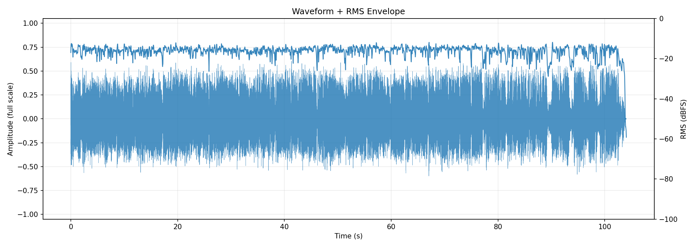
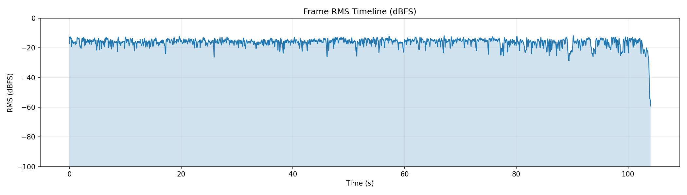
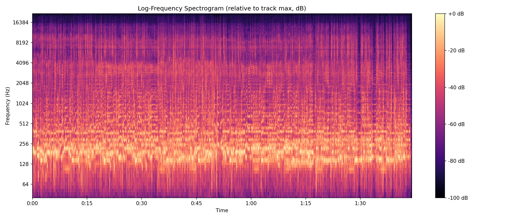
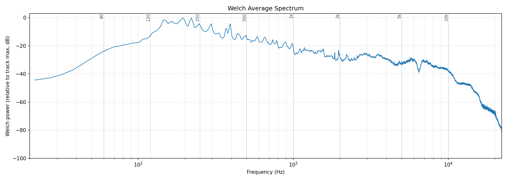
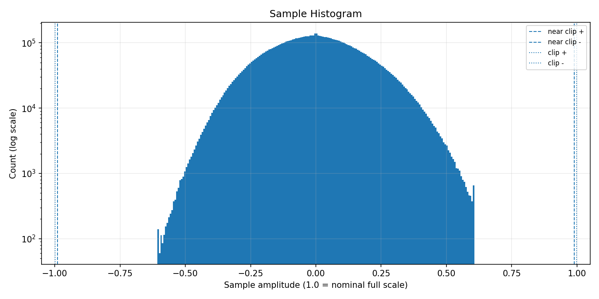
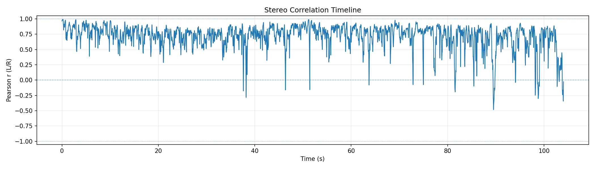
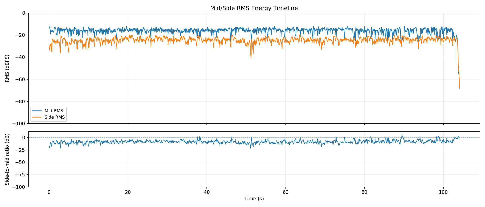
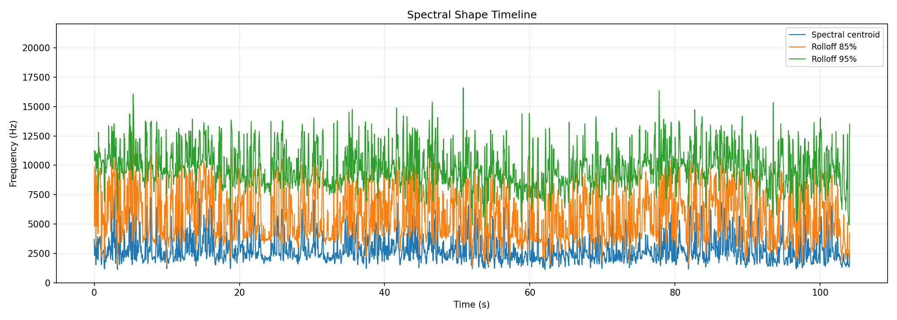
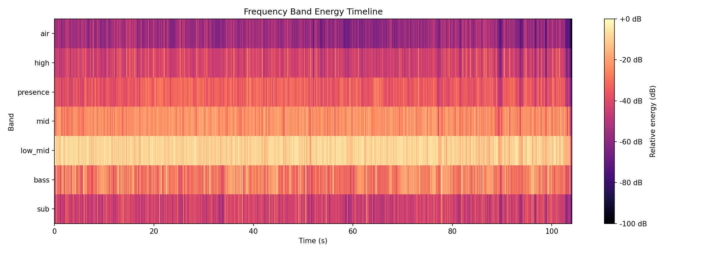
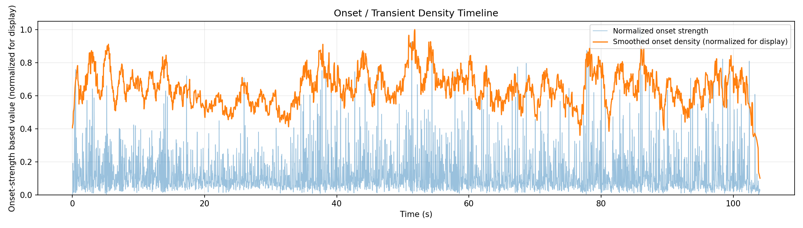

# AudioAtlas Report: Malone_Doja_BOL4_iKon_medley.wav

## File

- Duration: 104.05s (1:44)
- Sample rate: 44100 Hz
- Channels: 2
- Format: WAV / PCM_16

## Level metrics

| Metric | Value | Unit |
|---|---|---|
| Sample peak | -4.324 | dBFS |
| True-peak (approx.) | -3.143 | dBTP |
| RMS | -15.152 | dBFS |
| Crest factor | 10.828 | dB |
| Integrated loudness | -12.581 | LUFS |
| PLR (peak - LUFS) | 9.437 | dB |
| Clipped samples | 0 |  |
| Near-clipping | 0 |  |

## Per-channel breakdown

| Metric | ch 0 | ch 1 | Unit |
|---|---|---|---|
| Sample peak | -4.325 | -4.324 | dBFS |
| True-peak (approx.) | -3.143 | -3.373 | dBTP |
| RMS | -15.512 | -14.820 | dBFS |
| DC offset | -0.000 | -0.000 |  |

## Frame RMS envelope summary

- frame_length: 4096
- hop_length: 1024
- frames: 4482
- rms_dbfs_min: -59.205
- rms_dbfs_max: -11.853
- rms_dbfs_mean: -16.310

## Average spectrum summary

Relative dB plots use track max = 0 dB and are not calibrated dBFS.

- nperseg: 8192
- bins: 4097
- strongest_bin_hz: 193.799
- strongest_bin_db: 0.000
- strongest_band: low_mid

## Band energy summary

| Band | Range | Energy |
|---|---|---|
| sub | 20.000-60.000 Hz | -30.080 dB relative |
| bass | 60.000-120.000 Hz | -17.248 dB relative |
| low_mid | 120.000-350.000 Hz | -5.194 dB relative |
| mid | 350.000-2000.000 Hz | -18.429 dB relative |
| presence | 2000.000-5000.000 Hz | -28.658 dB relative |
| high | 5000.000-10000.000 Hz | -32.959 dB relative |
| air | 10000.000-20000.000 Hz | -47.541 dB relative |

## Spectral shape summary

- n_fft: 4096
- hop_length: 1024
- frames: 4482
- valid_frames: 4482
- undefined_frames: 0
- centroid_mean_hz: 2840.442
- centroid_median_hz: 2517.060
- centroid_min_hz: 1123.461
- centroid_max_hz: 7398.248
- rolloff_85_median_hz: 5598.633
- rolloff_95_median_hz: 9663.025
- bandwidth_median_hz: 3275.827
- centroid_elevated_threshold_hz: 3775.589
- centroid_reduced_threshold_hz: 1258.530
- centroid_large_shift_threshold_hz: 2000.000
- centroid_elevated_ranges: 206
- centroid_reduced_ranges: 15
- centroid_large_shift_ranges: 42

## Band energy timeline summary

Relative dB values use this analysis view's maximum as 0 dB and are not calibrated dBFS.

- frames: 4482
- valid_frames: 4482
- strongest_band_by_median: low_mid

| Band | Median | Mean | Min | Max |
|---|---|---|---|---|
| sub | -44.269 | -43.663 | -81.724 | -11.321 |
| bass | -26.810 | -26.785 | -70.682 | 0.000 |
| low_mid | -8.851 | -9.620 | -53.153 | -2.015 |
| mid | -22.472 | -23.460 | -60.062 | -14.821 |
| presence | -34.651 | -35.199 | -81.110 | -21.795 |
| high | -43.741 | -43.024 | -94.214 | -19.593 |
| air | -56.816 | -56.438 | -100.000 | -35.682 |

## Onset / transient density summary

- hop_length: 1024
- frames: 4482
- smoothing_window_seconds: 1.000
- smoothing_window_frames: 43
- onset_strength_mean: 1.426
- onset_strength_median: 0.978
- onset_strength_max: 11.564
- onset_density_mean: 1.424
- onset_density_median: 1.420
- onset_density_max: 2.211
- high_onset_density_threshold: 2.130
- high_onset_density_ranges: 2
- strongest_onset_density_time: 51.804

## Stereo correlation summary

- frame_length: 4096
- hop_length: 1024
- frames: 4482
- defined_frames: 4482
- undefined_frames: 0
- correlation_min: -0.483
- correlation_max: 0.993
- correlation_mean: 0.717
- correlation_median: 0.767
- overall_correlation: 0.754
- correlation_below_0_ranges: 16
- correlation_below_0_3_ranges: 34

## Mid/side energy summary

- frame_length: 4096
- hop_length: 1024
- frames: 4482
- mid_rms_dbfs_min: -68.216
- mid_rms_dbfs_max: -11.853
- mid_rms_dbfs_mean: -16.332
- side_rms_dbfs_min: -67.993
- side_rms_dbfs_max: -19.861
- side_rms_dbfs_mean: -24.823
- side_to_mid_ratio_db_median: -8.681
- side_to_mid_ratio_db_mean: -8.491
- undefined_ratio_frames: 0
- side_to_mid_ratio_above_minus_6_ranges: 131

## Findings

Findings are prioritized factual observations. Some lower-priority observations may be omitted from this report.
Long lists of time ranges are summarized here; see findings.json for full machine-readable details.

### Minimum L/R correlation is below 0

- Severity: warning
- Category: stereo
- Measured value: -0.483 Pearson r
- Threshold: 0.000
- Evidence: correlation_min measured -0.483.
- Why it matters: Negative L/R correlation can indicate phase-inverted content in at least part of the measured timeline.
- Suggested checks:
  - Inspect the stereo correlation plot around the low-correlation region.
  - Listen in mono around these regions if mono compatibility matters.
- Time ranges: 3 regions, total 1.091s, longest 0.418s.
- First range: 89.443s-89.838s
- Last range: 103.793s-104.072s
- Showing first 3:
  - 89.443s-89.838s
  - 98.638s-99.056s
  - 103.793s-104.072s
- Confidence: medium

### L/R correlation falls below 0.3 in some regions

- Severity: info
- Category: stereo
- Measured value: 6 regions
- Threshold: 0.300
- Evidence: 6 time range(s) have frame correlation below 0.3.
- Why it matters: Low L/R correlation marks regions where the two channels are less similar by this measurement.
- Suggested checks:
  - Inspect the stereo correlation plot around these regions.
  - Listen in mono around these regions if mono compatibility matters.
- Time ranges: 6 regions, total 2.438s, longest 0.580s.
- First range: 77.230s-77.485s
- Last range: 103.770s-104.072s
- Showing first 6:
  - 77.230s-77.485s
  - 81.409s-81.757s
  - 89.350s-89.931s
  - 98.615s-99.080s
  - 103.004s-103.491s
  - 103.770s-104.072s
- Confidence: medium

### Strongest average-spectrum bin is in the low-mid region

- Severity: info
- Category: spectrum
- Measured value: 193.799 Hz
- Threshold: 120
- Evidence: strongest_bin_hz measured 193.799 Hz.
- Why it matters: This identifies where the strongest Welch average-spectrum bin falls; it does not describe whether the balance is desirable.
- Suggested checks:
  - Inspect the average spectrum plot around 120-350 Hz.
  - Listen for which instruments or sources occupy that region.
- Confidence: medium

### Spectral centroid is elevated relative to this track's median

- Severity: info
- Category: spectrum
- Measured value: 2517.060 Hz
- Threshold: 3775.589
- Evidence: centroid_median_hz measured 2517.060 Hz; 3 time range(s) exceed the relative threshold.
- Why it matters: Spectral centroid is a frequency-distribution statistic; elevated regions indicate the centroid is higher than this track's median by the configured heuristic.
- Suggested checks:
  - Inspect EQ, arrangement density, cymbals, distortion, or vocal presence in these regions.
  - Check whether these sections sound brighter or denser; centroid is only a proxy.
- Time ranges: 3 regions, total 0.813s, longest 0.279s.
- First range: 21.920s-22.198s
- Last range: 90.326s-90.581s
- Showing first 3:
  - 21.920s-22.198s
  - 25.170s-25.449s
  - 90.326s-90.581s
- Confidence: medium

### Multiple band-energy changes detected

- Severity: info
- Category: spectrum
- Measured value: 3 band observations
- Threshold: 1
- Evidence: Affected bands after duration and energy filters: bass elevated, high reduced, air reduced.
- Why it matters: This groups broad frequency-band changes that crossed relative track-level thresholds.
- Suggested checks:
  - Inspect the frequency band energy timeline around the listed regions.
  - Check whether arrangement, source content, or processing changes align with these regions.
- Time ranges: 4 regions, total 2.531s, longest 0.720s.
- First range: 9.288s-9.822s
- Last range: 103.352s-104.072s
- Showing first 4:
  - 9.288s-9.822s
  - 95.782s-96.432s
  - 103.445s-104.072s
  - 103.352s-104.072s
- Confidence: medium

## Plots

### Waveform + RMS Envelope

### Frame RMS Timeline

### Log-Frequency Spectrogram

### Welch Average Spectrum

### Sample Histogram

### Stereo Correlation Timeline

### Mid/Side Energy Timeline

### Spectral Shape Timeline

### Frequency Band Energy Timeline

### Onset / Transient Density Timeline

## Human notes

- Observations:
- EQ ideas:
- Dynamics notes:
- Stereo/image notes: