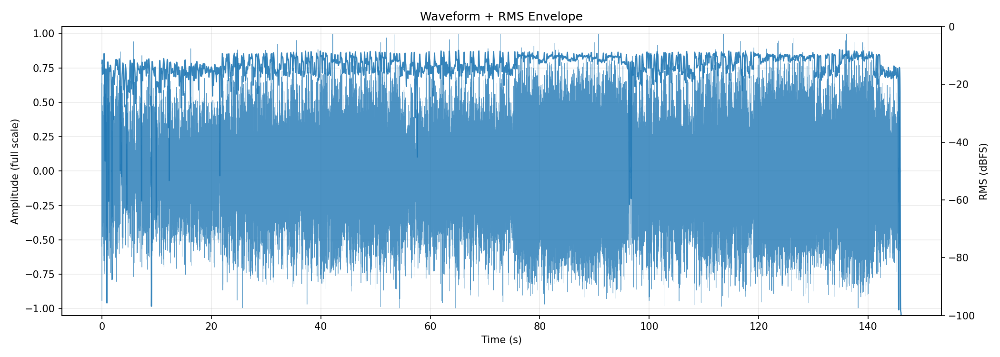
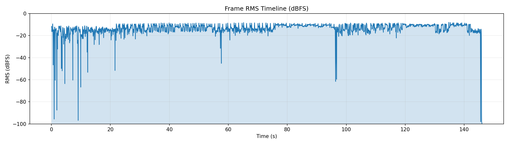
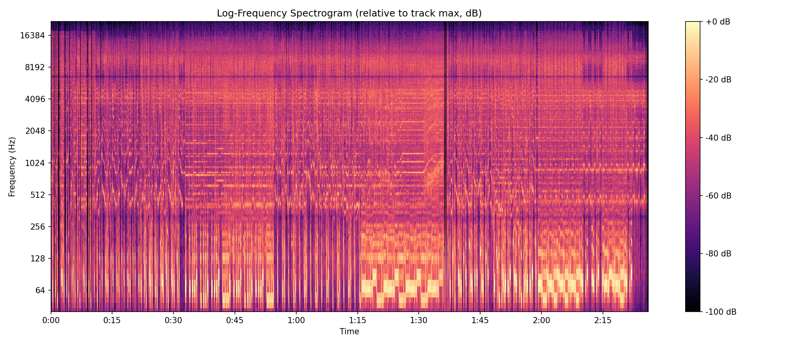
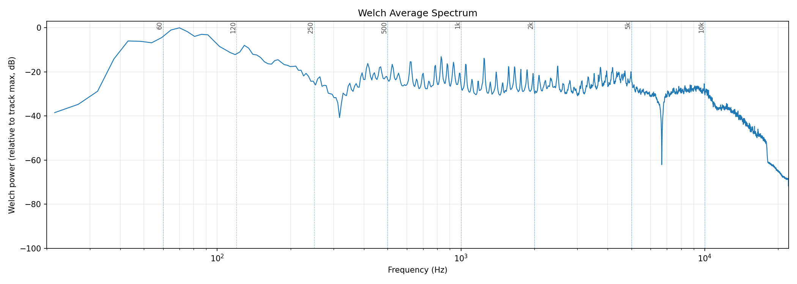
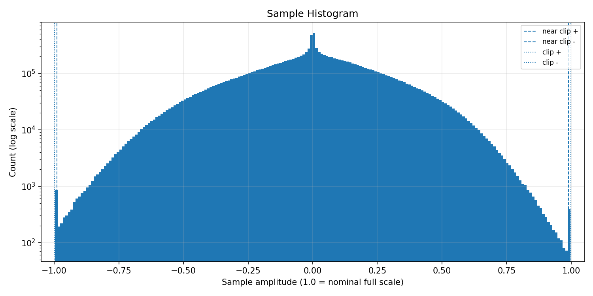
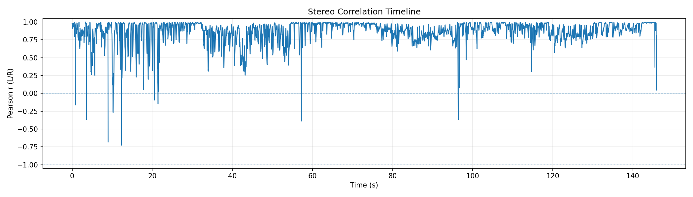
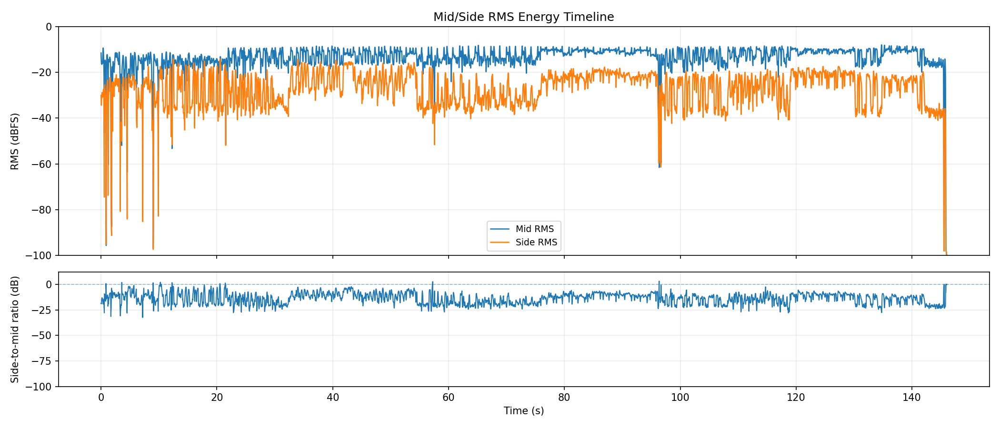
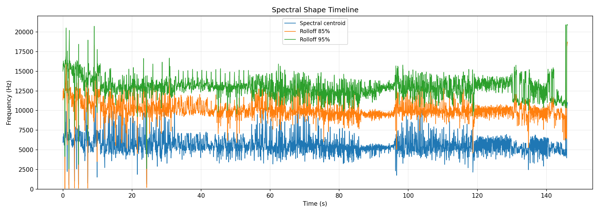
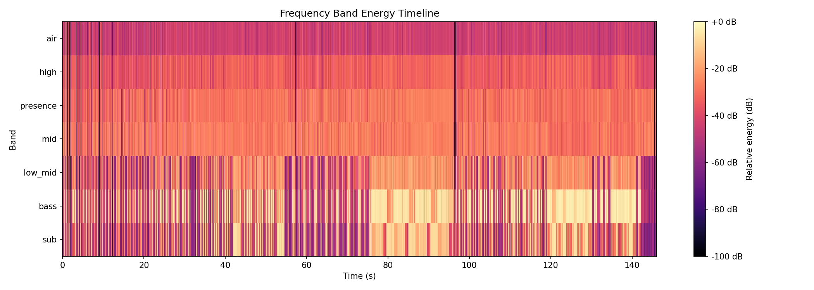
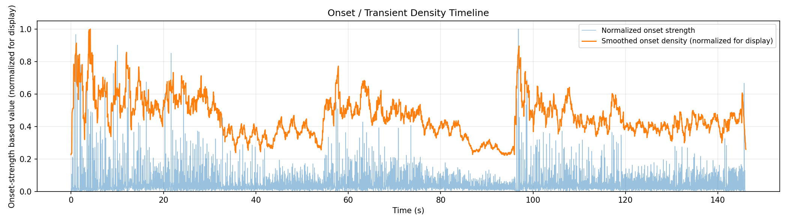

# AudioAtlas Report: Prompt_Architect__Toking_On_Tokens.wav

## File

- Duration: 146.07s (2:26)
- Sample rate: 44100 Hz
- Channels: 2
- Format: WAV / PCM_16

## Level metrics

| Metric | Value | Unit |
|---|---|---|
| Sample peak | -0.024 | dBFS |
| True-peak (approx.) | 1.176 | dBTP |
| RMS | -11.858 | dBFS |
| Crest factor | 11.834 | dB |
| Integrated loudness | -8.310 | LUFS |
| PLR (peak - LUFS) | 9.486 | dB |
| Clipped samples | 0 |  |
| Near-clipping | 1200 |  |

## Per-channel breakdown

| Metric | ch 0 | ch 1 | Unit |
|---|---|---|---|
| Sample peak | -0.024 | -0.024 | dBFS |
| True-peak (approx.) | 1.055 | 1.176 | dBTP |
| RMS | -12.004 | -11.717 | dBFS |
| DC offset | 0.000 | 0.000 |  |

## Frame RMS envelope summary

- frame_length: 4096
- hop_length: 1024
- frames: 6291
- rms_dbfs_min: -100.000
- rms_dbfs_max: -7.952
- rms_dbfs_mean: -13.463

## Average spectrum summary

Relative dB plots use track max = 0 dB and are not calibrated dBFS.

- nperseg: 8192
- bins: 4097
- strongest_bin_hz: 69.983
- strongest_bin_db: 0.000
- strongest_band: bass

## Band energy summary

| Band | Range | Energy |
|---|---|---|
| sub | 20.000-60.000 Hz | -8.579 dB relative |
| bass | 60.000-120.000 Hz | -3.878 dB relative |
| low_mid | 120.000-350.000 Hz | -16.895 dB relative |
| mid | 350.000-2000.000 Hz | -22.915 dB relative |
| presence | 2000.000-5000.000 Hz | -24.056 dB relative |
| high | 5000.000-10000.000 Hz | -28.852 dB relative |
| air | 10000.000-20000.000 Hz | -38.338 dB relative |

## Spectral shape summary

- n_fft: 4096
- hop_length: 1024
- frames: 6291
- valid_frames: 6291
- undefined_frames: 0
- centroid_mean_hz: 5596.223
- centroid_median_hz: 5427.667
- centroid_min_hz: 533.265
- centroid_max_hz: 11040.844
- rolloff_85_median_hz: 9937.573
- rolloff_95_median_hz: 12984.521
- bandwidth_median_hz: 4106.899
- centroid_elevated_threshold_hz: 8141.501
- centroid_reduced_threshold_hz: 2713.834
- centroid_large_shift_threshold_hz: 4070.750
- centroid_elevated_ranges: 74
- centroid_reduced_ranges: 15
- centroid_large_shift_ranges: 12

## Band energy timeline summary

Relative dB values use this analysis view's maximum as 0 dB and are not calibrated dBFS.

- frames: 6291
- valid_frames: 6291
- strongest_band_by_median: bass

| Band | Median | Mean | Min | Max |
|---|---|---|---|---|
| sub | -30.550 | -32.623 | -100.000 | -1.770 |
| bass | -17.318 | -24.151 | -100.000 | 0.000 |
| low_mid | -26.245 | -32.153 | -100.000 | -8.681 |
| mid | -27.442 | -29.452 | -100.000 | -16.588 |
| presence | -29.080 | -30.577 | -100.000 | -21.297 |
| high | -33.968 | -35.346 | -100.000 | -25.129 |
| air | -44.018 | -44.925 | -100.000 | -31.147 |

## Onset / transient density summary

- hop_length: 1024
- frames: 6291
- smoothing_window_seconds: 1.000
- smoothing_window_frames: 43
- onset_strength_mean: 1.811
- onset_strength_median: 1.006
- onset_strength_max: 35.312
- onset_density_mean: 1.809
- onset_density_median: 1.755
- onset_density_max: 3.959
- high_onset_density_threshold: 2.633
- high_onset_density_ranges: 29
- strongest_onset_density_time: 4.180

## Stereo correlation summary

- frame_length: 4096
- hop_length: 1024
- frames: 6291
- defined_frames: 6273
- undefined_frames: 18
- correlation_min: -0.729
- correlation_max: 1.000
- correlation_mean: 0.866
- correlation_median: 0.907
- overall_correlation: 0.855
- correlation_below_0_ranges: 10
- correlation_below_0_3_ranges: 19
- warning: one or more frames are below correlation_min_rms_dbfs; correlation is undefined

## Mid/side energy summary

- frame_length: 4096
- hop_length: 1024
- frames: 6291
- mid_rms_dbfs_min: -100.000
- mid_rms_dbfs_max: -7.952
- mid_rms_dbfs_mean: -13.490
- side_rms_dbfs_min: -100.000
- side_rms_dbfs_max: -14.101
- side_rms_dbfs_mean: -27.187
- side_to_mid_ratio_db_median: -12.953
- side_to_mid_ratio_db_mean: -13.697
- undefined_ratio_frames: 0
- side_to_mid_ratio_above_minus_6_ranges: 66

## Findings

Findings are prioritized factual observations. Some lower-priority observations may be omitted from this report.
Long lists of time ranges are summarized here; see findings.json for full machine-readable details.

### Approximate true peak is above 0 dBTP

- Severity: warning
- Category: levels
- Measured value: 1.176 dBTP
- Threshold: 0.000
- Evidence: true_peak_dbtp measured 1.176 dBTP.
- Why it matters: Samples reconstructed by downstream playback or encoding can exceed nominal full scale when true peak is above 0 dBTP.
- Suggested checks:
  - Check a dedicated true-peak meter if this file will be encoded or limited.
  - Inspect the loudest passage for inter-sample peak behavior.
- Confidence: medium

### Near-full-scale samples detected

- Severity: warning
- Category: levels
- Measured value: 1200 samples
- Threshold: 0
- Evidence: near_clipping_samples measured 1200.
- Why it matters: Samples near full scale can indicate limited headroom, even when no sample reaches the clipping threshold.
- Suggested checks:
  - Inspect the sample histogram and peak values.
  - Check whether near-full-scale samples cluster in a specific passage.
- Time ranges: 248 regions, total 47.624s, longest 1.347s.
- First range: 0.000s-0.023s
- Last range: 142.408s-142.501s
- Showing first 8:
  - 0.000s-0.023s
  - 0.348s-0.441s
  - 5.526s-5.619s
  - 8.475s-8.568s
  - 11.285s-11.378s
  - 13.235s-13.328s
  - 16.184s-16.277s
  - 19.365s-19.482s
  - ...and 240 more range(s); see findings.json for full details.
- Confidence: high

### Minimum L/R correlation is below 0

- Severity: warning
- Category: stereo
- Measured value: -0.729 Pearson r
- Threshold: 0.000
- Evidence: correlation_min measured -0.729.
- Why it matters: Negative L/R correlation can indicate phase-inverted content in at least part of the measured timeline.
- Suggested checks:
  - Inspect the stereo correlation plot around the low-correlation region.
  - Listen in mono around these regions if mono compatibility matters.
- Confidence: medium

### Integrated loudness is above -10 LUFS

- Severity: info
- Category: levels
- Measured value: -8.310 LUFS
- Threshold: -10.000
- Evidence: integrated_lufs measured -8.310 LUFS.
- Why it matters: Integrated LUFS is a whole-track loudness measurement; values above -10 LUFS indicate a high measured loudness for this file.
- Suggested checks:
  - Compare this measured loudness with the intended delivery context.
  - Check PLR and waveform/RMS plots for additional context.
- Confidence: high

### L/R correlation falls below 0.3 in some regions

- Severity: info
- Category: stereo
- Measured value: 1 regions
- Threshold: 0.300
- Evidence: 1 time range(s) have frame correlation below 0.3.
- Why it matters: Low L/R correlation marks regions where the two channels are less similar by this measurement.
- Suggested checks:
  - Inspect the stereo correlation plot around these regions.
  - Listen in mono around these regions if mono compatibility matters.
- Time ranges: 1 regions, total 0.418s, longest 0.418s.
- First range: 10.031s-10.449s
- Last range: 10.031s-10.449s
- Showing first 1:
  - 10.031s-10.449s
- Confidence: medium

### Multiple band-energy changes detected

- Severity: info
- Category: spectrum
- Measured value: 3 band observations
- Threshold: 1
- Evidence: Affected bands after duration and energy filters: sub elevated, bass elevated, low_mid elevated.
- Why it matters: This groups broad frequency-band changes that crossed relative track-level thresholds.
- Suggested checks:
  - Inspect the frequency band energy timeline around the listed regions.
  - Check whether arrangement, source content, or processing changes align with these regions.
- Time ranges: 36 regions, total 59.234s, longest 4.551s.
- First range: 41.912s-43.955s
- Last range: 85.171s-86.053s
- Showing first 8:
  - 41.912s-43.955s
  - 52.709s-54.590s
  - 75.952s-78.274s
  - 79.644s-84.196s
  - 85.055s-89.072s
  - 90.442s-94.459s
  - 119.885s-121.440s
  - 122.462s-123.855s
  - ...and 28 more range(s); see findings.json for full details.
- Confidence: medium

### Onset density is elevated relative to this track's median

- Severity: info
- Category: dynamics
- Measured value: 1.755 onset strength
- Threshold: 2.633
- Evidence: onset_density_median measured 1.755; 9 time range(s) exceed the relative threshold.
- Why it matters: This marks regions with higher onset-strength activity by a relative track-level heuristic.
- Suggested checks:
  - Check whether these sections feel rhythmically dense or transient-heavy.
  - Inspect drums, strums, plucks, consonants, or percussive elements in these regions.
- Time ranges: 9 regions, total 6.037s, longest 1.254s.
- First range: 0.534s-1.277s
- Last range: 98.197s-98.476s
- Showing first 8:
  - 0.534s-1.277s
  - 1.625s-2.461s
  - 3.553s-4.807s
  - 11.889s-12.701s
  - 14.443s-14.930s
  - 23.870s-24.172s
  - 57.377s-57.887s
  - 96.525s-97.338s
  - ...and 1 more range(s); see findings.json for full details.
- Confidence: medium

## Plots

### Waveform + RMS Envelope

### Frame RMS Timeline

### Log-Frequency Spectrogram

### Welch Average Spectrum

### Sample Histogram

### Stereo Correlation Timeline

### Mid/Side Energy Timeline

### Spectral Shape Timeline

### Frequency Band Energy Timeline

### Onset / Transient Density Timeline

## Human notes

- Observations:
- EQ ideas:
- Dynamics notes:
- Stereo/image notes: