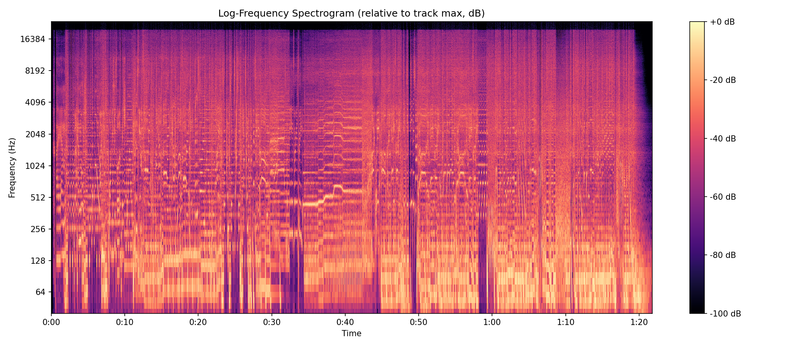
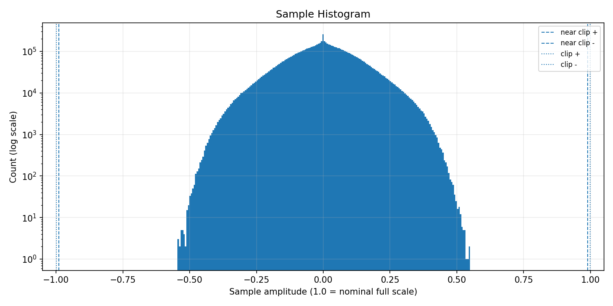
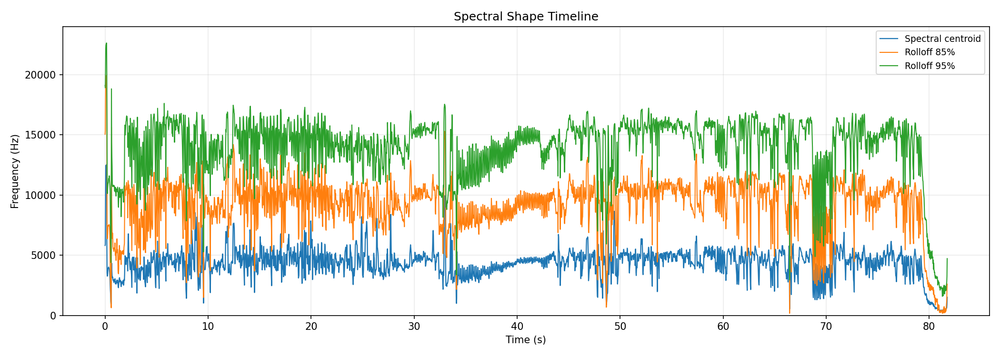

# AudioAtlas Report: aster.wav

## File

- Duration: 81.76s (1:22)
- Sample rate: 48000 Hz
- Channels: 2
- Format: WAV / PCM_16

## Level metrics

| Metric | Value | Unit |
|---|---|---|
| Sample peak | -5.203 | dBFS |
| True-peak (approx.) | -5.099 | dBTP |
| RMS | -17.879 | dBFS |
| Crest factor | 12.677 | dB |
| Integrated loudness | -15.194 | LUFS |
| PLR (peak - LUFS) | 10.095 | dB |
| Clipped samples | 0 |  |
| Near-clipping | 0 |  |

## Per-channel breakdown

| Metric | ch 0 | ch 1 | Unit |
|---|---|---|---|
| Sample peak | -5.267 | -5.203 | dBFS |
| True-peak (approx.) | -5.213 | -5.099 | dBTP |
| RMS | -17.956 | -17.804 | dBFS |
| DC offset | 0.000 | 0.000 |  |

## Frame RMS envelope summary

- frame_length: 4096
- hop_length: 1024
- frames: 3833
- rms_dbfs_min: -100.000
- rms_dbfs_max: -12.182
- rms_dbfs_mean: -19.457

## Average spectrum summary

Relative dB plots use track max = 0 dB and are not calibrated dBFS.

- nperseg: 8192
- bins: 4097
- strongest_bin_hz: 87.891
- strongest_bin_db: 0.000
- strongest_band: bass

## Band energy summary

| Band | Range | Energy |
|---|---|---|
| sub | 20.000-60.000 Hz | -4.152 dB relative |
| bass | 60.000-120.000 Hz | -2.523 dB relative |
| low_mid | 120.000-350.000 Hz | -10.129 dB relative |
| mid | 350.000-2000.000 Hz | -18.171 dB relative |
| presence | 2000.000-5000.000 Hz | -24.559 dB relative |
| high | 5000.000-10000.000 Hz | -32.153 dB relative |
| air | 10000.000-20000.000 Hz | -40.064 dB relative |

## Spectral shape summary

- n_fft: 4096
- hop_length: 1024
- frames: 3833
- valid_frames: 3833
- undefined_frames: 0
- centroid_mean_hz: 4325.123
- centroid_median_hz: 4455.316
- centroid_min_hz: 333.712
- centroid_max_hz: 12538.116
- rolloff_85_median_hz: 9667.969
- rolloff_95_median_hz: 14648.438
- bandwidth_median_hz: 4614.440
- centroid_elevated_threshold_hz: 6682.974
- centroid_reduced_threshold_hz: 2227.658
- centroid_large_shift_threshold_hz: 3341.487
- centroid_elevated_ranges: 28
- centroid_reduced_ranges: 30
- centroid_large_shift_ranges: 9

## Band energy timeline summary

Relative dB values use this analysis view's maximum as 0 dB and are not calibrated dBFS.

- frames: 3833
- valid_frames: 3833
- strongest_band_by_median: bass

| Band | Median | Mean | Min | Max |
|---|---|---|---|---|
| sub | -24.078 | -27.823 | -100.000 | -0.611 |
| bass | -16.969 | -21.489 | -100.000 | 0.000 |
| low_mid | -21.881 | -23.474 | -100.000 | -7.617 |
| mid | -27.625 | -29.819 | -100.000 | -19.725 |
| presence | -34.131 | -36.119 | -100.000 | -24.440 |
| high | -42.683 | -44.696 | -100.000 | -30.533 |
| air | -50.739 | -53.009 | -100.000 | -39.775 |

## Onset / transient density summary

- hop_length: 1024
- frames: 3833
- smoothing_window_seconds: 1.000
- smoothing_window_frames: 47
- onset_strength_mean: 1.477
- onset_strength_median: 0.709
- onset_strength_max: 29.076
- onset_density_mean: 1.475
- onset_density_median: 1.414
- onset_density_max: 3.417
- high_onset_density_threshold: 2.121
- high_onset_density_ranges: 17
- strongest_onset_density_time: 2.987

## Stereo correlation summary

- frame_length: 4096
- hop_length: 1024
- frames: 3833
- defined_frames: 3828
- undefined_frames: 5
- correlation_min: -0.760
- correlation_max: 1.000
- correlation_mean: 0.872
- correlation_median: 0.933
- overall_correlation: 0.900
- correlation_below_0_ranges: 5
- correlation_below_0_3_ranges: 9
- warning: one or more frames are below correlation_min_rms_dbfs; correlation is undefined

## Mid/side energy summary

- frame_length: 4096
- hop_length: 1024
- frames: 3833
- mid_rms_dbfs_min: -100.000
- mid_rms_dbfs_max: -12.182
- mid_rms_dbfs_mean: -19.446
- side_rms_dbfs_min: -100.000
- side_rms_dbfs_max: -22.609
- side_rms_dbfs_mean: -35.252
- side_to_mid_ratio_db_median: -14.521
- side_to_mid_ratio_db_mean: -15.809
- undefined_ratio_frames: 0
- side_to_mid_ratio_above_minus_6_ranges: 41

## Findings

Findings are prioritized factual observations. Some lower-priority observations may be omitted from this report.
Long lists of time ranges are summarized here; see findings.json for full machine-readable details.

### Minimum L/R correlation is below 0

- Severity: warning
- Category: stereo
- Measured value: -0.760 Pearson r
- Threshold: 0.000
- Evidence: correlation_min measured -0.760.
- Why it matters: Negative L/R correlation can indicate phase-inverted content in at least part of the measured timeline.
- Suggested checks:
  - Inspect the stereo correlation plot around the low-correlation region.
  - Listen in mono around these regions if mono compatibility matters.
- Confidence: medium

### L/R correlation falls below 0.3 in some regions

- Severity: info
- Category: stereo
- Measured value: 1 regions
- Threshold: 0.300
- Evidence: 1 time range(s) have frame correlation below 0.3.
- Why it matters: Low L/R correlation marks regions where the two channels are less similar by this measurement.
- Suggested checks:
  - Inspect the stereo correlation plot around these regions.
  - Listen in mono around these regions if mono compatibility matters.
- Time ranges: 1 regions, total 0.512s, longest 0.512s.
- First range: 81.259s-81.771s
- Last range: 81.259s-81.771s
- Showing first 1:
  - 81.259s-81.771s
- Confidence: medium

### Spectral centroid is reduced relative to this track's median

- Severity: info
- Category: spectrum
- Measured value: 4455.316 Hz
- Threshold: 2227.658
- Evidence: centroid_median_hz measured 4455.316 Hz; 1 time range(s) fall below the relative threshold.
- Why it matters: Spectral centroid is a frequency-distribution statistic; reduced regions indicate the centroid is lower than this track's median by the configured heuristic.
- Suggested checks:
  - Inspect EQ, arrangement density, instrumentation, or source changes in these regions.
  - Check whether these sections sound less high-frequency-weighted; centroid is only a proxy.
- Time ranges: 1 regions, total 2.240s, longest 2.240s.
- First range: 79.531s-81.771s
- Last range: 79.531s-81.771s
- Showing first 1:
  - 79.531s-81.771s
- Confidence: medium

### Multiple band-energy changes detected

- Severity: info
- Category: spectrum
- Measured value: 4 band observations
- Threshold: 1
- Evidence: Affected bands after duration and energy filters: sub elevated, bass elevated, high reduced, air reduced.
- Why it matters: This groups broad frequency-band changes that crossed relative track-level thresholds.
- Suggested checks:
  - Inspect the frequency band energy timeline around the listed regions.
  - Check whether arrangement, source content, or processing changes align with these regions.
- Time ranges: 18 regions, total 16.149s, longest 2.240s.
- First range: 29.141s-29.781s
- Last range: 79.531s-81.771s
- Showing first 8:
  - 29.141s-29.781s
  - 47.595s-48.256s
  - 54.101s-54.741s
  - 56.640s-58.112s
  - 61.803s-62.400s
  - 62.464s-63.061s
  - 67.243s-67.947s
  - 68.011s-68.651s
  - ...and 10 more range(s); see findings.json for full details.
- Confidence: medium

### Onset density is elevated relative to this track's median

- Severity: info
- Category: dynamics
- Measured value: 1.414 onset strength
- Threshold: 2.121
- Evidence: onset_density_median measured 1.414; 6 time range(s) exceed the relative threshold.
- Why it matters: This marks regions with higher onset-strength activity by a relative track-level heuristic.
- Suggested checks:
  - Check whether these sections feel rhythmically dense or transient-heavy.
  - Inspect drums, strums, plucks, consonants, or percussive elements in these regions.
- Time ranges: 6 regions, total 4.672s, longest 1.323s.
- First range: 2.197s-3.520s
- Last range: 66.197s-67.072s
- Showing first 6:
  - 2.197s-3.520s
  - 5.312s-6.485s
  - 25.003s-25.344s
  - 33.899s-34.176s
  - 49.045s-49.728s
  - 66.197s-67.072s
- Confidence: medium

## Plots

### Waveform + RMS Envelope

### Frame RMS Timeline

### Log-Frequency Spectrogram

### Welch Average Spectrum

### Sample Histogram

### Stereo Correlation Timeline

### Mid/Side Energy Timeline

### Spectral Shape Timeline

### Frequency Band Energy Timeline

### Onset / Transient Density Timeline

## Human notes

- Observations:
- EQ ideas:
- Dynamics notes:
- Stereo/image notes: