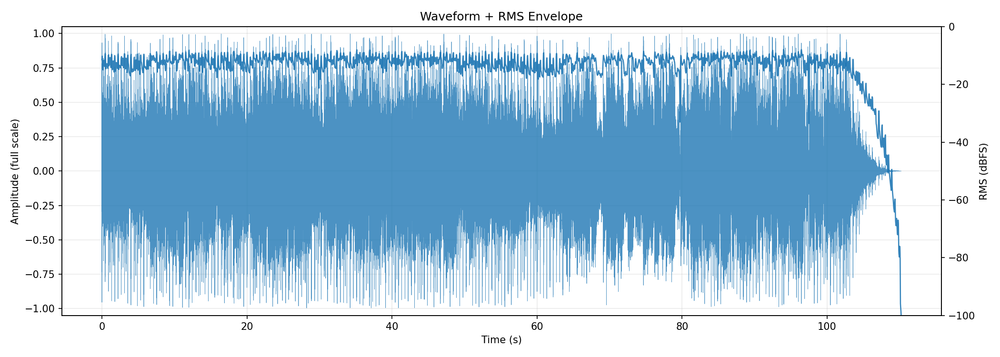
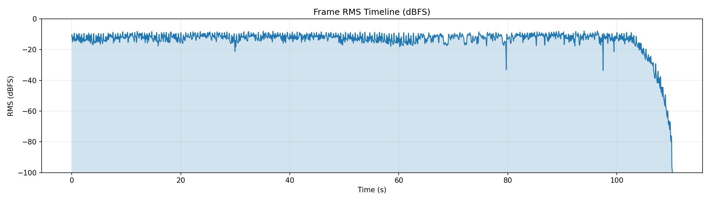
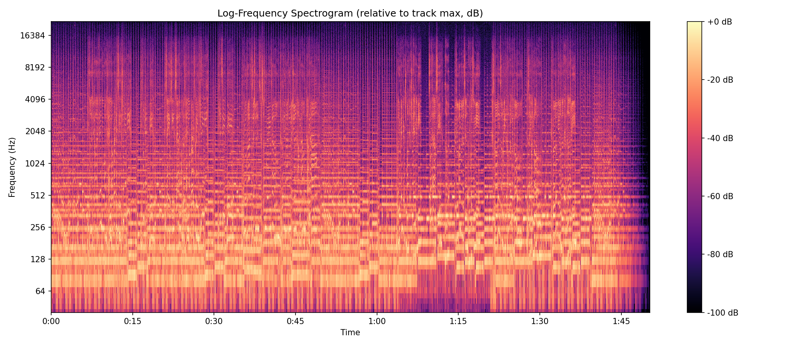
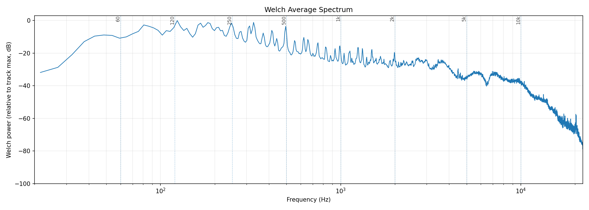
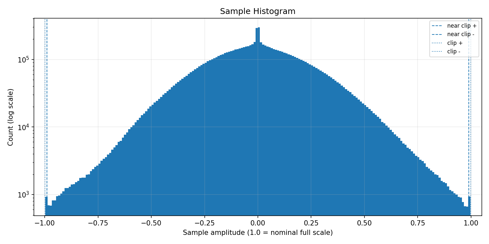
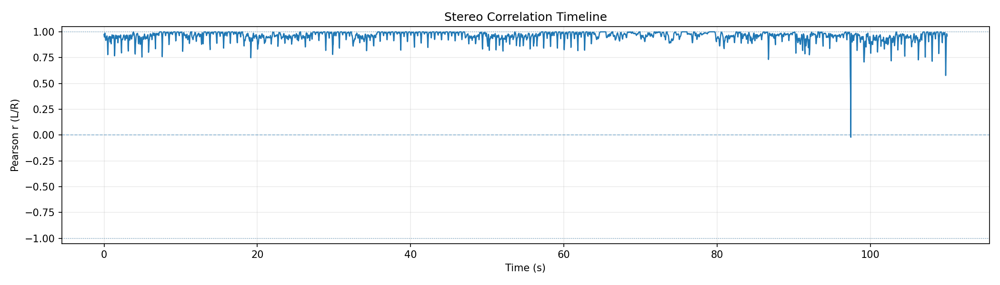
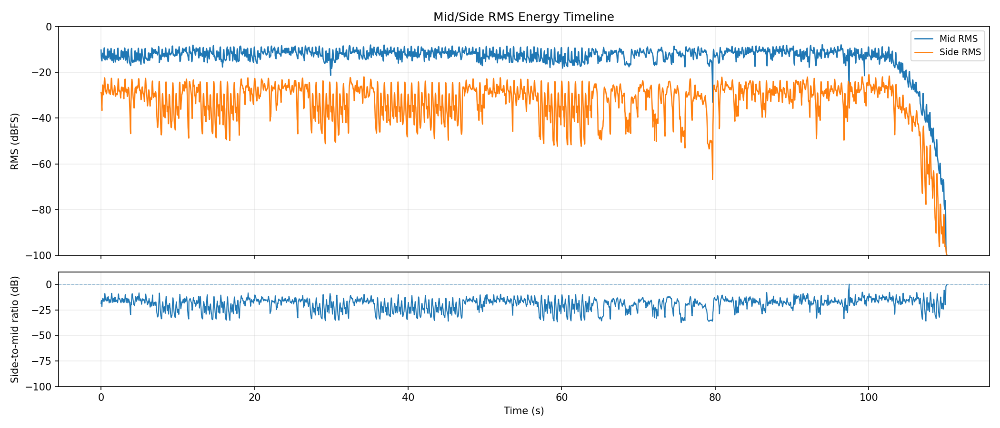
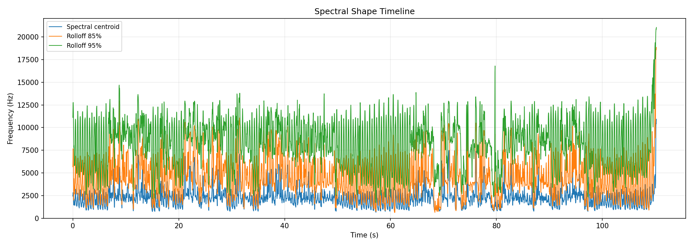
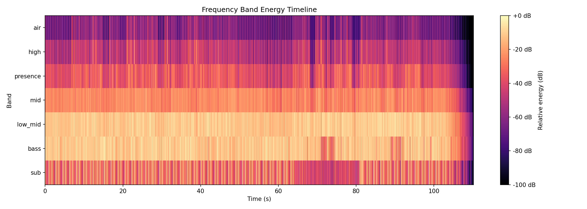
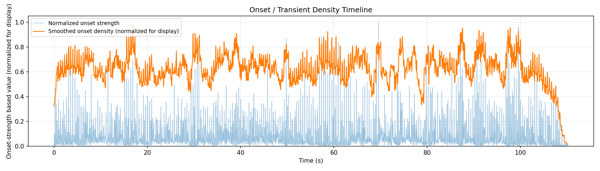

# AudioAtlas Report: birdcansing.wav

## File

- Duration: 110.22s (1:50)
- Sample rate: 44100 Hz
- Channels: 2
- Format: WAV / PCM_16

## Level metrics

| Metric | Value | Unit |
|---|---|---|
| Sample peak | -0.024 | dBFS |
| True-peak (approx.) | 0.170 | dBTP |
| RMS | -11.829 | dBFS |
| Crest factor | 11.804 | dB |
| Integrated loudness | -9.250 | LUFS |
| PLR (peak - LUFS) | 9.420 | dB |
| Clipped samples | 0 |  |
| Near-clipping | 1540 |  |

## Per-channel breakdown

| Metric | ch 0 | ch 1 | Unit |
|---|---|---|---|
| Sample peak | -0.024 | -0.024 | dBFS |
| True-peak (approx.) | 0.170 | 0.152 | dBTP |
| RMS | -12.018 | -11.648 | dBFS |
| DC offset | 0.000 | -0.000 |  |

## Frame RMS envelope summary

- frame_length: 4096
- hop_length: 1024
- frames: 4747
- rms_dbfs_min: -99.886
- rms_dbfs_max: -7.875
- rms_dbfs_mean: -13.703

## Average spectrum summary

Relative dB plots use track max = 0 dB and are not calibrated dBFS.

- nperseg: 8192
- bins: 4097
- strongest_bin_hz: 123.816
- strongest_bin_db: 0.000
- strongest_band: low_mid

## Band energy summary

| Band | Range | Energy |
|---|---|---|
| sub | 20.000-60.000 Hz | -11.962 dB relative |
| bass | 60.000-120.000 Hz | -5.612 dB relative |
| low_mid | 120.000-350.000 Hz | -5.133 dB relative |
| mid | 350.000-2000.000 Hz | -18.368 dB relative |
| presence | 2000.000-5000.000 Hz | -27.516 dB relative |
| high | 5000.000-10000.000 Hz | -34.651 dB relative |
| air | 10000.000-20000.000 Hz | -47.733 dB relative |

## Spectral shape summary

- n_fft: 4096
- hop_length: 1024
- frames: 4747
- valid_frames: 4747
- undefined_frames: 0
- centroid_mean_hz: 2246.523
- centroid_median_hz: 2151.496
- centroid_min_hz: 669.210
- centroid_max_hz: 10924.322
- rolloff_85_median_hz: 4112.842
- rolloff_95_median_hz: 8753.247
- bandwidth_median_hz: 2990.003
- centroid_elevated_threshold_hz: 3227.244
- centroid_reduced_threshold_hz: 1075.748
- centroid_large_shift_threshold_hz: 2000.000
- centroid_elevated_ranges: 106
- centroid_reduced_ranges: 90
- centroid_large_shift_ranges: 13

## Band energy timeline summary

Relative dB values use this analysis view's maximum as 0 dB and are not calibrated dBFS.

- frames: 4747
- valid_frames: 4747
- strongest_band_by_median: low_mid

| Band | Median | Mean | Min | Max |
|---|---|---|---|---|
| sub | -32.279 | -31.806 | -100.000 | -5.128 |
| bass | -12.292 | -14.299 | -100.000 | 0.000 |
| low_mid | -11.815 | -13.016 | -100.000 | -2.953 |
| mid | -24.496 | -26.307 | -100.000 | -15.815 |
| presence | -36.553 | -38.579 | -100.000 | -22.212 |
| high | -47.446 | -49.694 | -100.000 | -23.301 |
| air | -61.482 | -63.309 | -100.000 | -35.399 |

## Onset / transient density summary

- hop_length: 1024
- frames: 4747
- smoothing_window_seconds: 1.000
- smoothing_window_frames: 43
- onset_strength_mean: 1.253
- onset_strength_median: 0.634
- onset_strength_max: 14.721
- onset_density_mean: 1.252
- onset_density_median: 1.259
- onset_density_max: 2.004
- high_onset_density_threshold: 1.889
- high_onset_density_ranges: 3
- strongest_onset_density_time: 16.927

## Stereo correlation summary

- frame_length: 4096
- hop_length: 1024
- frames: 4747
- defined_frames: 4739
- undefined_frames: 8
- correlation_min: -0.021
- correlation_max: 1.000
- correlation_mean: 0.959
- correlation_median: 0.969
- overall_correlation: 0.960
- correlation_below_0_ranges: 1
- correlation_below_0_3_ranges: 1
- warning: one or more frames are below correlation_min_rms_dbfs; correlation is undefined

## Mid/side energy summary

- frame_length: 4096
- hop_length: 1024
- frames: 4747
- mid_rms_dbfs_min: -100.000
- mid_rms_dbfs_max: -7.875
- mid_rms_dbfs_mean: -13.740
- side_rms_dbfs_min: -100.000
- side_rms_dbfs_max: -20.982
- side_rms_dbfs_mean: -33.057
- side_to_mid_ratio_db_median: -17.714
- side_to_mid_ratio_db_mean: -19.317
- undefined_ratio_frames: 0
- side_to_mid_ratio_above_minus_6_ranges: 3

## Findings

Findings are prioritized factual observations. Some lower-priority observations may be omitted from this report.
Long lists of time ranges are summarized here; see findings.json for full machine-readable details.

### Approximate true peak is above 0 dBTP

- Severity: warning
- Category: levels
- Measured value: 0.170 dBTP
- Threshold: 0.000
- Evidence: true_peak_dbtp measured 0.170 dBTP.
- Why it matters: Samples reconstructed by downstream playback or encoding can exceed nominal full scale when true peak is above 0 dBTP.
- Suggested checks:
  - Check a dedicated true-peak meter if this file will be encoded or limited.
  - Inspect the loudest passage for inter-sample peak behavior.
- Confidence: medium

### Near-full-scale samples detected

- Severity: warning
- Category: levels
- Measured value: 1540 samples
- Threshold: 0
- Evidence: near_clipping_samples measured 1540.
- Why it matters: Samples near full scale can indicate limited headroom, even when no sample reaches the clipping threshold.
- Suggested checks:
  - Inspect the sample histogram and peak values.
  - Check whether near-full-scale samples cluster in a specific passage.
- Time ranges: 232 regions, total 24.799s, longest 0.279s.
- First range: 0.000s-0.023s
- Last range: 102.980s-103.120s
- Showing first 8:
  - 0.000s-0.023s
  - 0.372s-0.464s
  - 0.813s-0.929s
  - 1.254s-1.347s
  - 1.695s-1.788s
  - 2.159s-2.252s
  - 2.601s-2.694s
  - 3.042s-3.135s
  - ...and 224 more range(s); see findings.json for full details.
- Confidence: high

### Minimum L/R correlation is below 0

- Severity: warning
- Category: stereo
- Measured value: -0.021 Pearson r
- Threshold: 0.000
- Evidence: correlation_min measured -0.021.
- Why it matters: Negative L/R correlation can indicate phase-inverted content in at least part of the measured timeline.
- Suggested checks:
  - Inspect the stereo correlation plot around the low-correlation region.
  - Listen in mono around these regions if mono compatibility matters.
- Confidence: medium

### Integrated loudness is above -10 LUFS

- Severity: info
- Category: levels
- Measured value: -9.250 LUFS
- Threshold: -10.000
- Evidence: integrated_lufs measured -9.250 LUFS.
- Why it matters: Integrated LUFS is a whole-track loudness measurement; values above -10 LUFS indicate a high measured loudness for this file.
- Suggested checks:
  - Compare this measured loudness with the intended delivery context.
  - Check PLR and waveform/RMS plots for additional context.
- Confidence: high

### Strongest average-spectrum bin is in the low-mid region

- Severity: info
- Category: spectrum
- Measured value: 123.816 Hz
- Threshold: 120
- Evidence: strongest_bin_hz measured 123.816 Hz.
- Why it matters: This identifies where the strongest Welch average-spectrum bin falls; it does not describe whether the balance is desirable.
- Suggested checks:
  - Inspect the average spectrum plot around 120-350 Hz.
  - Listen for which instruments or sources occupy that region.
- Confidence: medium

### Spectral centroid is elevated relative to this track's median

- Severity: info
- Category: spectrum
- Measured value: 2151.496 Hz
- Threshold: 3227.244
- Evidence: centroid_median_hz measured 2151.496 Hz; 6 time range(s) exceed the relative threshold.
- Why it matters: Spectral centroid is a frequency-distribution statistic; elevated regions indicate the centroid is higher than this track's median by the configured heuristic.
- Suggested checks:
  - Inspect EQ, arrangement density, cymbals, distortion, or vocal presence in these regions.
  - Check whether these sections sound brighter or denser; centroid is only a proxy.
- Time ranges: 6 regions, total 1.811s, longest 0.418s.
- First range: 12.214s-12.469s
- Last range: 109.807s-110.225s
- Showing first 6:
  - 12.214s-12.469s
  - 21.966s-22.221s
  - 22.848s-23.104s
  - 70.821s-71.192s
  - 77.555s-77.810s
  - 109.807s-110.225s
- Confidence: medium

### Spectral centroid is reduced relative to this track's median

- Severity: info
- Category: spectrum
- Measured value: 2151.496 Hz
- Threshold: 1075.748
- Evidence: centroid_median_hz measured 2151.496 Hz; 3 time range(s) fall below the relative threshold.
- Why it matters: Spectral centroid is a frequency-distribution statistic; reduced regions indicate the centroid is lower than this track's median by the configured heuristic.
- Suggested checks:
  - Inspect EQ, arrangement density, instrumentation, or source changes in these regions.
  - Check whether these sections sound less high-frequency-weighted; centroid is only a proxy.
- Time ranges: 3 regions, total 1.184s, longest 0.464s.
- First range: 68.476s-68.847s
- Last range: 79.180s-79.644s
- Showing first 3:
  - 68.476s-68.847s
  - 69.172s-69.521s
  - 79.180s-79.644s
- Confidence: medium

### Multiple band-energy changes detected

- Severity: info
- Category: spectrum
- Measured value: 4 band observations
- Threshold: 1
- Evidence: Affected bands after duration and energy filters: sub elevated, presence elevated, high reduced, air reduced.
- Why it matters: This groups broad frequency-band changes that crossed relative track-level thresholds.
- Suggested checks:
  - Inspect the frequency band energy timeline around the listed regions.
  - Check whether arrangement, source content, or processing changes align with these regions.
- Time ranges: 10 regions, total 12.446s, longest 3.901s.
- First range: 81.316s-81.920s
- Last range: 107.183s-110.225s
- Showing first 8:
  - 81.316s-81.920s
  - 13.978s-14.536s
  - 78.182s-78.855s
  - 95.806s-96.386s
  - 68.174s-69.079s
  - 79.180s-79.784s
  - 106.324s-110.225s
  - 68.220s-69.103s
  - ...and 2 more range(s); see findings.json for full details.
- Confidence: medium

## Plots

### Waveform + RMS Envelope

### Frame RMS Timeline

### Log-Frequency Spectrogram

### Welch Average Spectrum

### Sample Histogram

### Stereo Correlation Timeline

### Mid/Side Energy Timeline

### Spectral Shape Timeline

### Frequency Band Energy Timeline

### Onset / Transient Density Timeline

## Human notes

- Observations:
- EQ ideas:
- Dynamics notes:
- Stereo/image notes: