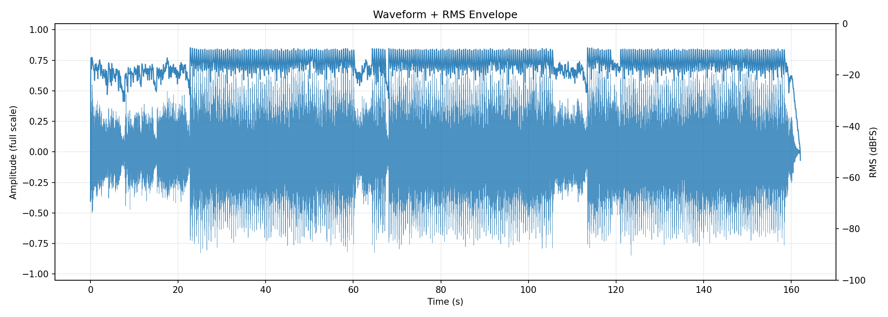
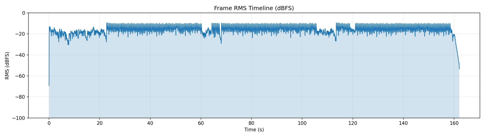
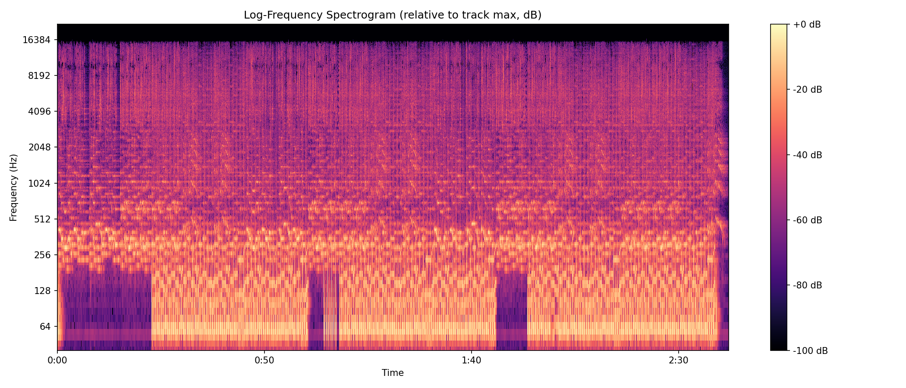
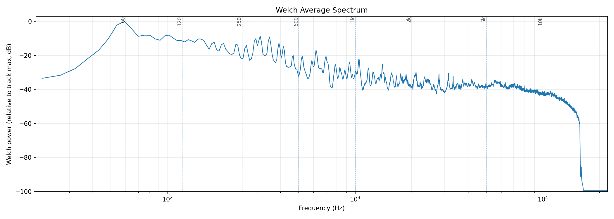
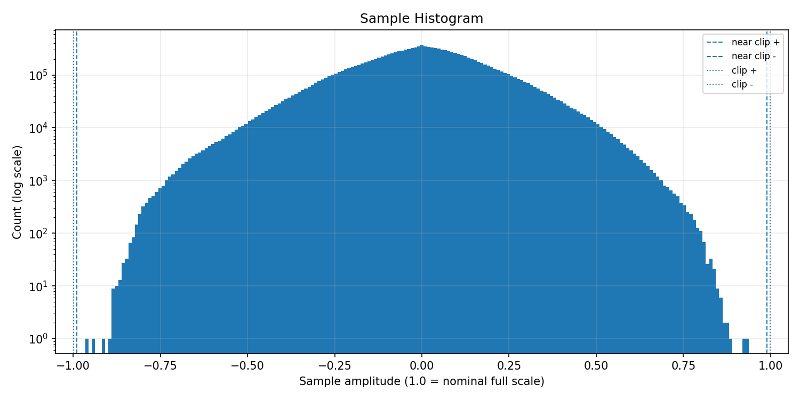
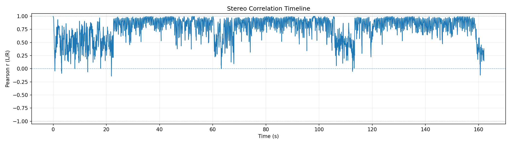
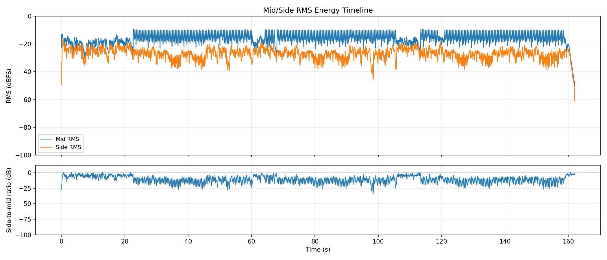
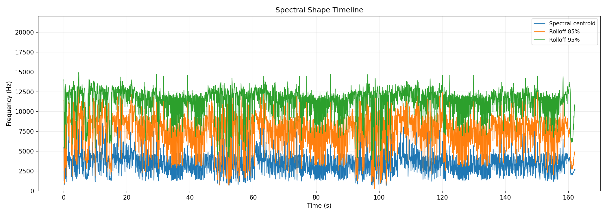
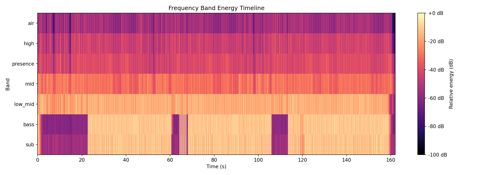
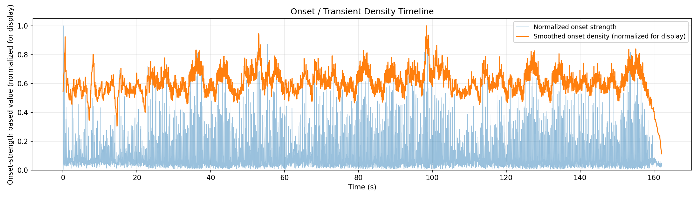

# AudioAtlas Report: bunnyparty.mp3

## File

- Duration: 162.05s (2:42)
- Sample rate: 44100 Hz
- Channels: 2
- Format: MP3 / MPEG_LAYER_III

## Level metrics

| Metric | Value | Unit |
|---|---|---|
| Sample peak | -0.304 | dBFS |
| True-peak (approx.) | -0.299 | dBTP |
| RMS | -14.353 | dBFS |
| Crest factor | 14.048 | dB |
| Integrated loudness | -12.679 | LUFS |
| PLR (peak - LUFS) | 12.380 | dB |
| Clipped samples | 0 |  |
| Near-clipping | 0 |  |

## Per-channel breakdown

| Metric | ch 0 | ch 1 | Unit |
|---|---|---|---|
| Sample peak | -0.484 | -0.304 | dBFS |
| True-peak (approx.) | -0.479 | -0.299 | dBTP |
| RMS | -14.264 | -14.443 | dBFS |
| DC offset | -0.000 | -0.000 |  |

## Frame RMS envelope summary

- frame_length: 4096
- hop_length: 1024
- frames: 6980
- rms_dbfs_min: -69.309
- rms_dbfs_max: -9.356
- rms_dbfs_mean: -16.113

## Average spectrum summary

Relative dB plots use track max = 0 dB and are not calibrated dBFS.

- nperseg: 8192
- bins: 4097
- strongest_bin_hz: 59.216
- strongest_bin_db: 0.000
- strongest_band: sub

## Band energy summary

| Band | Range | Energy |
|---|---|---|
| sub | 20.000-60.000 Hz | -6.635 dB relative |
| bass | 60.000-120.000 Hz | -8.564 dB relative |
| low_mid | 120.000-350.000 Hz | -13.679 dB relative |
| mid | 350.000-2000.000 Hz | -27.002 dB relative |
| presence | 2000.000-5000.000 Hz | -37.065 dB relative |
| high | 5000.000-10000.000 Hz | -38.873 dB relative |
| air | 10000.000-20000.000 Hz | -48.197 dB relative |

## Spectral shape summary

- n_fft: 4096
- hop_length: 1024
- frames: 6980
- valid_frames: 6980
- undefined_frames: 0
- centroid_mean_hz: 3391.722
- centroid_median_hz: 3351.297
- centroid_min_hz: 522.200
- centroid_max_hz: 8899.682
- rolloff_85_median_hz: 7795.020
- rolloff_95_median_hz: 11746.362
- bandwidth_median_hz: 3835.984
- centroid_elevated_threshold_hz: 5026.945
- centroid_reduced_threshold_hz: 1675.648
- centroid_large_shift_threshold_hz: 2513.472
- centroid_elevated_ranges: 138
- centroid_reduced_ranges: 172
- centroid_large_shift_ranges: 50

## Band energy timeline summary

Relative dB values use this analysis view's maximum as 0 dB and are not calibrated dBFS.

- frames: 6980
- valid_frames: 6980
- strongest_band_by_median: sub

| Band | Median | Mean | Min | Max |
|---|---|---|---|---|
| sub | -14.707 | -21.992 | -93.237 | -3.057 |
| bass | -14.907 | -22.404 | -97.050 | 0.000 |
| low_mid | -17.346 | -17.901 | -100.000 | -6.618 |
| mid | -29.849 | -30.337 | -99.868 | -19.095 |
| presence | -40.013 | -40.943 | -100.000 | -28.416 |
| high | -44.362 | -45.055 | -100.000 | -25.745 |
| air | -53.750 | -54.963 | -100.000 | -33.318 |

## Onset / transient density summary

- hop_length: 1024
- frames: 6980
- smoothing_window_seconds: 1.000
- smoothing_window_frames: 43
- onset_strength_mean: 1.444
- onset_strength_median: 0.786
- onset_strength_max: 14.834
- onset_density_mean: 1.441
- onset_density_median: 1.433
- onset_density_max: 2.408
- high_onset_density_threshold: 2.149
- high_onset_density_ranges: 6
- strongest_onset_density_time: 98.383

## Stereo correlation summary

- frame_length: 4096
- hop_length: 1024
- frames: 6979
- defined_frames: 6979
- undefined_frames: 0
- correlation_min: -0.143
- correlation_max: 0.999
- correlation_mean: 0.772
- correlation_median: 0.840
- overall_correlation: 0.852
- correlation_below_0_ranges: 10
- correlation_below_0_3_ranges: 77

## Mid/side energy summary

- frame_length: 4096
- hop_length: 1024
- frames: 6979
- mid_rms_dbfs_min: -60.414
- mid_rms_dbfs_max: -9.356
- mid_rms_dbfs_mean: -16.105
- side_rms_dbfs_min: -61.601
- side_rms_dbfs_max: -16.508
- side_rms_dbfs_mean: -27.051
- side_to_mid_ratio_db_median: -10.530
- side_to_mid_ratio_db_mean: -10.946
- undefined_ratio_frames: 0
- side_to_mid_ratio_above_minus_6_ranges: 131

## Findings

Findings are prioritized factual observations. Some lower-priority observations may be omitted from this report.
Long lists of time ranges are summarized here; see findings.json for full machine-readable details.

### Minimum L/R correlation is below 0

- Severity: warning
- Category: stereo
- Measured value: -0.143 Pearson r
- Threshold: 0.000
- Evidence: correlation_min measured -0.143.
- Why it matters: Negative L/R correlation can indicate phase-inverted content in at least part of the measured timeline.
- Suggested checks:
  - Inspect the stereo correlation plot around the low-correlation region.
  - Listen in mono around these regions if mono compatibility matters.
- Confidence: medium

### L/R correlation falls below 0.3 in some regions

- Severity: info
- Category: stereo
- Measured value: 3 regions
- Threshold: 0.300
- Evidence: 3 time range(s) have frame correlation below 0.3.
- Why it matters: Low L/R correlation marks regions where the two channels are less similar by this measurement.
- Suggested checks:
  - Inspect the stereo correlation plot around these regions.
  - Listen in mono around these regions if mono compatibility matters.
- Time ranges: 3 regions, total 0.859s, longest 0.325s.
- First range: 9.497s-9.822s
- Last range: 161.100s-161.355s
- Showing first 3:
  - 9.497s-9.822s
  - 160.450s-160.729s
  - 161.100s-161.355s
- Confidence: medium

### Spectral centroid is reduced relative to this track's median

- Severity: info
- Category: spectrum
- Measured value: 3351.297 Hz
- Threshold: 1675.648
- Evidence: centroid_median_hz measured 3351.297 Hz; 1 time range(s) fall below the relative threshold.
- Why it matters: Spectral centroid is a frequency-distribution statistic; reduced regions indicate the centroid is lower than this track's median by the configured heuristic.
- Suggested checks:
  - Inspect EQ, arrangement density, instrumentation, or source changes in these regions.
  - Check whether these sections sound less high-frequency-weighted; centroid is only a proxy.
- Time ranges: 1 regions, total 0.441s, longest 0.441s.
- First range: 14.698s-15.139s
- Last range: 14.698s-15.139s
- Showing first 1:
  - 14.698s-15.139s
- Confidence: medium

### Multiple band-energy changes detected

- Severity: info
- Category: spectrum
- Measured value: 2 band observations
- Threshold: 1
- Evidence: Affected bands after duration and energy filters: high reduced, air reduced.
- Why it matters: This groups broad frequency-band changes that crossed relative track-level thresholds.
- Suggested checks:
  - Inspect the frequency band energy timeline around the listed regions.
  - Check whether arrangement, source content, or processing changes align with these regions.
- Time ranges: 6 regions, total 6.130s, longest 1.509s.
- First range: 6.966s-7.686s
- Last range: 160.612s-162.075s
- Showing first 6:
  - 6.966s-7.686s
  - 14.396s-15.139s
  - 160.566s-162.075s
  - 6.757s-7.663s
  - 14.373s-15.163s
  - 160.612s-162.075s
- Confidence: medium

## Plots

### Waveform + RMS Envelope

### Frame RMS Timeline

### Log-Frequency Spectrogram

### Welch Average Spectrum

### Sample Histogram

### Stereo Correlation Timeline

### Mid/Side Energy Timeline

### Spectral Shape Timeline

### Frequency Band Energy Timeline

### Onset / Transient Density Timeline

## Human notes

- Observations:
- EQ ideas:
- Dynamics notes:
- Stereo/image notes: