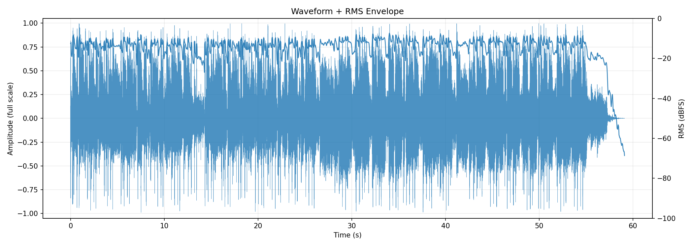
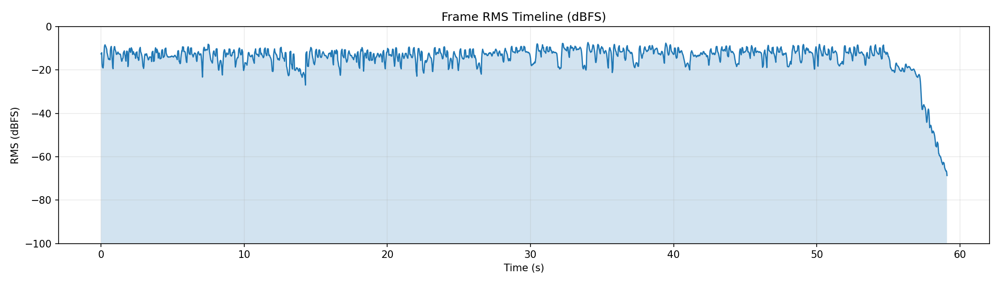
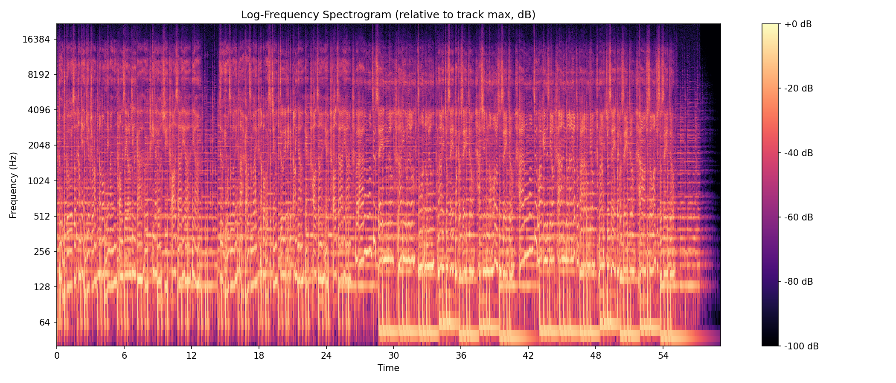
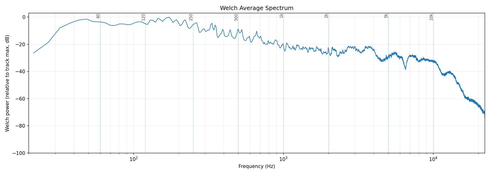
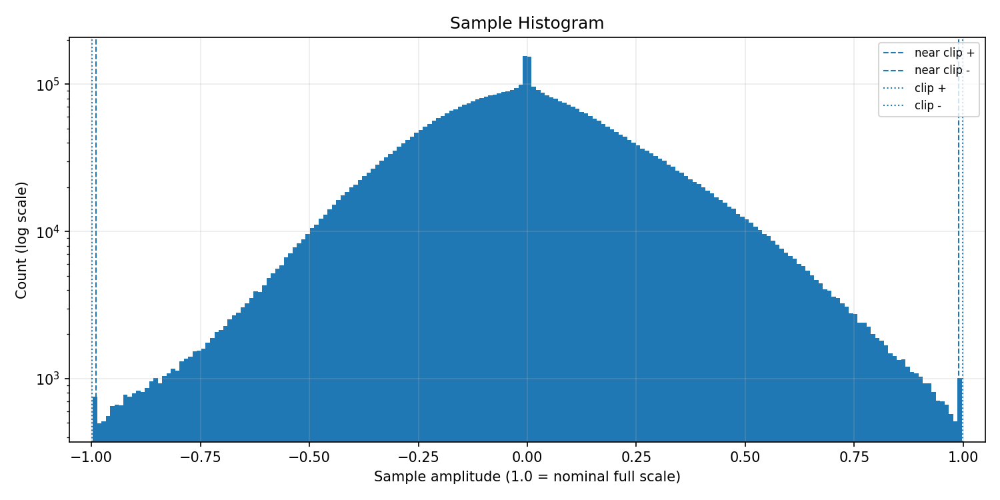
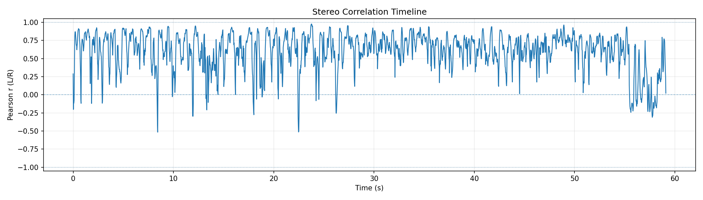
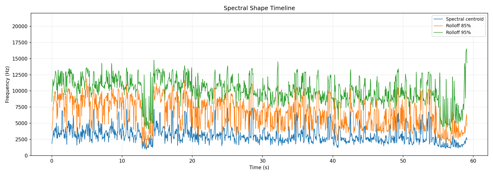

# AudioAtlas Report: dittoguitar.wav

## File

- Duration: 59.10s (0:59)
- Sample rate: 44100 Hz
- Channels: 2
- Format: WAV / PCM_16

## Level metrics

| Metric | Value | Unit |
|---|---|---|
| Sample peak | -0.024 | dBFS |
| True-peak (approx.) | 0.592 | dBTP |
| RMS | -11.707 | dBFS |
| Crest factor | 11.683 | dB |
| Integrated loudness | -9.107 | LUFS |
| PLR (peak - LUFS) | 9.699 | dB |
| Clipped samples | 0 |  |
| Near-clipping | 1482 |  |

## Per-channel breakdown

| Metric | ch 0 | ch 1 | Unit |
|---|---|---|---|
| Sample peak | -0.024 | -0.024 | dBFS |
| True-peak (approx.) | 0.592 | 0.551 | dBTP |
| RMS | -11.939 | -11.488 | dBFS |
| DC offset | -0.001 | -0.000 |  |

## Frame RMS envelope summary

- frame_length: 4096
- hop_length: 1024
- frames: 2546
- rms_dbfs_min: -68.663
- rms_dbfs_max: -7.327
- rms_dbfs_mean: -14.490

## Average spectrum summary

Relative dB plots use track max = 0 dB and are not calibrated dBFS.

- nperseg: 8192
- bins: 4097
- strongest_bin_hz: 172.266
- strongest_bin_db: 0.000
- strongest_band: low_mid

## Band energy summary

| Band | Range | Energy |
|---|---|---|
| sub | 20.000-60.000 Hz | -4.557 dB relative |
| bass | 60.000-120.000 Hz | -4.688 dB relative |
| low_mid | 120.000-350.000 Hz | -4.440 dB relative |
| mid | 350.000-2000.000 Hz | -17.963 dB relative |
| presence | 2000.000-5000.000 Hz | -24.900 dB relative |
| high | 5000.000-10000.000 Hz | -30.024 dB relative |
| air | 10000.000-20000.000 Hz | -42.032 dB relative |

## Spectral shape summary

- n_fft: 4096
- hop_length: 1024
- frames: 2546
- valid_frames: 2546
- undefined_frames: 0
- centroid_mean_hz: 3106.183
- centroid_median_hz: 2854.704
- centroid_min_hz: 907.478
- centroid_max_hz: 7388.485
- rolloff_85_median_hz: 6944.458
- rolloff_95_median_hz: 10228.271
- bandwidth_median_hz: 3458.008
- centroid_elevated_threshold_hz: 4282.056
- centroid_reduced_threshold_hz: 1427.352
- centroid_large_shift_threshold_hz: 2141.028
- centroid_elevated_ranges: 83
- centroid_reduced_ranges: 27
- centroid_large_shift_ranges: 9

## Band energy timeline summary

Relative dB values use this analysis view's maximum as 0 dB and are not calibrated dBFS.

- frames: 2546
- valid_frames: 2546
- strongest_band_by_median: low_mid

| Band | Median | Mean | Min | Max |
|---|---|---|---|---|
| sub | -17.218 | -22.584 | -62.189 | -4.719 |
| bass | -22.209 | -22.044 | -84.458 | 0.000 |
| low_mid | -11.922 | -14.342 | -74.932 | -3.721 |
| mid | -26.268 | -27.873 | -90.881 | -16.976 |
| presence | -34.162 | -36.169 | -100.000 | -21.558 |
| high | -42.849 | -44.406 | -100.000 | -22.207 |
| air | -55.137 | -56.477 | -100.000 | -35.551 |

## Onset / transient density summary

- hop_length: 1024
- frames: 2546
- smoothing_window_seconds: 1.000
- smoothing_window_frames: 43
- onset_strength_mean: 1.286
- onset_strength_median: 0.883
- onset_strength_max: 11.107
- onset_density_mean: 1.284
- onset_density_median: 1.297
- onset_density_max: 1.947
- high_onset_density_threshold: 1.946
- high_onset_density_ranges: 1
- strongest_onset_density_time: 14.164

## Stereo correlation summary

- frame_length: 4096
- hop_length: 1024
- frames: 2546
- defined_frames: 2546
- undefined_frames: 0
- correlation_min: -0.516
- correlation_max: 0.977
- correlation_mean: 0.601
- correlation_median: 0.656
- overall_correlation: 0.643
- correlation_below_0_ranges: 24
- correlation_below_0_3_ranges: 63

## Mid/side energy summary

- frame_length: 4096
- hop_length: 1024
- frames: 2546
- mid_rms_dbfs_min: -75.392
- mid_rms_dbfs_max: -7.327
- mid_rms_dbfs_mean: -14.538
- side_rms_dbfs_min: -75.787
- side_rms_dbfs_max: -13.451
- side_rms_dbfs_mean: -21.292
- side_to_mid_ratio_db_median: -6.758
- side_to_mid_ratio_db_mean: -6.754
- undefined_ratio_frames: 0
- side_to_mid_ratio_above_minus_6_ranges: 148

## Findings

Findings are prioritized factual observations. Some lower-priority observations may be omitted from this report.
Long lists of time ranges are summarized here; see findings.json for full machine-readable details.
1 lower-priority finding(s) suppressed; see findings.json for details.

### Approximate true peak is above 0 dBTP

- Severity: warning
- Category: levels
- Measured value: 0.592 dBTP
- Threshold: 0.000
- Evidence: true_peak_dbtp measured 0.592 dBTP.
- Why it matters: Samples reconstructed by downstream playback or encoding can exceed nominal full scale when true peak is above 0 dBTP.
- Suggested checks:
  - Check a dedicated true-peak meter if this file will be encoded or limited.
  - Inspect the loudest passage for inter-sample peak behavior.
- Confidence: medium

### Near-full-scale samples detected

- Severity: warning
- Category: levels
- Measured value: 1482 samples
- Threshold: 0
- Evidence: near_clipping_samples measured 1482.
- Why it matters: Samples near full scale can indicate limited headroom, even when no sample reaches the clipping threshold.
- Suggested checks:
  - Inspect the sample histogram and peak values.
  - Check whether near-full-scale samples cluster in a specific passage.
- Time ranges: 140 regions, total 19.180s, longest 0.464s.
- First range: 0.000s-0.046s
- Last range: 54.544s-54.729s
- Showing first 8:
  - 0.000s-0.046s
  - 0.163s-0.372s
  - 0.604s-0.743s
  - 0.813s-1.068s
  - 1.509s-1.602s
  - 1.718s-1.834s
  - 1.881s-1.997s
  - 2.043s-2.229s
  - ...and 132 more range(s); see findings.json for full details.
- Confidence: high

### Minimum L/R correlation is below 0

- Severity: warning
- Category: stereo
- Measured value: -0.516 Pearson r
- Threshold: 0.000
- Evidence: correlation_min measured -0.516.
- Why it matters: Negative L/R correlation can indicate phase-inverted content in at least part of the measured timeline.
- Suggested checks:
  - Inspect the stereo correlation plot around the low-correlation region.
  - Listen in mono around these regions if mono compatibility matters.
- Time ranges: 2 regions, total 0.975s, longest 0.557s.
- First range: 55.496s-55.914s
- Last range: 57.678s-58.236s
- Showing first 2:
  - 55.496s-55.914s
  - 57.678s-58.236s
- Confidence: medium

### Integrated loudness is above -10 LUFS

- Severity: info
- Category: levels
- Measured value: -9.107 LUFS
- Threshold: -10.000
- Evidence: integrated_lufs measured -9.107 LUFS.
- Why it matters: Integrated LUFS is a whole-track loudness measurement; values above -10 LUFS indicate a high measured loudness for this file.
- Suggested checks:
  - Compare this measured loudness with the intended delivery context.
  - Check PLR and waveform/RMS plots for additional context.
- Confidence: high

### L/R correlation falls below 0.3 in some regions

- Severity: info
- Category: stereo
- Measured value: 4 regions
- Threshold: 0.300
- Evidence: 4 time range(s) have frame correlation below 0.3.
- Why it matters: Low L/R correlation marks regions where the two channels are less similar by this measurement.
- Suggested checks:
  - Inspect the stereo correlation plot around these regions.
  - Listen in mono around these regions if mono compatibility matters.
- Time ranges: 4 regions, total 2.276s, longest 1.045s.
- First range: 55.449s-55.937s
- Last range: 57.214s-58.259s
- Showing first 4:
  - 55.449s-55.937s
  - 56.099s-56.355s
  - 56.494s-56.982s
  - 57.214s-58.259s
- Confidence: medium

### Strongest average-spectrum bin is in the low-mid region

- Severity: info
- Category: spectrum
- Measured value: 172.266 Hz
- Threshold: 120
- Evidence: strongest_bin_hz measured 172.266 Hz.
- Why it matters: This identifies where the strongest Welch average-spectrum bin falls; it does not describe whether the balance is desirable.
- Suggested checks:
  - Inspect the average spectrum plot around 120-350 Hz.
  - Listen for which instruments or sources occupy that region.
- Confidence: medium

### Spectral centroid is elevated relative to this track's median

- Severity: info
- Category: spectrum
- Measured value: 2854.704 Hz
- Threshold: 4282.056
- Evidence: centroid_median_hz measured 2854.704 Hz; 1 time range(s) exceed the relative threshold.
- Why it matters: Spectral centroid is a frequency-distribution statistic; elevated regions indicate the centroid is higher than this track's median by the configured heuristic.
- Suggested checks:
  - Inspect EQ, arrangement density, cymbals, distortion, or vocal presence in these regions.
  - Check whether these sections sound brighter or denser; centroid is only a proxy.
- Time ranges: 1 regions, total 0.255s, longest 0.255s.
- First range: 28.398s-28.653s
- Last range: 28.398s-28.653s
- Showing first 1:
  - 28.398s-28.653s
- Confidence: medium

### Spectral centroid is reduced relative to this track's median

- Severity: info
- Category: spectrum
- Measured value: 2854.704 Hz
- Threshold: 1427.352
- Evidence: centroid_median_hz measured 2854.704 Hz; 1 time range(s) fall below the relative threshold.
- Why it matters: Spectral centroid is a frequency-distribution statistic; reduced regions indicate the centroid is lower than this track's median by the configured heuristic.
- Suggested checks:
  - Inspect EQ, arrangement density, instrumentation, or source changes in these regions.
  - Check whether these sections sound less high-frequency-weighted; centroid is only a proxy.
- Time ranges: 1 regions, total 0.418s, longest 0.418s.
- First range: 56.401s-56.819s
- Last range: 56.401s-56.819s
- Showing first 1:
  - 56.401s-56.819s
- Confidence: medium

## Plots

### Waveform + RMS Envelope

### Frame RMS Timeline

### Log-Frequency Spectrogram

### Welch Average Spectrum

### Sample Histogram

### Stereo Correlation Timeline

### Mid/Side Energy Timeline

### Spectral Shape Timeline

### Frequency Band Energy Timeline

### Onset / Transient Density Timeline

## Human notes

- Observations:
- EQ ideas:
- Dynamics notes:
- Stereo/image notes: