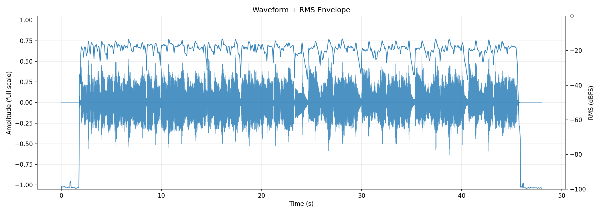
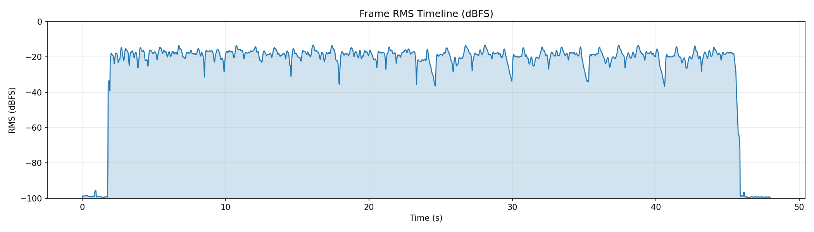
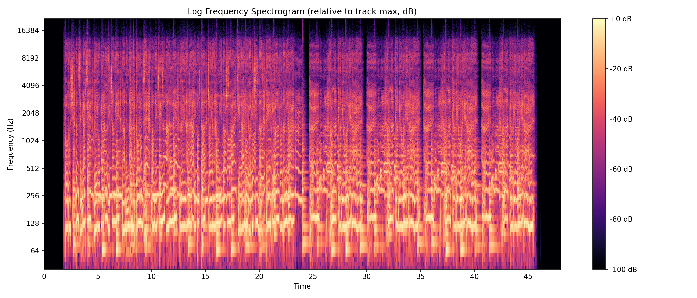
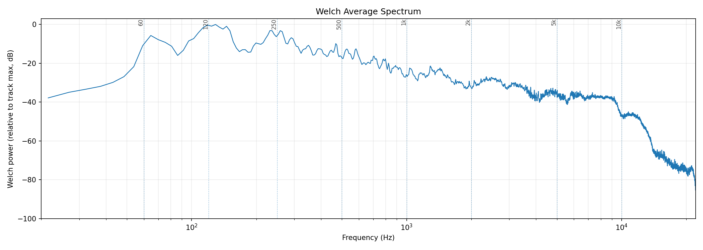
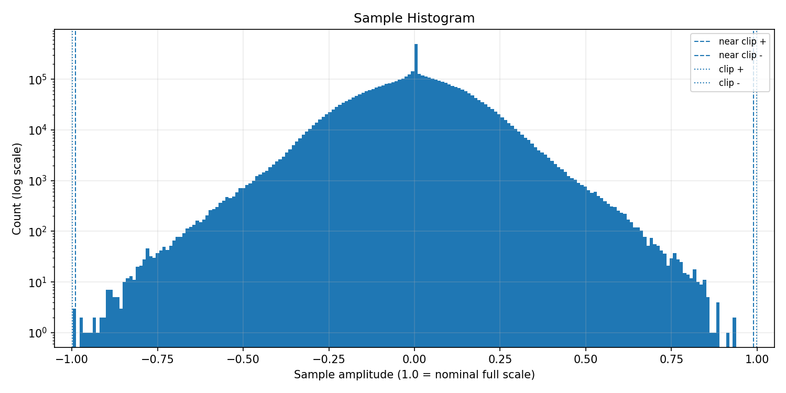
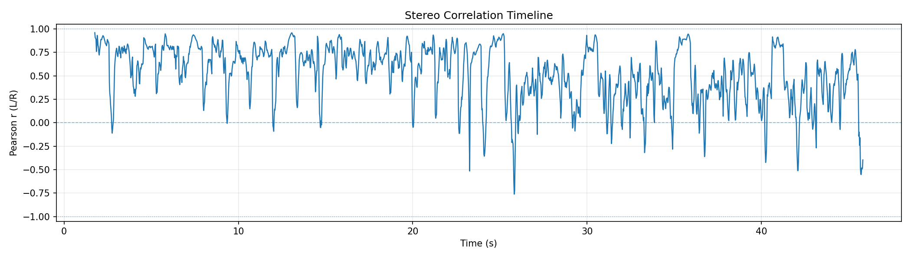
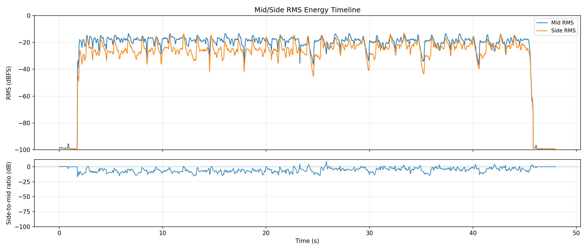
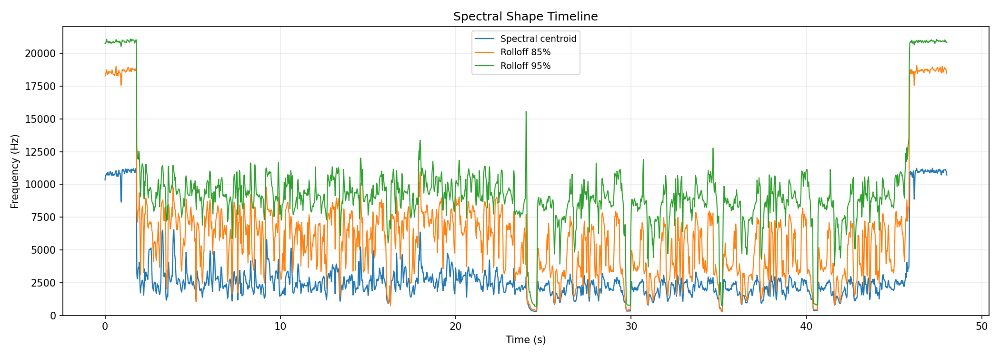
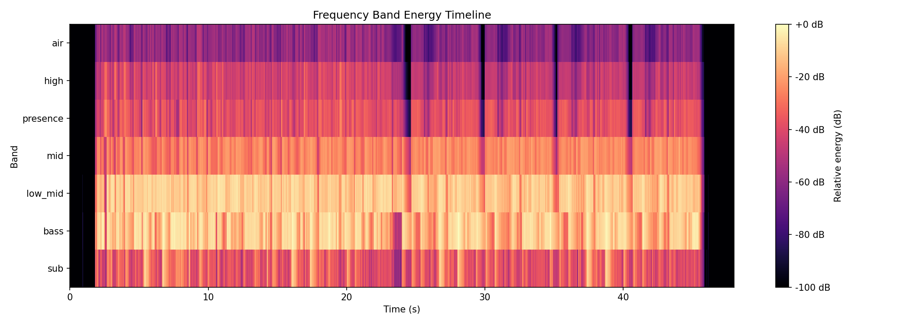
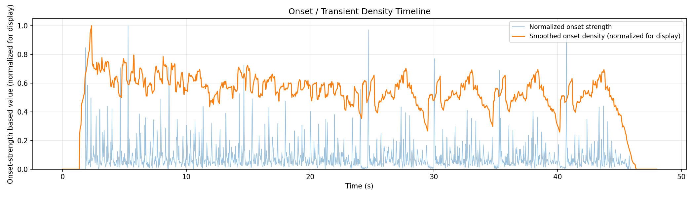

# AudioAtlas Report: hurt3.wav

## File

- Duration: 48.00s (0:48)
- Sample rate: 44100 Hz
- Channels: 2
- Format: WAV / PCM_16

## Level metrics

| Metric | Value | Unit |
|---|---|---|
| Sample peak | -0.025 | dBFS |
| True-peak (approx.) | -0.020 | dBTP |
| RMS | -17.249 | dBFS |
| Crest factor | 17.223 | dB |
| Integrated loudness | -14.628 | LUFS |
| PLR (peak - LUFS) | 14.608 | dB |
| Clipped samples | 0 |  |
| Near-clipping | 3 |  |

## Per-channel breakdown

| Metric | ch 0 | ch 1 | Unit |
|---|---|---|---|
| Sample peak | -0.551 | -0.025 | dBFS |
| True-peak (approx.) | -0.525 | -0.020 | dBTP |
| RMS | -17.460 | -17.047 | dBFS |
| DC offset | 0.000 | 0.000 |  |

## Frame RMS envelope summary

- frame_length: 4096
- hop_length: 1024
- frames: 2068
- rms_dbfs_min: -100.000
- rms_dbfs_max: -13.295
- rms_dbfs_mean: -25.941

## Average spectrum summary

Relative dB plots use track max = 0 dB and are not calibrated dBFS.

- nperseg: 8192
- bins: 4097
- strongest_bin_hz: 129.199
- strongest_bin_db: 0.000
- strongest_band: bass

## Band energy summary

| Band | Range | Energy |
|---|---|---|
| sub | 20.000-60.000 Hz | -19.364 dB relative |
| bass | 60.000-120.000 Hz | -5.579 dB relative |
| low_mid | 120.000-350.000 Hz | -6.265 dB relative |
| mid | 350.000-2000.000 Hz | -20.332 dB relative |
| presence | 2000.000-5000.000 Hz | -31.943 dB relative |
| high | 5000.000-10000.000 Hz | -37.712 dB relative |
| air | 10000.000-20000.000 Hz | -52.845 dB relative |

## Spectral shape summary

- n_fft: 4096
- hop_length: 1024
- frames: 2068
- valid_frames: 2068
- undefined_frames: 0
- centroid_mean_hz: 3028.200
- centroid_median_hz: 2374.688
- centroid_min_hz: 299.018
- centroid_max_hz: 11238.349
- rolloff_85_median_hz: 6104.663
- rolloff_95_median_hz: 9151.611
- bandwidth_median_hz: 3085.645
- centroid_elevated_threshold_hz: 3562.032
- centroid_reduced_threshold_hz: 1187.344
- centroid_large_shift_threshold_hz: 2000.000
- centroid_elevated_ranges: 37
- centroid_reduced_ranges: 26
- centroid_large_shift_ranges: 3

## Band energy timeline summary

Relative dB values use this analysis view's maximum as 0 dB and are not calibrated dBFS.

- frames: 2068
- valid_frames: 2068
- strongest_band_by_median: low_mid

| Band | Median | Mean | Min | Max |
|---|---|---|---|---|
| sub | -37.301 | -40.789 | -100.000 | -7.051 |
| bass | -13.228 | -21.446 | -100.000 | 0.000 |
| low_mid | -11.289 | -19.870 | -100.000 | -3.734 |
| mid | -25.438 | -32.769 | -100.000 | -15.909 |
| presence | -38.312 | -45.045 | -100.000 | -22.817 |
| high | -45.719 | -51.447 | -100.000 | -27.453 |
| air | -59.840 | -64.563 | -100.000 | -44.589 |

## Onset / transient density summary

- hop_length: 1024
- frames: 2068
- smoothing_window_seconds: 1.000
- smoothing_window_frames: 43
- onset_strength_mean: 1.178
- onset_strength_median: 0.782
- onset_strength_max: 15.104
- onset_density_mean: 1.178
- onset_density_median: 1.257
- onset_density_max: 2.297
- high_onset_density_threshold: 1.886
- high_onset_density_ranges: 1
- strongest_onset_density_time: 2.345

## Stereo correlation summary

- frame_length: 4096
- hop_length: 1024
- frames: 2068
- defined_frames: 1898
- undefined_frames: 170
- correlation_min: -0.761
- correlation_max: 0.960
- correlation_mean: 0.528
- correlation_median: 0.585
- overall_correlation: 0.471
- correlation_below_0_ranges: 28
- correlation_below_0_3_ranges: 63
- warning: one or more frames are below correlation_min_rms_dbfs; correlation is undefined

## Mid/side energy summary

- frame_length: 4096
- hop_length: 1024
- frames: 2068
- mid_rms_dbfs_min: -100.000
- mid_rms_dbfs_max: -13.295
- mid_rms_dbfs_mean: -25.941
- side_rms_dbfs_min: -100.000
- side_rms_dbfs_max: -12.931
- side_rms_dbfs_mean: -31.184
- side_to_mid_ratio_db_median: -5.001
- side_to_mid_ratio_db_mean: -5.243
- undefined_ratio_frames: 0
- side_to_mid_ratio_above_minus_6_ranges: 67

## Findings

Findings are prioritized factual observations. Some lower-priority observations may be omitted from this report.
Long lists of time ranges are summarized here; see findings.json for full machine-readable details.

### Near-full-scale samples detected

- Severity: warning
- Category: levels
- Measured value: 3 samples
- Threshold: 0
- Evidence: near_clipping_samples measured 3.
- Why it matters: Samples near full scale can indicate limited headroom, even when no sample reaches the clipping threshold.
- Suggested checks:
  - Inspect the sample histogram and peak values.
  - Check whether near-full-scale samples cluster in a specific passage.
- Time ranges: 1 regions, total 0.093s, longest 0.093s.
- First range: 33.344s-33.437s
- Last range: 33.344s-33.437s
- Showing first 1:
  - 33.344s-33.437s
- Confidence: high

### Minimum L/R correlation is below 0

- Severity: warning
- Category: stereo
- Measured value: -0.761 Pearson r
- Threshold: 0.000
- Evidence: correlation_min measured -0.761.
- Why it matters: Negative L/R correlation can indicate phase-inverted content in at least part of the measured timeline.
- Suggested checks:
  - Inspect the stereo correlation plot around the low-correlation region.
  - Listen in mono around these regions if mono compatibility matters.
- Time ranges: 2 regions, total 0.511s, longest 0.255s.
- First range: 25.658s-25.913s
- Last range: 45.581s-45.836s
- Showing first 2:
  - 25.658s-25.913s
  - 45.581s-45.836s
- Confidence: medium

### L/R correlation falls below 0.3 in some regions

- Severity: info
- Category: stereo
- Measured value: 10 regions
- Threshold: 0.300
- Evidence: 10 time range(s) have frame correlation below 0.3.
- Why it matters: Low L/R correlation marks regions where the two channels are less similar by this measurement.
- Suggested checks:
  - Inspect the stereo correlation plot around these regions.
  - Listen in mono around these regions if mono compatibility matters.
- Time ranges: 10 regions, total 3.344s, longest 0.511s.
- First range: 23.963s-24.265s
- Last range: 45.558s-45.836s
- Showing first 8:
  - 23.963s-24.265s
  - 25.612s-25.937s
  - 29.118s-29.629s
  - 31.347s-31.602s
  - 33.088s-33.437s
  - 34.319s-34.667s
  - 39.822s-40.101s
  - 41.912s-42.307s
  - ...and 2 more range(s); see findings.json for full details.
- Confidence: medium

### Median side-to-mid ratio is above -6 dB

- Severity: info
- Category: stereo
- Measured value: -5.001 dB
- Threshold: -6.000
- Evidence: side_to_mid_ratio_db_median measured -5.001 dB.
- Why it matters: A higher side-to-mid ratio means side-channel RMS is closer to mid-channel RMS in the measured frames.
- Suggested checks:
  - Inspect the mid/side energy plot and side-to-mid ratio panel.
  - Listen in mono around these regions if side-heavy sections matter.
- Time ranges: 34 regions, total 23.754s, longest 2.554s.
- First range: 0.000s-1.741s
- Last range: 45.465s-48.019s
- Showing first 8:
  - 0.000s-1.741s
  - 2.601s-2.926s
  - 4.272s-4.551s
  - 6.594s-6.850s
  - 7.964s-8.243s
  - 9.265s-9.683s
  - 10.472s-10.820s
  - 14.629s-14.884s
  - ...and 26 more range(s); see findings.json for full details.
- Confidence: medium

### Strongest average-spectrum bin is in the low-mid region

- Severity: info
- Category: spectrum
- Measured value: 129.199 Hz
- Threshold: 120
- Evidence: strongest_bin_hz measured 129.199 Hz.
- Why it matters: This identifies where the strongest Welch average-spectrum bin falls; it does not describe whether the balance is desirable.
- Suggested checks:
  - Inspect the average spectrum plot around 120-350 Hz.
  - Listen for which instruments or sources occupy that region.
- Confidence: medium

### Spectral centroid is elevated relative to this track's median

- Severity: info
- Category: spectrum
- Measured value: 2374.688 Hz
- Threshold: 3562.032
- Evidence: centroid_median_hz measured 2374.688 Hz; 2 time range(s) exceed the relative threshold.
- Why it matters: Spectral centroid is a frequency-distribution statistic; elevated regions indicate the centroid is higher than this track's median by the configured heuristic.
- Suggested checks:
  - Inspect EQ, arrangement density, cymbals, distortion, or vocal presence in these regions.
  - Check whether these sections sound brighter or denser; centroid is only a proxy.
- Time ranges: 2 regions, total 4.040s, longest 2.229s.
- First range: 0.000s-1.811s
- Last range: 45.790s-48.019s
- Showing first 2:
  - 0.000s-1.811s
  - 45.790s-48.019s
- Confidence: medium

### Spectral centroid is reduced relative to this track's median

- Severity: info
- Category: spectrum
- Measured value: 2374.688 Hz
- Threshold: 1187.344
- Evidence: centroid_median_hz measured 2374.688 Hz; 3 time range(s) fall below the relative threshold.
- Why it matters: Spectral centroid is a frequency-distribution statistic; reduced regions indicate the centroid is lower than this track's median by the configured heuristic.
- Suggested checks:
  - Inspect EQ, arrangement density, instrumentation, or source changes in these regions.
  - Check whether these sections sound less high-frequency-weighted; centroid is only a proxy.
- Time ranges: 3 regions, total 1.277s, longest 0.580s.
- First range: 24.079s-24.660s
- Last range: 40.333s-40.658s
- Showing first 3:
  - 24.079s-24.660s
  - 29.605s-29.977s
  - 40.333s-40.658s
- Confidence: medium

### Multiple band-energy changes detected

- Severity: info
- Category: spectrum
- Measured value: 4 band observations
- Threshold: 1
- Evidence: Affected bands after duration and energy filters: sub elevated, bass elevated, high reduced, air reduced.
- Why it matters: This groups broad frequency-band changes that crossed relative track-level thresholds.
- Suggested checks:
  - Inspect the frequency band energy timeline around the listed regions.
  - Check whether arrangement, source content, or processing changes align with these regions.
- Time ranges: 15 regions, total 14.745s, longest 2.438s.
- First range: 5.341s-5.851s
- Last range: 45.581s-48.019s
- Showing first 8:
  - 5.341s-5.851s
  - 6.664s-7.175s
  - 7.639s-8.266s
  - 17.345s-17.879s
  - 26.610s-27.144s
  - 37.268s-37.825s
  - 38.684s-39.219s
  - 7.291s-7.988s
  - ...and 7 more range(s); see findings.json for full details.
- Confidence: medium

## Plots

### Waveform + RMS Envelope

### Frame RMS Timeline

### Log-Frequency Spectrogram

### Welch Average Spectrum

### Sample Histogram

### Stereo Correlation Timeline

### Mid/Side Energy Timeline

### Spectral Shape Timeline

### Frequency Band Energy Timeline

### Onset / Transient Density Timeline

## Human notes

- Observations:
- EQ ideas:
- Dynamics notes:
- Stereo/image notes: