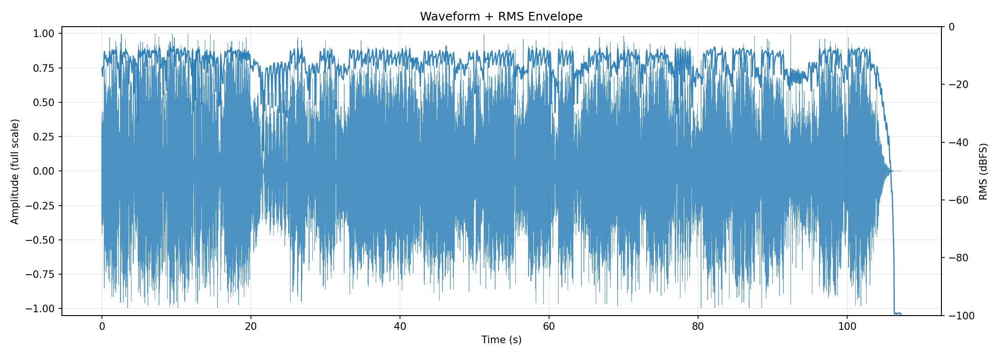
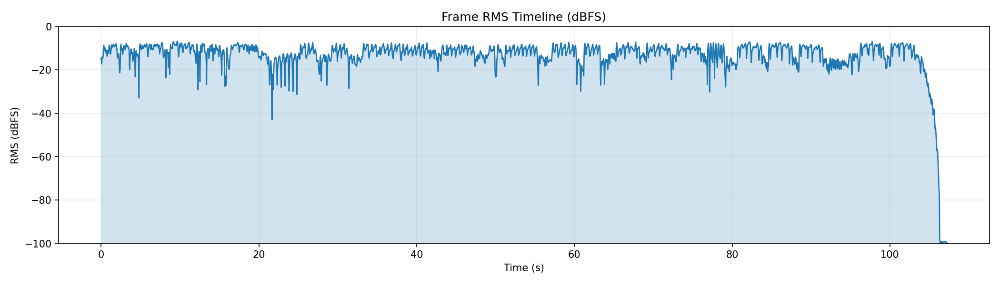
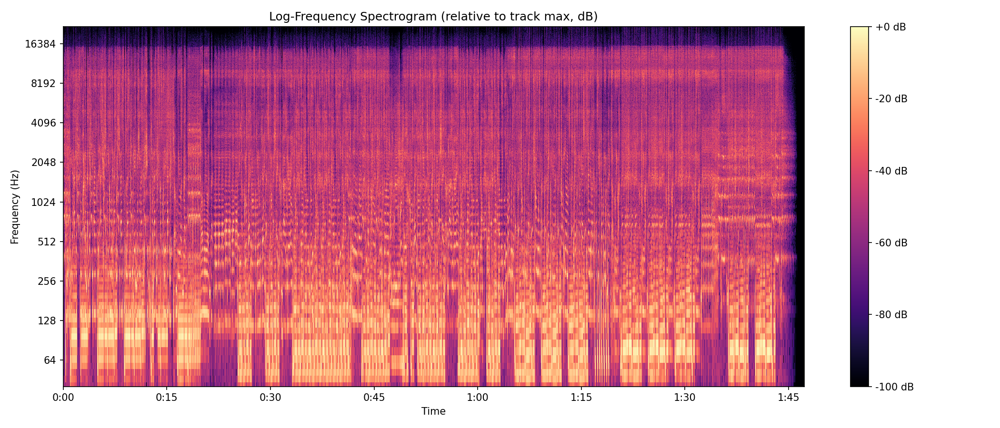
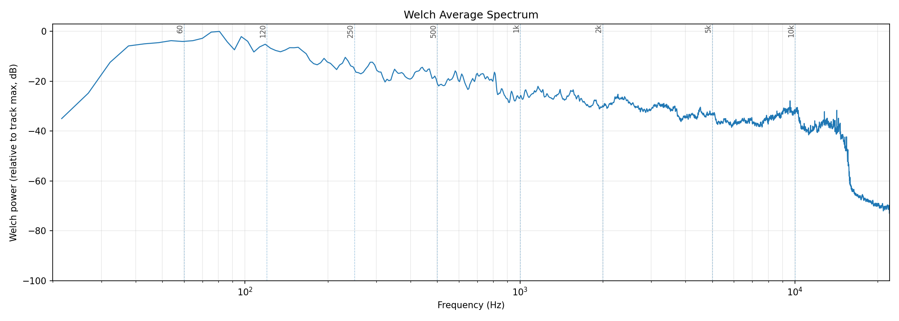
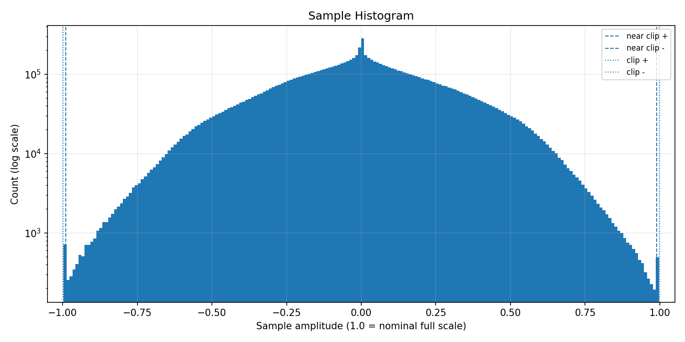
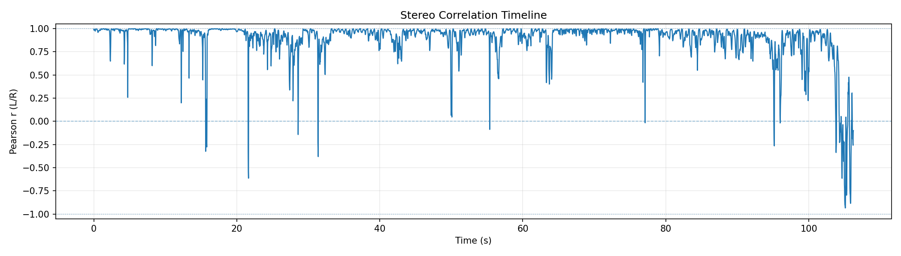
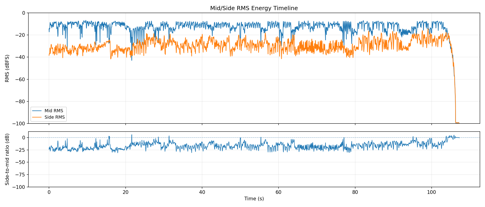
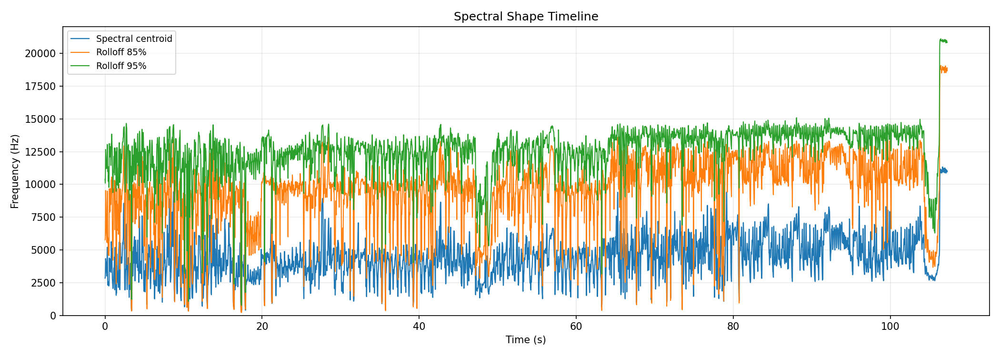
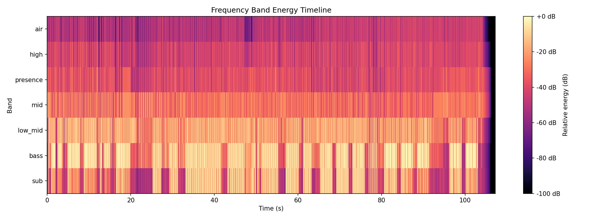
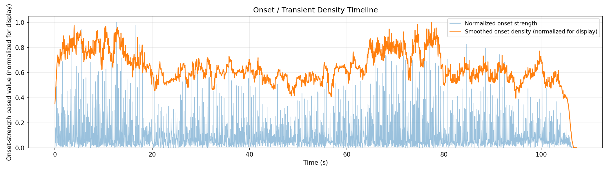

# AudioAtlas Report: jarmedley.wav

## File

- Duration: 107.25s (1:47)
- Sample rate: 44100 Hz
- Channels: 2
- Format: WAV / PCM_16

## Level metrics

| Metric | Value | Unit |
|---|---|---|
| Sample peak | -0.024 | dBFS |
| True-peak (approx.) | 2.031 | dBTP |
| RMS | -11.102 | dBFS |
| Crest factor | 11.078 | dB |
| Integrated loudness | -9.100 | LUFS |
| PLR (peak - LUFS) | 11.131 | dB |
| Clipped samples | 0 |  |
| Near-clipping | 1113 |  |

## Per-channel breakdown

| Metric | ch 0 | ch 1 | Unit |
|---|---|---|---|
| Sample peak | -0.024 | -0.024 | dBFS |
| True-peak (approx.) | 2.031 | 1.905 | dBTP |
| RMS | -11.264 | -10.947 | dBFS |
| DC offset | 0.000 | 0.000 |  |

## Frame RMS envelope summary

- frame_length: 4096
- hop_length: 1024
- frames: 4619
- rms_dbfs_min: -100.000
- rms_dbfs_max: -6.746
- rms_dbfs_mean: -13.529

## Average spectrum summary

Relative dB plots use track max = 0 dB and are not calibrated dBFS.

- nperseg: 8192
- bins: 4097
- strongest_bin_hz: 80.750
- strongest_bin_db: 0.000
- strongest_band: bass

## Band energy summary

| Band | Range | Energy |
|---|---|---|
| sub | 20.000-60.000 Hz | -6.434 dB relative |
| bass | 60.000-120.000 Hz | -3.264 dB relative |
| low_mid | 120.000-350.000 Hz | -11.543 dB relative |
| mid | 350.000-2000.000 Hz | -22.091 dB relative |
| presence | 2000.000-5000.000 Hz | -30.748 dB relative |
| high | 5000.000-10000.000 Hz | -34.446 dB relative |
| air | 10000.000-20000.000 Hz | -40.267 dB relative |

## Spectral shape summary

- n_fft: 4096
- hop_length: 1024
- frames: 4619
- valid_frames: 4619
- undefined_frames: 0
- centroid_mean_hz: 4367.848
- centroid_median_hz: 4256.563
- centroid_min_hz: 362.917
- centroid_max_hz: 11336.261
- rolloff_85_median_hz: 9980.640
- rolloff_95_median_hz: 12952.222
- bandwidth_median_hz: 4376.379
- centroid_elevated_threshold_hz: 6384.845
- centroid_reduced_threshold_hz: 2128.282
- centroid_large_shift_threshold_hz: 3192.422
- centroid_elevated_ranges: 126
- centroid_reduced_ranges: 116
- centroid_large_shift_ranges: 14

## Band energy timeline summary

Relative dB values use this analysis view's maximum as 0 dB and are not calibrated dBFS.

- frames: 4619
- valid_frames: 4619
- strongest_band_by_median: bass

| Band | Median | Mean | Min | Max |
|---|---|---|---|---|
| sub | -21.939 | -27.913 | -100.000 | 0.000 |
| bass | -11.776 | -19.189 | -100.000 | -0.689 |
| low_mid | -18.127 | -22.163 | -100.000 | -6.133 |
| mid | -28.852 | -31.044 | -100.000 | -18.294 |
| presence | -38.652 | -40.064 | -100.000 | -20.914 |
| high | -42.126 | -43.802 | -100.000 | -28.287 |
| air | -47.444 | -49.913 | -100.000 | -32.130 |

## Onset / transient density summary

- hop_length: 1024
- frames: 4619
- smoothing_window_seconds: 1.000
- smoothing_window_frames: 43
- onset_strength_mean: 1.684
- onset_strength_median: 0.951
- onset_strength_max: 17.682
- onset_density_mean: 1.682
- onset_density_median: 1.639
- onset_density_max: 2.658
- high_onset_density_threshold: 2.459
- high_onset_density_ranges: 19
- strongest_onset_density_time: 77.439

## Stereo correlation summary

- frame_length: 4096
- hop_length: 1024
- frames: 4619
- defined_frames: 4576
- undefined_frames: 43
- correlation_min: -0.934
- correlation_max: 0.999
- correlation_mean: 0.893
- correlation_median: 0.961
- overall_correlation: 0.943
- correlation_below_0_ranges: 16
- correlation_below_0_3_ranges: 19
- warning: one or more frames are below correlation_min_rms_dbfs; correlation is undefined

## Mid/side energy summary

- frame_length: 4096
- hop_length: 1024
- frames: 4619
- mid_rms_dbfs_min: -100.000
- mid_rms_dbfs_max: -6.746
- mid_rms_dbfs_mean: -13.566
- side_rms_dbfs_min: -100.000
- side_rms_dbfs_max: -14.184
- side_rms_dbfs_mean: -29.985
- side_to_mid_ratio_db_median: -16.843
- side_to_mid_ratio_db_mean: -16.420
- undefined_ratio_frames: 0
- side_to_mid_ratio_above_minus_6_ranges: 37

## Findings

Findings are prioritized factual observations. Some lower-priority observations may be omitted from this report.
Long lists of time ranges are summarized here; see findings.json for full machine-readable details.

### Approximate true peak is above 0 dBTP

- Severity: warning
- Category: levels
- Measured value: 2.031 dBTP
- Threshold: 0.000
- Evidence: true_peak_dbtp measured 2.031 dBTP.
- Why it matters: Samples reconstructed by downstream playback or encoding can exceed nominal full scale when true peak is above 0 dBTP.
- Suggested checks:
  - Check a dedicated true-peak meter if this file will be encoded or limited.
  - Inspect the loudest passage for inter-sample peak behavior.
- Confidence: medium

### Near-full-scale samples detected

- Severity: warning
- Category: levels
- Measured value: 1113 samples
- Threshold: 0
- Evidence: near_clipping_samples measured 1113.
- Why it matters: Samples near full scale can indicate limited headroom, even when no sample reaches the clipping threshold.
- Suggested checks:
  - Inspect the sample histogram and peak values.
  - Check whether near-full-scale samples cluster in a specific passage.
- Time ranges: 226 regions, total 26.146s, longest 0.348s.
- First range: 0.464s-0.557s
- Last range: 103.700s-103.793s
- Showing first 8:
  - 0.464s-0.557s
  - 0.604s-0.697s
  - 0.952s-1.045s
  - 1.254s-1.347s
  - 1.440s-1.556s
  - 1.718s-1.881s
  - 2.415s-2.508s
  - 2.531s-2.647s
  - ...and 218 more range(s); see findings.json for full details.
- Confidence: high

### Minimum L/R correlation is below 0

- Severity: warning
- Category: stereo
- Measured value: -0.934 Pearson r
- Threshold: 0.000
- Evidence: correlation_min measured -0.934.
- Why it matters: Negative L/R correlation can indicate phase-inverted content in at least part of the measured timeline.
- Suggested checks:
  - Inspect the stereo correlation plot around the low-correlation region.
  - Listen in mono around these regions if mono compatibility matters.
- Time ranges: 3 regions, total 1.184s, longest 0.650s.
- First range: 104.536s-105.186s
- Last range: 105.697s-105.976s
- Showing first 3:
  - 104.536s-105.186s
  - 105.210s-105.465s
  - 105.697s-105.976s
- Confidence: medium

### Integrated loudness is above -10 LUFS

- Severity: info
- Category: levels
- Measured value: -9.100 LUFS
- Threshold: -10.000
- Evidence: integrated_lufs measured -9.100 LUFS.
- Why it matters: Integrated LUFS is a whole-track loudness measurement; values above -10 LUFS indicate a high measured loudness for this file.
- Suggested checks:
  - Compare this measured loudness with the intended delivery context.
  - Check PLR and waveform/RMS plots for additional context.
- Confidence: high

### L/R correlation falls below 0.3 in some regions

- Severity: info
- Category: stereo
- Measured value: 2 regions
- Threshold: 0.300
- Evidence: 2 time range(s) have frame correlation below 0.3.
- Why it matters: Low L/R correlation marks regions where the two channels are less similar by this measurement.
- Suggested checks:
  - Inspect the stereo correlation plot around these regions.
  - Listen in mono around these regions if mono compatibility matters.
- Time ranges: 2 regions, total 1.625s, longest 1.254s.
- First range: 104.234s-105.488s
- Last range: 105.674s-106.046s
- Showing first 2:
  - 104.234s-105.488s
  - 105.674s-106.046s
- Confidence: medium

### Spectral centroid is elevated relative to this track's median

- Severity: info
- Category: spectrum
- Measured value: 4256.563 Hz
- Threshold: 6384.845
- Evidence: centroid_median_hz measured 4256.563 Hz; 4 time range(s) exceed the relative threshold.
- Why it matters: Spectral centroid is a frequency-distribution statistic; elevated regions indicate the centroid is higher than this track's median by the configured heuristic.
- Suggested checks:
  - Inspect EQ, arrangement density, cymbals, distortion, or vocal presence in these regions.
  - Check whether these sections sound brighter or denser; centroid is only a proxy.
- Time ranges: 4 regions, total 2.159s, longest 0.975s.
- First range: 87.679s-88.143s
- Last range: 106.278s-107.253s
- Showing first 4:
  - 87.679s-88.143s
  - 91.533s-91.788s
  - 91.835s-92.299s
  - 106.278s-107.253s
- Confidence: medium

### Multiple band-energy changes detected

- Severity: info
- Category: spectrum
- Measured value: 4 band observations
- Threshold: 1
- Evidence: Affected bands after duration and energy filters: sub elevated, bass elevated, high reduced, air reduced.
- Why it matters: This groups broad frequency-band changes that crossed relative track-level thresholds.
- Suggested checks:
  - Inspect the frequency band energy timeline around the listed regions.
  - Check whether arrangement, source content, or processing changes align with these regions.
- Time ranges: 33 regions, total 26.610s, longest 2.670s.
- First range: 16.718s-17.299s
- Last range: 104.583s-107.253s
- Showing first 8:
  - 16.718s-17.299s
  - 48.762s-49.459s
  - 65.550s-66.339s
  - 66.409s-66.943s
  - 66.990s-67.918s
  - 69.404s-70.217s
  - 70.264s-70.821s
  - 70.844s-71.796s
  - ...and 25 more range(s); see findings.json for full details.
- Confidence: medium

## Plots

### Waveform + RMS Envelope

### Frame RMS Timeline

### Log-Frequency Spectrogram

### Welch Average Spectrum

### Sample Histogram

### Stereo Correlation Timeline

### Mid/Side Energy Timeline

### Spectral Shape Timeline

### Frequency Band Energy Timeline

### Onset / Transient Density Timeline

## Human notes

- Observations:
- EQ ideas:
- Dynamics notes:
- Stereo/image notes: