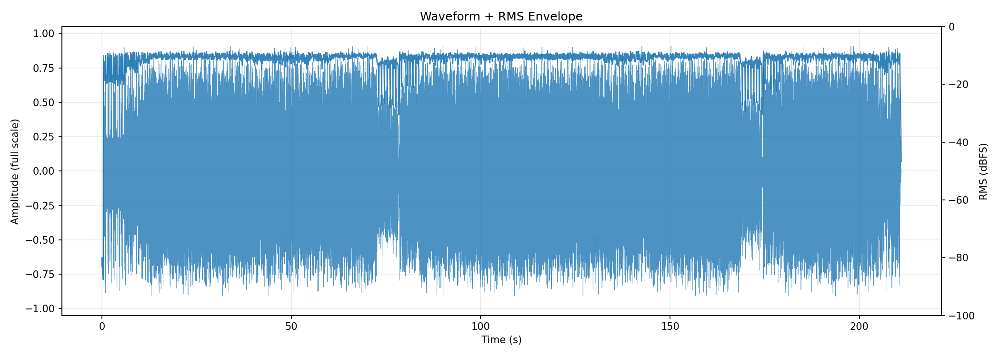
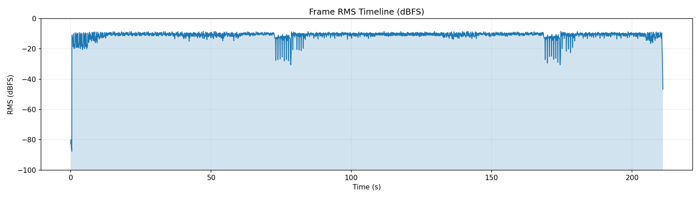
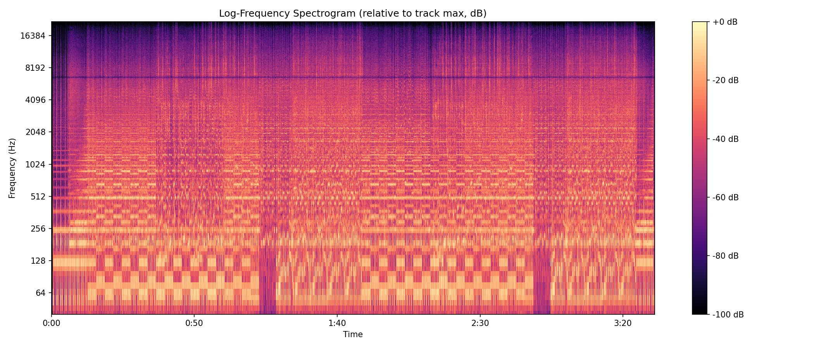
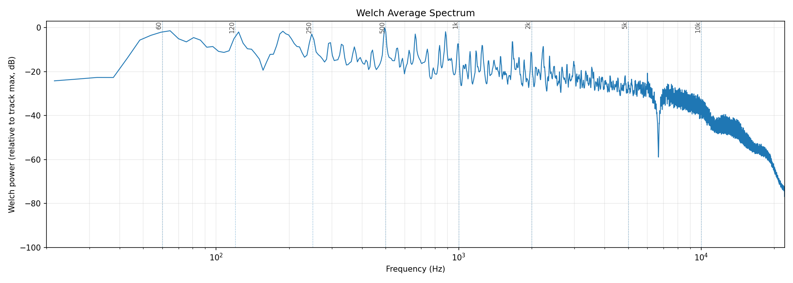
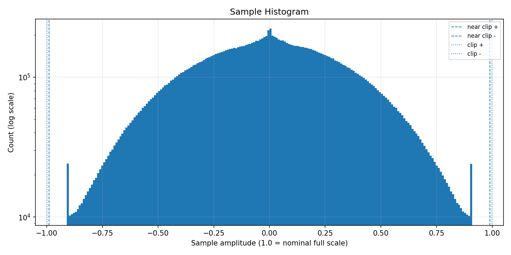
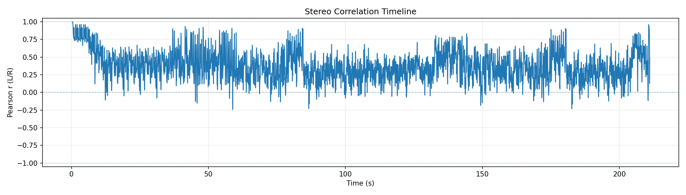
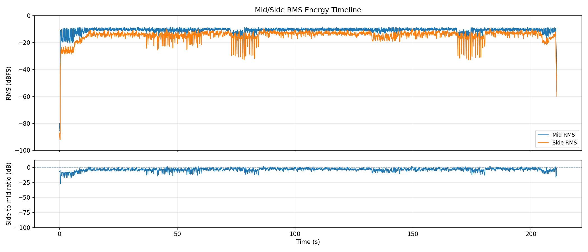
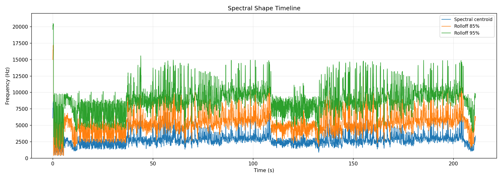
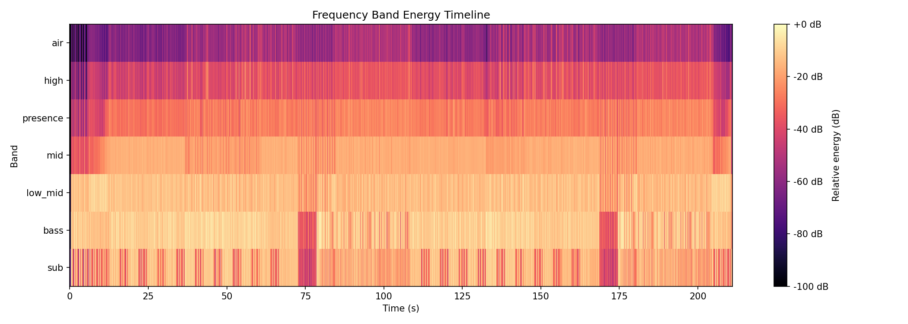
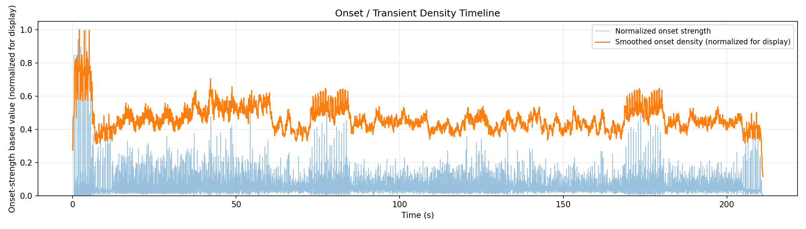

# AudioAtlas Report: rept.wav

## File

- Duration: 211.03s (3:31)
- Sample rate: 44100 Hz
- Channels: 2
- Format: WAV / PCM_16

## Level metrics

| Metric | Value | Unit |
|---|---|---|
| Sample peak | -0.816 | dBFS |
| True-peak (approx.) | 0.256 | dBTP |
| RMS | -8.983 | dBFS |
| Crest factor | 8.167 | dB |
| Integrated loudness | -5.512 | LUFS |
| PLR (peak - LUFS) | 5.768 | dB |
| Clipped samples | 0 |  |
| Near-clipping | 0 |  |

## Per-channel breakdown

| Metric | ch 0 | ch 1 | Unit |
|---|---|---|---|
| Sample peak | -0.816 | -0.816 | dBFS |
| True-peak (approx.) | -0.136 | 0.256 | dBTP |
| RMS | -9.369 | -8.629 | dBFS |
| DC offset | -0.000 | -0.000 |  |

## Frame RMS envelope summary

- frame_length: 4096
- hop_length: 1024
- frames: 9089
- rms_dbfs_min: -87.641
- rms_dbfs_max: -8.406
- rms_dbfs_mean: -11.128

## Average spectrum summary

Relative dB plots use track max = 0 dB and are not calibrated dBFS.

- nperseg: 8192
- bins: 4097
- strongest_bin_hz: 495.264
- strongest_bin_db: 0.000
- strongest_band: bass

## Band energy summary

| Band | Range | Energy |
|---|---|---|
| sub | 20.000-60.000 Hz | -7.542 dB relative |
| bass | 60.000-120.000 Hz | -6.047 dB relative |
| low_mid | 120.000-350.000 Hz | -7.917 dB relative |
| mid | 350.000-2000.000 Hz | -13.734 dB relative |
| presence | 2000.000-5000.000 Hz | -22.000 dB relative |
| high | 5000.000-10000.000 Hz | -30.520 dB relative |
| air | 10000.000-20000.000 Hz | -45.142 dB relative |

## Spectral shape summary

- n_fft: 4096
- hop_length: 1024
- frames: 9089
- valid_frames: 9089
- undefined_frames: 0
- centroid_mean_hz: 2787.782
- centroid_median_hz: 2664.769
- centroid_min_hz: 384.566
- centroid_max_hz: 8668.567
- rolloff_85_median_hz: 5200.269
- rolloff_95_median_hz: 8807.080
- bandwidth_median_hz: 2981.729
- centroid_elevated_threshold_hz: 3997.154
- centroid_reduced_threshold_hz: 1332.385
- centroid_large_shift_threshold_hz: 2000.000
- centroid_elevated_ranges: 154
- centroid_reduced_ranges: 33
- centroid_large_shift_ranges: 10

## Band energy timeline summary

Relative dB values use this analysis view's maximum as 0 dB and are not calibrated dBFS.

- frames: 9089
- valid_frames: 9089
- strongest_band_by_median: bass

| Band | Median | Mean | Min | Max |
|---|---|---|---|---|
| sub | -15.311 | -19.664 | -77.026 | -0.014 |
| bass | -10.522 | -12.846 | -91.149 | 0.000 |
| low_mid | -13.516 | -13.787 | -93.856 | -2.518 |
| mid | -17.480 | -19.258 | -100.000 | -13.719 |
| presence | -26.749 | -28.338 | -100.000 | -17.195 |
| high | -38.587 | -39.341 | -100.000 | -20.318 |
| air | -55.671 | -56.218 | -100.000 | -29.648 |

## Onset / transient density summary

- hop_length: 1024
- frames: 9089
- smoothing_window_seconds: 1.000
- smoothing_window_frames: 43
- onset_strength_mean: 1.187
- onset_strength_median: 0.751
- onset_strength_max: 20.567
- onset_density_mean: 1.187
- onset_density_median: 1.153
- onset_density_max: 2.572
- high_onset_density_threshold: 1.729
- high_onset_density_ranges: 13
- strongest_onset_density_time: 2.043

## Stereo correlation summary

- frame_length: 4096
- hop_length: 1024
- frames: 9089
- defined_frames: 9075
- undefined_frames: 14
- correlation_min: -0.243
- correlation_max: 0.998
- correlation_mean: 0.374
- correlation_median: 0.357
- overall_correlation: 0.352
- correlation_below_0_ranges: 73
- correlation_below_0_3_ranges: 481
- warning: one or more frames are below correlation_min_rms_dbfs; correlation is undefined

## Mid/side energy summary

- frame_length: 4096
- hop_length: 1024
- frames: 9089
- mid_rms_dbfs_min: -87.641
- mid_rms_dbfs_max: -8.406
- mid_rms_dbfs_mean: -11.122
- side_rms_dbfs_min: -91.901
- side_rms_dbfs_max: -9.741
- side_rms_dbfs_mean: -14.794
- side_to_mid_ratio_db_median: -3.211
- side_to_mid_ratio_db_mean: -3.671
- undefined_ratio_frames: 0
- side_to_mid_ratio_above_minus_6_ranges: 187

## Findings

Findings are prioritized factual observations. Some lower-priority observations may be omitted from this report.
Long lists of time ranges are summarized here; see findings.json for full machine-readable details.
3 lower-priority finding(s) suppressed; see findings.json for details.

### Approximate true peak is above 0 dBTP

- Severity: warning
- Category: levels
- Measured value: 0.256 dBTP
- Threshold: 0.000
- Evidence: true_peak_dbtp measured 0.256 dBTP.
- Why it matters: Samples reconstructed by downstream playback or encoding can exceed nominal full scale when true peak is above 0 dBTP.
- Suggested checks:
  - Check a dedicated true-peak meter if this file will be encoded or limited.
  - Inspect the loudest passage for inter-sample peak behavior.
- Confidence: medium

### Peak-to-loudness ratio is below 8 dB

- Severity: warning
- Category: dynamics
- Measured value: 5.768 dB
- Threshold: 8.000
- Evidence: plr_db measured 5.768 dB.
- Why it matters: PLR is the difference between true peak and integrated LUFS; lower values indicate less peak headroom relative to measured loudness.
- Suggested checks:
  - Inspect the frame RMS timeline alongside peak metrics.
  - Check whether this PLR matches the intended production style.
- Confidence: medium

### Minimum L/R correlation is below 0

- Severity: warning
- Category: stereo
- Measured value: -0.243 Pearson r
- Threshold: 0.000
- Evidence: correlation_min measured -0.243.
- Why it matters: Negative L/R correlation can indicate phase-inverted content in at least part of the measured timeline.
- Suggested checks:
  - Inspect the stereo correlation plot around the low-correlation region.
  - Listen in mono around these regions if mono compatibility matters.
- Time ranges: 2 regions, total 0.650s, longest 0.325s.
- First range: 86.564s-86.889s
- Last range: 182.555s-182.880s
- Showing first 2:
  - 86.564s-86.889s
  - 182.555s-182.880s
- Confidence: medium

### Median L/R correlation is below 0.5

- Severity: warning
- Category: stereo
- Measured value: 0.357 Pearson r
- Threshold: 0.500
- Evidence: correlation_median measured 0.357.
- Why it matters: A lower median L/R correlation indicates less similarity between the left and right channels over the measured frames.
- Suggested checks:
  - Inspect the stereo correlation timeline for persistent low-correlation sections.
  - Check whether the stereo presentation matches the intended playback context.
- Confidence: medium

### Integrated loudness is above -10 LUFS

- Severity: info
- Category: levels
- Measured value: -5.512 LUFS
- Threshold: -10.000
- Evidence: integrated_lufs measured -5.512 LUFS.
- Why it matters: Integrated LUFS is a whole-track loudness measurement; values above -10 LUFS indicate a high measured loudness for this file.
- Suggested checks:
  - Compare this measured loudness with the intended delivery context.
  - Check PLR and waveform/RMS plots for additional context.
- Confidence: high

### L/R correlation falls below 0.3 in some regions

- Severity: info
- Category: stereo
- Measured value: 115 regions
- Threshold: 0.300
- Evidence: 115 time range(s) have frame correlation below 0.3.
- Why it matters: Low L/R correlation marks regions where the two channels are less similar by this measurement.
- Suggested checks:
  - Inspect the stereo correlation plot around these regions.
  - Listen in mono around these regions if mono compatibility matters.
- Time ranges: 115 regions, total 41.494s, longest 0.859s.
- First range: 12.283s-12.539s
- Last range: 201.596s-201.944s
- Showing first 8:
  - 12.283s-12.539s
  - 12.678s-12.934s
  - 16.765s-17.020s
  - 18.669s-18.924s
  - 22.756s-23.034s
  - 24.683s-24.938s
  - 28.746s-29.002s
  - 30.674s-30.929s
  - ...and 107 more range(s); see findings.json for full details.
- Confidence: medium

### Median side-to-mid ratio is above -6 dB

- Severity: info
- Category: stereo
- Measured value: -3.211 dB
- Threshold: -6.000
- Evidence: side_to_mid_ratio_db_median measured -3.211 dB.
- Why it matters: A higher side-to-mid ratio means side-channel RMS is closer to mid-channel RMS in the measured frames.
- Suggested checks:
  - Inspect the mid/side energy plot and side-to-mid ratio panel.
  - Listen in mono around these regions if side-heavy sections matter.
- Time ranges: 128 regions, total 175.821s, longest 17.694s.
- First range: 8.522s-8.986s
- Last range: 210.071s-210.582s
- Showing first 8:
  - 8.522s-8.986s
  - 9.660s-9.915s
  - 10.008s-10.472s
  - 10.774s-11.076s
  - 11.122s-11.424s
  - 11.517s-12.028s
  - 12.074s-15.000s
  - 15.070s-15.999s
  - ...and 120 more range(s); see findings.json for full details.
- Confidence: medium

### Spectral centroid is elevated relative to this track's median

- Severity: info
- Category: spectrum
- Measured value: 2664.769 Hz
- Threshold: 3997.154
- Evidence: centroid_median_hz measured 2664.769 Hz; 12 time range(s) exceed the relative threshold.
- Why it matters: Spectral centroid is a frequency-distribution statistic; elevated regions indicate the centroid is higher than this track's median by the configured heuristic.
- Suggested checks:
  - Inspect EQ, arrangement density, cymbals, distortion, or vocal presence in these regions.
  - Check whether these sections sound brighter or denser; centroid is only a proxy.
- Time ranges: 12 regions, total 3.460s, longest 0.395s.
- First range: 0.000s-0.395s
- Last range: 204.080s-204.336s
- Showing first 8:
  - 0.000s-0.395s
  - 43.398s-43.677s
  - 43.816s-44.141s
  - 55.914s-56.216s
  - 60.767s-61.022s
  - 67.431s-67.709s
  - 78.321s-78.600s
  - 108.066s-108.321s
  - ...and 4 more range(s); see findings.json for full details.
- Confidence: medium

## Plots

### Waveform + RMS Envelope

### Frame RMS Timeline

### Log-Frequency Spectrogram

### Welch Average Spectrum

### Sample Histogram

### Stereo Correlation Timeline

### Mid/Side Energy Timeline

### Spectral Shape Timeline

### Frequency Band Energy Timeline

### Onset / Transient Density Timeline

## Human notes

- Observations:
- EQ ideas:
- Dynamics notes:
- Stereo/image notes: