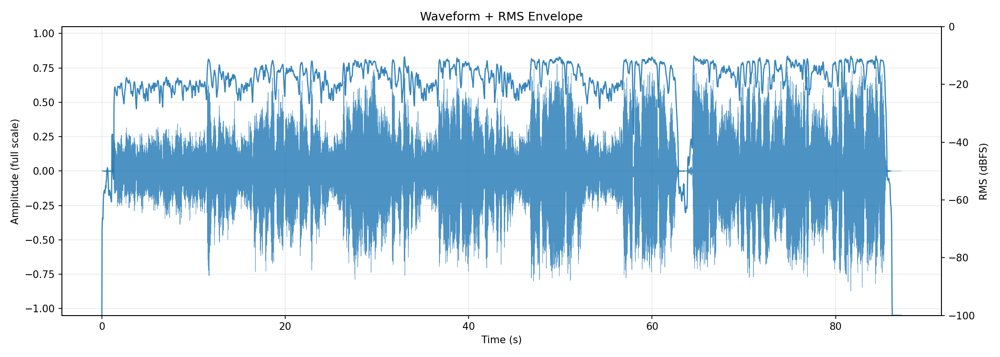
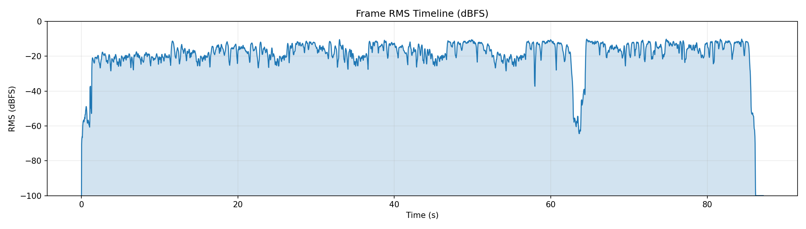
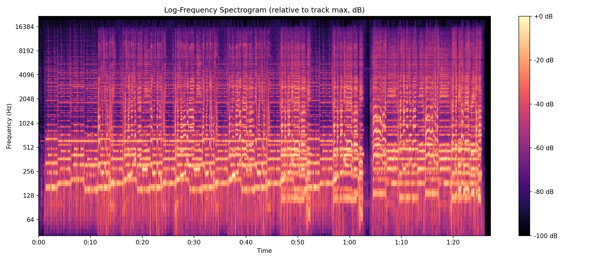
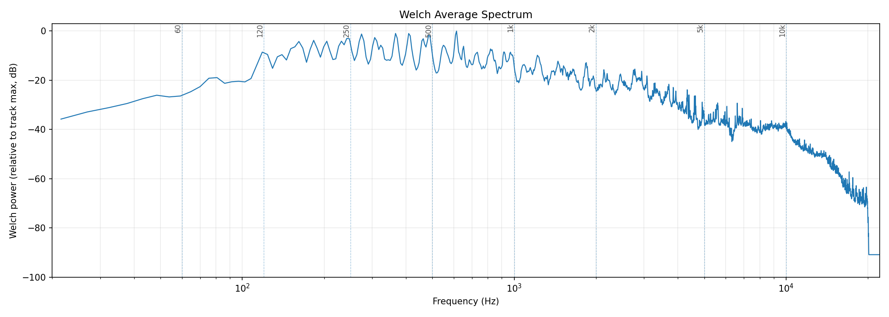
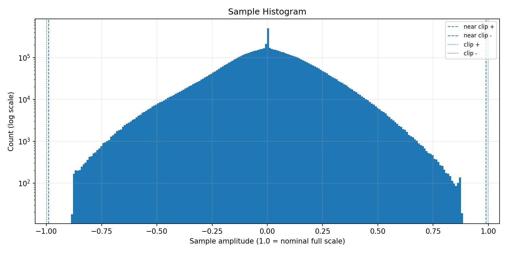
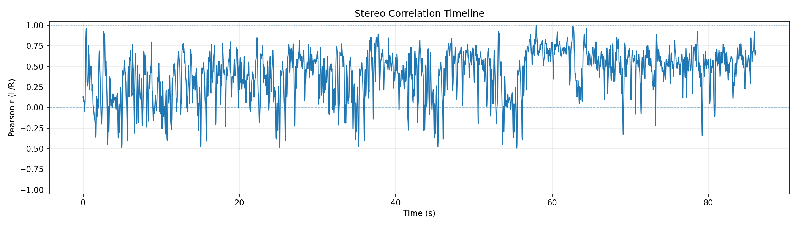
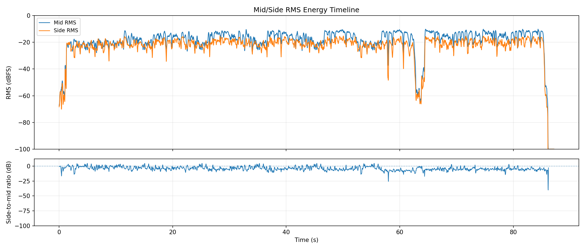
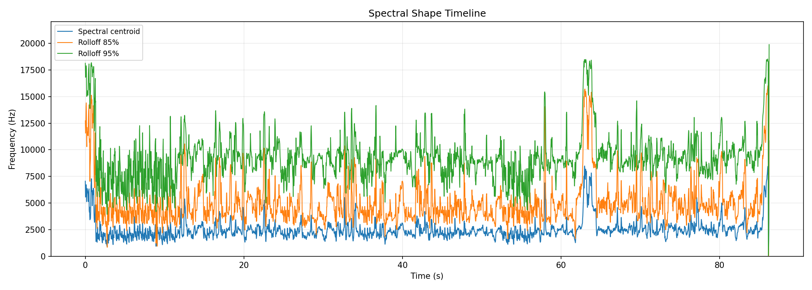
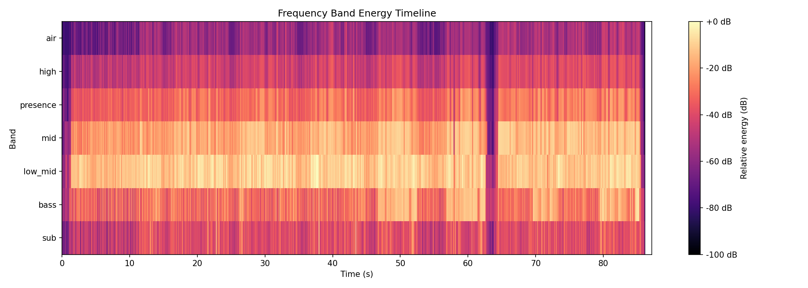
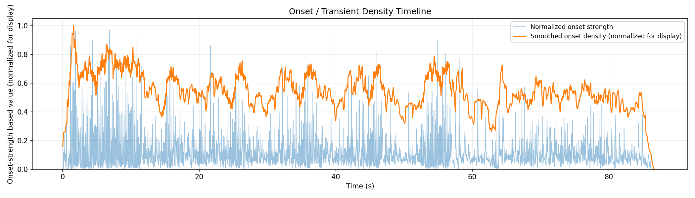

# AudioAtlas Report: sufjandry.mp3

## File

- Duration: 87.17s (1:27)
- Sample rate: 44100 Hz
- Channels: 2
- Format: MP3 / MPEG_LAYER_III

## Level metrics

| Metric | Value | Unit |
|---|---|---|
| Sample peak | -1.024 | dBFS |
| True-peak (approx.) | -0.928 | dBTP |
| RMS | -14.338 | dBFS |
| Crest factor | 13.313 | dB |
| Integrated loudness | -11.202 | LUFS |
| PLR (peak - LUFS) | 10.274 | dB |
| Clipped samples | 0 |  |
| Near-clipping | 0 |  |

## Per-channel breakdown

| Metric | ch 0 | ch 1 | Unit |
|---|---|---|---|
| Sample peak | -1.090 | -1.024 | dBFS |
| True-peak (approx.) | -1.000 | -0.928 | dBTP |
| RMS | -14.572 | -14.115 | dBFS |
| DC offset | 0.000 | 0.000 |  |

## Frame RMS envelope summary

- frame_length: 4096
- hop_length: 1024
- frames: 3755
- rms_dbfs_min: -100.000
- rms_dbfs_max: -10.166
- rms_dbfs_mean: -19.527

## Average spectrum summary

Relative dB plots use track max = 0 dB and are not calibrated dBFS.

- nperseg: 8192
- bins: 4097
- strongest_bin_hz: 613.696
- strongest_bin_db: 0.000
- strongest_band: low_mid

## Band energy summary

| Band | Range | Energy |
|---|---|---|
| sub | 20.000-60.000 Hz | -28.480 dB relative |
| bass | 60.000-120.000 Hz | -16.257 dB relative |
| low_mid | 120.000-350.000 Hz | -6.643 dB relative |
| mid | 350.000-2000.000 Hz | -11.479 dB relative |
| presence | 2000.000-5000.000 Hz | -23.745 dB relative |
| high | 5000.000-10000.000 Hz | -37.648 dB relative |
| air | 10000.000-20000.000 Hz | -49.631 dB relative |

## Spectral shape summary

- n_fft: 4096
- hop_length: 1024
- frames: 3755
- valid_frames: 3715
- undefined_frames: 40
- centroid_mean_hz: 2509.534
- centroid_median_hz: 2326.564
- centroid_min_hz: 93.136
- centroid_max_hz: 10861.855
- rolloff_85_median_hz: 4478.906
- rolloff_95_median_hz: 9087.012
- bandwidth_median_hz: 2969.846
- centroid_elevated_threshold_hz: 3489.846
- centroid_reduced_threshold_hz: 1163.282
- centroid_large_shift_threshold_hz: 2000.000
- centroid_elevated_ranges: 39
- centroid_reduced_ranges: 11
- centroid_large_shift_ranges: 4
- warning: one or more silent frames; spectral shape values are undefined there

## Band energy timeline summary

Relative dB values use this analysis view's maximum as 0 dB and are not calibrated dBFS.

- frames: 3755
- valid_frames: 3714
- strongest_band_by_median: low_mid

| Band | Median | Mean | Min | Max |
|---|---|---|---|---|
| sub | -40.180 | -40.499 | -100.000 | -6.721 |
| bass | -27.669 | -27.777 | -100.000 | -5.524 |
| low_mid | -11.326 | -12.958 | -100.000 | 0.000 |
| mid | -17.484 | -18.807 | -100.000 | -6.945 |
| presence | -30.686 | -31.368 | -100.000 | -15.036 |
| high | -42.860 | -44.323 | -100.000 | -31.895 |
| air | -56.229 | -57.785 | -100.000 | -38.246 |
- warning: one or more silent frames; band energy values are undefined there

## Onset / transient density summary

- hop_length: 1024
- frames: 3755
- smoothing_window_seconds: 1.000
- smoothing_window_frames: 43
- onset_strength_mean: 1.230
- onset_strength_median: 0.851
- onset_strength_max: 10.824
- onset_density_mean: 1.230
- onset_density_median: 1.213
- onset_density_max: 2.283
- high_onset_density_threshold: 1.820
- high_onset_density_ranges: 10
- strongest_onset_density_time: 1.602

## Stereo correlation summary

- frame_length: 4096
- hop_length: 1024
- frames: 3755
- defined_frames: 3708
- undefined_frames: 47
- correlation_min: -0.493
- correlation_max: 0.995
- correlation_mean: 0.407
- correlation_median: 0.470
- overall_correlation: 0.494
- correlation_below_0_ranges: 89
- correlation_below_0_3_ranges: 137
- warning: one or more frames have zero variance; correlation is undefined
- warning: one or more frames are below correlation_min_rms_dbfs; correlation is undefined

## Mid/side energy summary

- frame_length: 4096
- hop_length: 1024
- frames: 3755
- mid_rms_dbfs_min: -100.000
- mid_rms_dbfs_max: -10.166
- mid_rms_dbfs_mean: -19.535
- side_rms_dbfs_min: -100.000
- side_rms_dbfs_max: -15.281
- side_rms_dbfs_mean: -23.541
- side_to_mid_ratio_db_median: -4.316
- side_to_mid_ratio_db_mean: -4.079
- undefined_ratio_frames: 42
- side_to_mid_ratio_above_minus_6_ranges: 154

## Findings

Findings are prioritized factual observations. Some lower-priority observations may be omitted from this report.
Long lists of time ranges are summarized here; see findings.json for full machine-readable details.

### Minimum L/R correlation is below 0

- Severity: warning
- Category: stereo
- Measured value: -0.493 Pearson r
- Threshold: 0.000
- Evidence: correlation_min measured -0.493.
- Why it matters: Negative L/R correlation can indicate phase-inverted content in at least part of the measured timeline.
- Suggested checks:
  - Inspect the stereo correlation plot around the low-correlation region.
  - Listen in mono around these regions if mono compatibility matters.
- Time ranges: 1 regions, total 0.348s, longest 0.348s.
- First range: 1.347s-1.695s
- Last range: 1.347s-1.695s
- Showing first 1:
  - 1.347s-1.695s
- Confidence: medium

### Median L/R correlation is below 0.5

- Severity: warning
- Category: stereo
- Measured value: 0.470 Pearson r
- Threshold: 0.500
- Evidence: correlation_median measured 0.470.
- Why it matters: A lower median L/R correlation indicates less similarity between the left and right channels over the measured frames.
- Suggested checks:
  - Inspect the stereo correlation timeline for persistent low-correlation sections.
  - Check whether the stereo presentation matches the intended playback context.
- Confidence: medium

### L/R correlation falls below 0.3 in some regions

- Severity: info
- Category: stereo
- Measured value: 30 regions
- Threshold: 0.300
- Evidence: 30 time range(s) have frame correlation below 0.3.
- Why it matters: Low L/R correlation marks regions where the two channels are less similar by this measurement.
- Suggested checks:
  - Inspect the stereo correlation plot around these regions.
  - Listen in mono around these regions if mono compatibility matters.
- Time ranges: 30 regions, total 15.488s, longest 1.579s.
- First range: 0.000s-0.302s
- Last range: 63.367s-63.762s
- Showing first 8:
  - 0.000s-0.302s
  - 1.138s-2.020s
  - 2.206s-2.554s
  - 3.019s-3.413s
  - 3.483s-5.062s
  - 5.503s-5.759s
  - 8.847s-9.520s
  - 9.892s-10.194s
  - ...and 22 more range(s); see findings.json for full details.
- Confidence: medium

### Median side-to-mid ratio is above -6 dB

- Severity: info
- Category: stereo
- Measured value: -4.316 dB
- Threshold: -6.000
- Evidence: side_to_mid_ratio_db_median measured -4.316 dB.
- Why it matters: A higher side-to-mid ratio means side-channel RMS is closer to mid-channel RMS in the measured frames.
- Suggested checks:
  - Inspect the mid/side energy plot and side-to-mid ratio panel.
  - Listen in mono around these regions if side-heavy sections matter.
- Time ranges: 67 regions, total 53.638s, longest 3.367s.
- First range: 0.000s-0.348s
- Last range: 84.822s-85.124s
- Showing first 8:
  - 0.000s-0.348s
  - 0.789s-2.067s
  - 2.136s-2.577s
  - 2.833s-6.084s
  - 6.385s-6.687s
  - 6.757s-8.011s
  - 8.034s-8.754s
  - 8.824s-12.190s
  - ...and 59 more range(s); see findings.json for full details.
- Confidence: medium

### Spectral centroid is elevated relative to this track's median

- Severity: info
- Category: spectrum
- Measured value: 2326.564 Hz
- Threshold: 3489.846
- Evidence: centroid_median_hz measured 2326.564 Hz; 5 time range(s) exceed the relative threshold.
- Why it matters: Spectral centroid is a frequency-distribution statistic; elevated regions indicate the centroid is higher than this track's median by the configured heuristic.
- Suggested checks:
  - Inspect EQ, arrangement density, cymbals, distortion, or vocal presence in these regions.
  - Check whether these sections sound brighter or denser; centroid is only a proxy.
- Time ranges: 5 regions, total 3.738s, longest 1.718s.
- First range: 0.000s-0.580s
- Last range: 85.473s-86.146s
- Showing first 5:
  - 0.000s-0.580s
  - 0.627s-1.138s
  - 62.717s-64.435s
  - 77.090s-77.346s
  - 85.473s-86.146s
- Confidence: medium

### Multiple band-energy changes detected

- Severity: info
- Category: spectrum
- Measured value: 7 band observations
- Threshold: 1
- Evidence: Affected bands after duration and energy filters: bass elevated, mid elevated, presence elevated, high elevated, high reduced, air elevated, air reduced.
- Why it matters: This groups broad frequency-band changes that crossed relative track-level thresholds.
- Suggested checks:
  - Inspect the frequency band energy timeline around the listed regions.
  - Check whether arrangement, source content, or processing changes align with these regions.
- Time ranges: 43 regions, total 40.240s, longest 2.717s.
- First range: 46.719s-47.763s
- Last range: 85.658s-86.239s
- Showing first 8:
  - 46.719s-47.763s
  - 47.949s-48.576s
  - 48.623s-51.339s
  - 51.641s-52.500s
  - 56.819s-57.887s
  - 58.050s-58.677s
  - 58.723s-61.417s
  - 61.742s-62.624s
  - ...and 35 more range(s); see findings.json for full details.
- Confidence: medium

### Onset density is elevated relative to this track's median

- Severity: info
- Category: dynamics
- Measured value: 1.213 onset strength
- Threshold: 1.820
- Evidence: onset_density_median measured 1.213; 3 time range(s) exceed the relative threshold.
- Why it matters: This marks regions with higher onset-strength activity by a relative track-level heuristic.
- Suggested checks:
  - Check whether these sections feel rhythmically dense or transient-heavy.
  - Inspect drums, strums, plucks, consonants, or percussive elements in these regions.
- Time ranges: 3 regions, total 1.300s, longest 0.650s.
- First range: 1.277s-1.927s
- Last range: 6.943s-7.245s
- Showing first 3:
  - 1.277s-1.927s
  - 6.385s-6.734s
  - 6.943s-7.245s
- Confidence: medium

## Plots

### Waveform + RMS Envelope

### Frame RMS Timeline

### Log-Frequency Spectrogram

### Welch Average Spectrum

### Sample Histogram

### Stereo Correlation Timeline

### Mid/Side Energy Timeline

### Spectral Shape Timeline

### Frequency Band Energy Timeline

### Onset / Transient Density Timeline

## Human notes

- Observations:
- EQ ideas:
- Dynamics notes:
- Stereo/image notes: