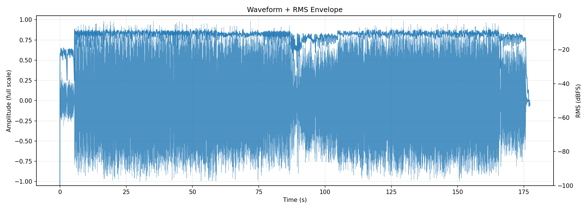
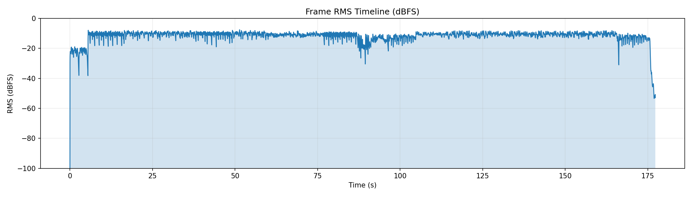
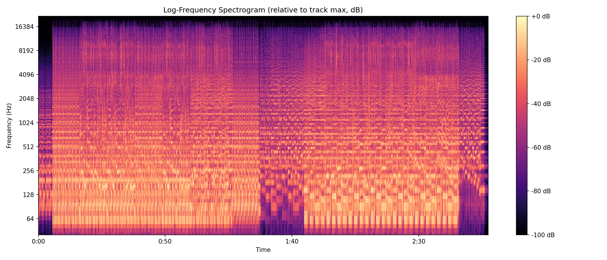
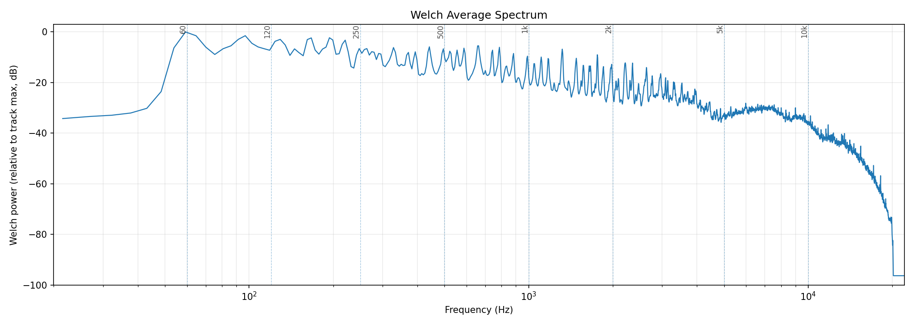
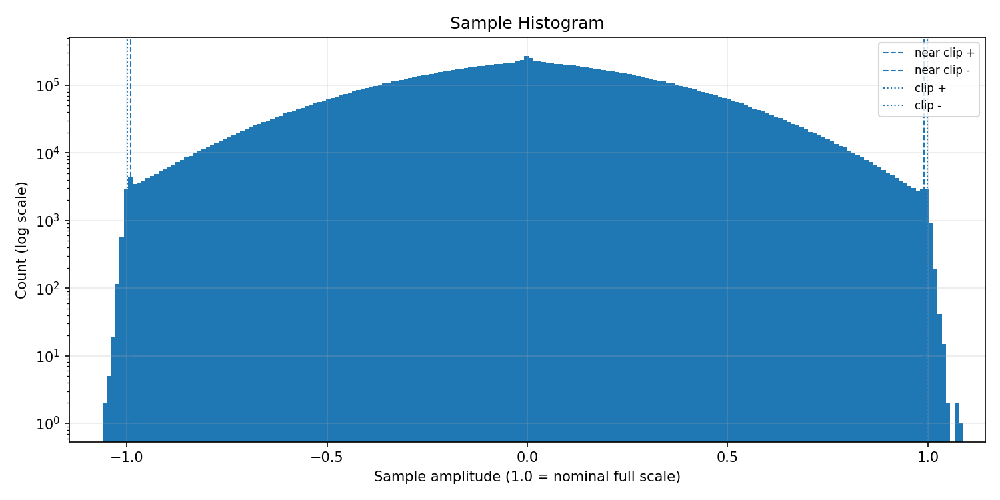
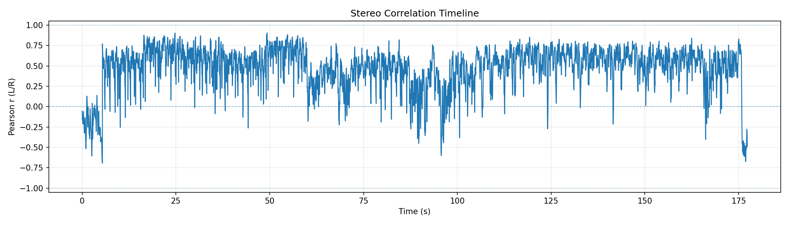
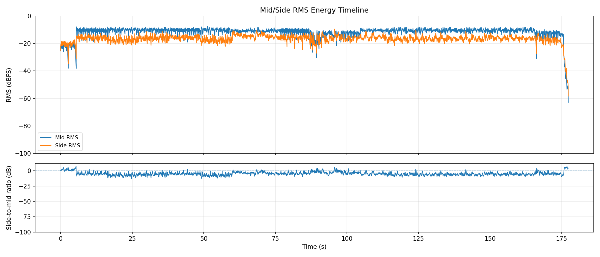
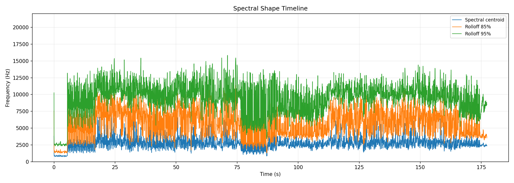
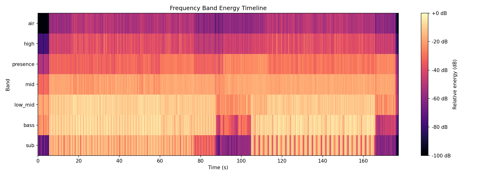
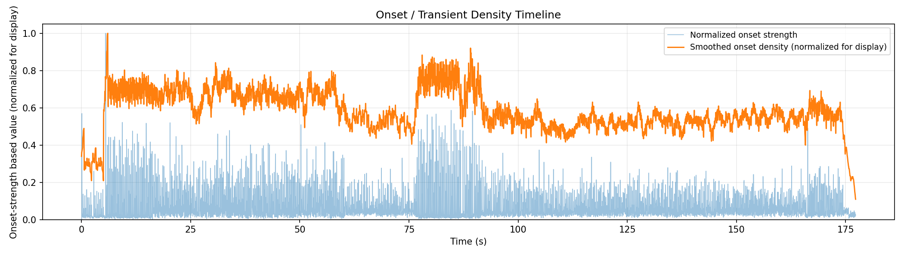

# AudioAtlas Report: sufjanm.mp3

## File

- Duration: 177.29s (2:57)
- Sample rate: 44100 Hz
- Channels: 2
- Format: MP3 / MPEG_LAYER_III

## Level metrics

| Metric | Value | Unit |
|---|---|---|
| Sample peak | 0.734 | dBFS |
| True-peak (approx.) | 1.737 | dBTP |
| RMS | -9.773 | dBFS |
| Crest factor | 10.507 | dB |
| Integrated loudness | -6.606 | LUFS |
| PLR (peak - LUFS) | 8.344 | dB |
| Clipped samples | 4400 |  |
| Near-clipping | 10864 |  |

## Per-channel breakdown

| Metric | ch 0 | ch 1 | Unit |
|---|---|---|---|
| Sample peak | 0.561 | 0.734 | dBFS |
| True-peak (approx.) | 1.737 | 1.178 | dBTP |
| RMS | -10.169 | -9.410 | dBFS |
| DC offset | 0.000 | 0.000 |  |

## Frame RMS envelope summary

- frame_length: 4096
- hop_length: 1024
- frames: 7636
- rms_dbfs_min: -100.000
- rms_dbfs_max: -7.555
- rms_dbfs_mean: -11.818

## Average spectrum summary

Relative dB plots use track max = 0 dB and are not calibrated dBFS.

- nperseg: 8192
- bins: 4097
- strongest_bin_hz: 59.216
- strongest_bin_db: 0.000
- strongest_band: bass

## Band energy summary

| Band | Range | Energy |
|---|---|---|
| sub | 20.000-60.000 Hz | -8.090 dB relative |
| bass | 60.000-120.000 Hz | -4.586 dB relative |
| low_mid | 120.000-350.000 Hz | -6.940 dB relative |
| mid | 350.000-2000.000 Hz | -14.378 dB relative |
| presence | 2000.000-5000.000 Hz | -23.716 dB relative |
| high | 5000.000-10000.000 Hz | -31.870 dB relative |
| air | 10000.000-20000.000 Hz | -44.505 dB relative |

## Spectral shape summary

- n_fft: 4096
- hop_length: 1024
- frames: 7636
- valid_frames: 7636
- undefined_frames: 0
- centroid_mean_hz: 2678.461
- centroid_median_hz: 2566.423
- centroid_min_hz: 728.742
- centroid_max_hz: 7779.028
- rolloff_85_median_hz: 5415.601
- rolloff_95_median_hz: 9517.676
- bandwidth_median_hz: 3097.908
- centroid_elevated_threshold_hz: 3849.635
- centroid_reduced_threshold_hz: 1283.212
- centroid_large_shift_threshold_hz: 2000.000
- centroid_elevated_ranges: 165
- centroid_reduced_ranges: 15
- centroid_large_shift_ranges: 19

## Band energy timeline summary

Relative dB values use this analysis view's maximum as 0 dB and are not calibrated dBFS.

- frames: 7636
- valid_frames: 7636
- strongest_band_by_median: bass

| Band | Median | Mean | Min | Max |
|---|---|---|---|---|
| sub | -19.674 | -27.394 | -100.000 | -3.546 |
| bass | -9.361 | -14.733 | -100.000 | 0.000 |
| low_mid | -11.361 | -13.195 | -100.000 | -2.491 |
| mid | -18.353 | -19.519 | -100.000 | -12.123 |
| presence | -29.147 | -30.323 | -100.000 | -19.197 |
| high | -40.837 | -42.114 | -100.000 | -20.615 |
| air | -53.209 | -54.816 | -100.000 | -31.453 |

## Onset / transient density summary

- hop_length: 1024
- frames: 7636
- smoothing_window_seconds: 1.000
- smoothing_window_frames: 43
- onset_strength_mean: 1.215
- onset_strength_median: 0.736
- onset_strength_max: 18.163
- onset_density_mean: 1.214
- onset_density_median: 1.184
- onset_density_max: 2.081
- high_onset_density_threshold: 1.776
- high_onset_density_ranges: 11
- strongest_onset_density_time: 6.014

## Stereo correlation summary

- frame_length: 4096
- hop_length: 1024
- frames: 7636
- defined_frames: 7636
- undefined_frames: 0
- correlation_min: -0.693
- correlation_max: 0.904
- correlation_mean: 0.470
- correlation_median: 0.532
- overall_correlation: 0.518
- correlation_below_0_ranges: 63
- correlation_below_0_3_ranges: 195

## Mid/side energy summary

- frame_length: 4096
- hop_length: 1024
- frames: 7636
- mid_rms_dbfs_min: -62.904
- mid_rms_dbfs_max: -7.555
- mid_rms_dbfs_mean: -11.816
- side_rms_dbfs_min: -58.286
- side_rms_dbfs_max: -9.553
- side_rms_dbfs_mean: -16.577
- side_to_mid_ratio_db_median: -5.094
- side_to_mid_ratio_db_mean: -4.761
- undefined_ratio_frames: 0
- side_to_mid_ratio_above_minus_6_ranges: 332

## Findings

Findings are prioritized factual observations. Some lower-priority observations may be omitted from this report.
Long lists of time ranges are summarized here; see findings.json for full machine-readable details.
3 lower-priority finding(s) suppressed; see findings.json for details.

### Sample clipping detected

- Severity: issue
- Category: levels
- Measured value: 4400 samples
- Threshold: 0
- Evidence: clipped_samples measured 4400.
- Why it matters: Samples at or beyond the clipping threshold can indicate flattened waveform peaks in the decoded audio.
- Suggested checks:
  - Inspect the waveform around peak sections.
  - Check whether clipping is intentional source material or processing.
- Confidence: high

### Approximate true peak is above 0 dBTP

- Severity: warning
- Category: levels
- Measured value: 1.737 dBTP
- Threshold: 0.000
- Evidence: true_peak_dbtp measured 1.737 dBTP.
- Why it matters: Samples reconstructed by downstream playback or encoding can exceed nominal full scale when true peak is above 0 dBTP.
- Suggested checks:
  - Check a dedicated true-peak meter if this file will be encoded or limited.
  - Inspect the loudest passage for inter-sample peak behavior.
- Confidence: medium

### Near-full-scale samples detected

- Severity: warning
- Category: levels
- Measured value: 10864 samples
- Threshold: 0
- Evidence: near_clipping_samples measured 10864.
- Why it matters: Samples near full scale can indicate limited headroom, even when no sample reaches the clipping threshold.
- Suggested checks:
  - Inspect the sample histogram and peak values.
  - Check whether near-full-scale samples cluster in a specific passage.
- Time ranges: 303 regions, total 133.840s, longest 4.783s.
- First range: 5.433s-5.968s
- Last range: 174.243s-174.335s
- Showing first 8:
  - 5.433s-5.968s
  - 6.107s-6.409s
  - 6.525s-7.338s
  - 7.477s-7.802s
  - 7.872s-8.104s
  - 8.150s-8.545s
  - 8.568s-8.731s
  - 8.847s-8.986s
  - ...and 295 more range(s); see findings.json for full details.
- Confidence: high

### Minimum L/R correlation is below 0

- Severity: warning
- Category: stereo
- Measured value: -0.693 Pearson r
- Threshold: 0.000
- Evidence: correlation_min measured -0.693.
- Why it matters: Negative L/R correlation can indicate phase-inverted content in at least part of the measured timeline.
- Suggested checks:
  - Inspect the stereo correlation plot around the low-correlation region.
  - Listen in mono around these regions if mono compatibility matters.
- Time ranges: 10 regions, total 7.755s, longest 1.486s.
- First range: 0.000s-1.231s
- Last range: 175.821s-177.308s
- Showing first 8:
  - 0.000s-1.231s
  - 1.393s-2.717s
  - 2.740s-3.344s
  - 3.390s-3.901s
  - 4.133s-5.433s
  - 68.360s-68.638s
  - 91.254s-91.603s
  - 95.550s-95.968s
  - ...and 2 more range(s); see findings.json for full details.
- Confidence: medium

### Integrated loudness is above -10 LUFS

- Severity: info
- Category: levels
- Measured value: -6.606 LUFS
- Threshold: -10.000
- Evidence: integrated_lufs measured -6.606 LUFS.
- Why it matters: Integrated LUFS is a whole-track loudness measurement; values above -10 LUFS indicate a high measured loudness for this file.
- Suggested checks:
  - Compare this measured loudness with the intended delivery context.
  - Check PLR and waveform/RMS plots for additional context.
- Confidence: high

### L/R correlation falls below 0.3 in some regions

- Severity: info
- Category: stereo
- Measured value: 31 regions
- Threshold: 0.300
- Evidence: 31 time range(s) have frame correlation below 0.3.
- Why it matters: Low L/R correlation marks regions where the two channels are less similar by this measurement.
- Suggested checks:
  - Inspect the stereo correlation plot around these regions.
  - Listen in mono around these regions if mono compatibility matters.
- Time ranges: 31 regions, total 18.297s, longest 5.433s.
- First range: 0.000s-5.433s
- Last range: 175.775s-177.308s
- Showing first 8:
  - 0.000s-5.433s
  - 60.000s-60.465s
  - 60.511s-60.836s
  - 61.510s-61.765s
  - 61.812s-62.253s
  - 62.856s-63.112s
  - 68.197s-68.801s
  - 70.008s-70.356s
  - ...and 23 more range(s); see findings.json for full details.
- Confidence: medium

### Median side-to-mid ratio is above -6 dB

- Severity: info
- Category: stereo
- Measured value: -5.094 dB
- Threshold: -6.000
- Evidence: side_to_mid_ratio_db_median measured -5.094 dB.
- Why it matters: A higher side-to-mid ratio means side-channel RMS is closer to mid-channel RMS in the measured frames.
- Suggested checks:
  - Inspect the mid/side energy plot and side-to-mid ratio panel.
  - Listen in mono around these regions if side-heavy sections matter.
- Time ranges: 132 regions, total 95.922s, longest 6.269s.
- First range: 0.000s-5.433s
- Last range: 175.729s-177.308s
- Showing first 8:
  - 0.000s-5.433s
  - 5.596s-6.362s
  - 6.618s-6.943s
  - 7.221s-7.616s
  - 8.406s-8.916s
  - 9.288s-10.612s
  - 11.331s-11.703s
  - 12.028s-12.307s
  - ...and 124 more range(s); see findings.json for full details.
- Confidence: medium

### Spectral centroid is elevated relative to this track's median

- Severity: info
- Category: spectrum
- Measured value: 2566.423 Hz
- Threshold: 3849.635
- Evidence: centroid_median_hz measured 2566.423 Hz; 3 time range(s) exceed the relative threshold.
- Why it matters: Spectral centroid is a frequency-distribution statistic; elevated regions indicate the centroid is higher than this track's median by the configured heuristic.
- Suggested checks:
  - Inspect EQ, arrangement density, cymbals, distortion, or vocal presence in these regions.
  - Check whether these sections sound brighter or denser; centroid is only a proxy.
- Time ranges: 3 regions, total 0.859s, longest 0.325s.
- First range: 69.544s-69.799s
- Last range: 133.724s-134.002s
- Showing first 3:
  - 69.544s-69.799s
  - 117.423s-117.748s
  - 133.724s-134.002s
- Confidence: medium

## Plots

### Waveform + RMS Envelope

### Frame RMS Timeline

### Log-Frequency Spectrogram

### Welch Average Spectrum

### Sample Histogram

### Stereo Correlation Timeline

### Mid/Side Energy Timeline

### Spectral Shape Timeline

### Frequency Band Energy Timeline

### Onset / Transient Density Timeline

## Human notes

- Observations:
- EQ ideas:
- Dynamics notes:
- Stereo/image notes: