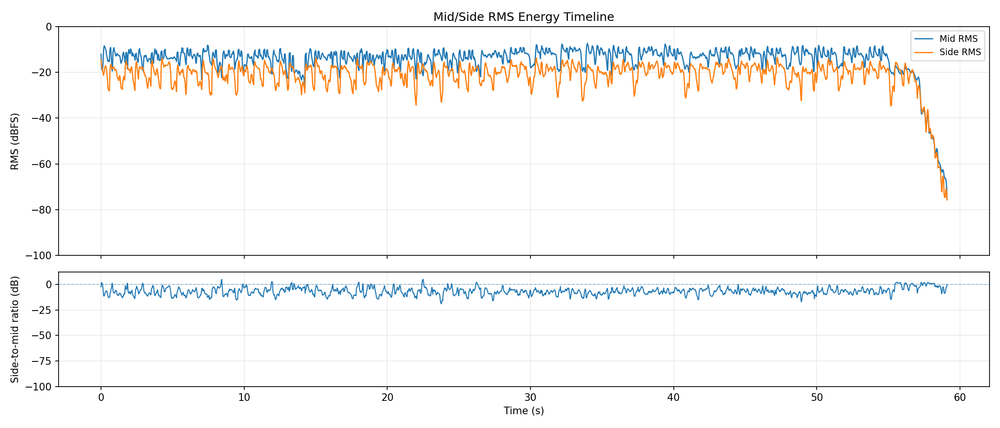
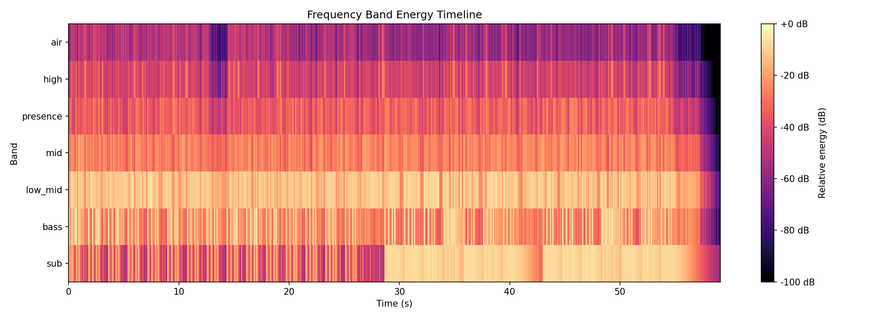
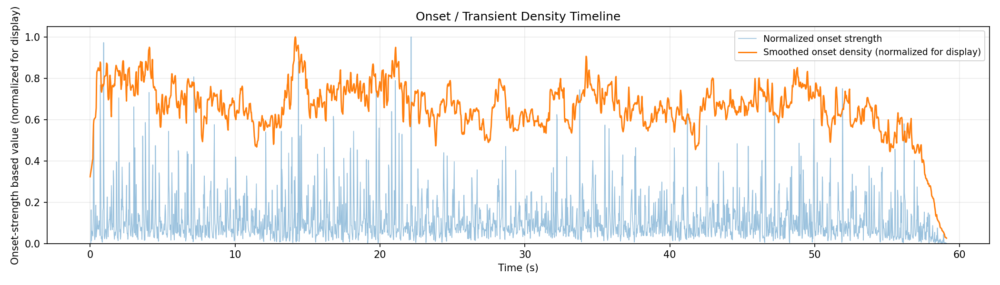

# AudioAtlas Report: dittoguitar.wav

## File

- Duration: 59.10s (0:59)
- Sample rate: 44100 Hz
- Channels: 2
- Format: WAV / PCM_16

## Level metrics

| Metric | Value | Unit |
|---|---|---|
| Sample peak | -0.024 | dBFS |
| True-peak (approx.) | 0.592 | dBTP |
| RMS | -11.707 | dBFS |
| Crest factor | 11.683 | dB |
| Integrated loudness | -9.107 | LUFS |
| PLR (peak - LUFS) | 9.699 | dB |
| Clipped samples | 0 |  |
| Near-clipping | 1482 |  |

## Per-channel breakdown

| Metric | ch 0 | ch 1 | Unit |
|---|---|---|---|
| Sample peak | -0.024 | -0.024 | dBFS |
| True-peak (approx.) | 0.592 | 0.551 | dBTP |
| RMS | -11.939 | -11.488 | dBFS |
| DC offset | -0.001 | -0.000 |  |

## Frame RMS envelope summary

- frame_length: 4096
- hop_length: 1024
- frames: 2546
- rms_dbfs_min: -68.663
- rms_dbfs_max: -7.327
- rms_dbfs_mean: -14.490

## Average spectrum summary

Relative dB plots use track max = 0 dB and are not calibrated dBFS.

- nperseg: 8192
- bins: 4097
- strongest_bin_hz: 172.266
- strongest_bin_db: 0.000
- strongest_band: low_mid

## Band energy summary

| Band | Range | Energy |
|---|---|---|
| sub | 20.000-60.000 Hz | -4.557 dB relative |
| bass | 60.000-120.000 Hz | -4.688 dB relative |
| low_mid | 120.000-350.000 Hz | -4.440 dB relative |
| mid | 350.000-2000.000 Hz | -17.963 dB relative |
| presence | 2000.000-5000.000 Hz | -24.900 dB relative |
| high | 5000.000-10000.000 Hz | -30.024 dB relative |
| air | 10000.000-20000.000 Hz | -42.032 dB relative |

## Spectral shape summary

- n_fft: 4096
- hop_length: 1024
- frames: 2546
- valid_frames: 2546
- undefined_frames: 0
- centroid_mean_hz: 3106.183
- centroid_median_hz: 2854.704
- centroid_min_hz: 907.478
- centroid_max_hz: 7388.485
- rolloff_85_median_hz: 6944.458
- rolloff_95_median_hz: 10228.271
- bandwidth_median_hz: 3458.008
- centroid_elevated_threshold_hz: 4282.056
- centroid_reduced_threshold_hz: 1427.352
- centroid_large_shift_threshold_hz: 2141.028

## Band energy timeline summary

Relative dB values use this analysis view's maximum as 0 dB and are not calibrated dBFS.

- frames: 2546
- valid_frames: 2546
- strongest_band_by_median: low_mid

| Band | Median | Mean | Min | Max |
|---|---|---|---|---|
| sub | -17.218 | -22.584 | -62.189 | -4.719 |
| bass | -22.209 | -22.044 | -84.458 | 0.000 |
| low_mid | -11.922 | -14.342 | -74.932 | -3.721 |
| mid | -26.268 | -27.873 | -90.881 | -16.976 |
| presence | -34.162 | -36.169 | -100.000 | -21.558 |
| high | -42.849 | -44.406 | -100.000 | -22.207 |
| air | -55.137 | -56.477 | -100.000 | -35.551 |

## Onset / transient density summary

- hop_length: 1024
- frames: 2546
- smoothing_window_seconds: 1.000
- smoothing_window_frames: 43
- onset_strength_mean: 1.286
- onset_strength_median: 0.883
- onset_strength_max: 11.107
- onset_density_mean: 1.284
- onset_density_median: 1.297
- onset_density_max: 1.947
- high_onset_density_threshold: 1.946
- strongest_onset_density_time: 14.164

## Stereo correlation summary

- frame_length: 4096
- hop_length: 1024
- frames: 2546
- defined_frames: 2546
- undefined_frames: 0
- correlation_min: -0.516
- correlation_max: 0.977
- correlation_mean: 0.601
- correlation_median: 0.656
- overall_correlation: 0.643
- correlation_below_0_time_ranges: [{'start': 0.023219954648526078, 'end': 0.11609977324262909, 'duration': 0.092879818594103}, {'start': 0.7662585034013606, 'end': 0.8126984126984114, 'duration': 0.046439909297050774}, {'start': 1.8343764172335602, 'end': 1.857596371882085, 'duration': 0.023219954648524777}, {'start': 2.9024943310657596, 'end': 2.9489342403628105, 'duration': 0.046439909297050885}, {'start': 8.382403628117913, 'end': 8.475283446712018, 'duration': 0.09287981859410444}, {'start': 9.891700680272109, 'end': 9.93814058956916, 'duration': 0.04643990929705133}, {'start': 11.911836734693878, 'end': 12.004716553287981, 'duration': 0.09287981859410266}, {'start': 13.235374149659863, 'end': 13.258594104308388, 'duration': 0.023219954648524777}, {'start': 13.281814058956916, 'end': 13.351473922902493, 'duration': 0.0696598639455761}, {'start': 13.467573696145125, 'end': 13.49079365079365, 'duration': 0.023219954648524777}, {'start': 17.949024943310658, 'end': 18.04190476190476, 'duration': 0.09287981859410266}, {'start': 18.297324263038547, 'end': 18.320544217687072, 'duration': 0.023219954648524777}, {'start': 18.83138321995465, 'end': 18.8778231292517, 'duration': 0.04643990929704955}, {'start': 20.456780045351476, 'end': 20.48, 'duration': 0.023219954648524777}, {'start': 22.430476190476192, 'end': 22.54657596371882, 'duration': 0.11609977324262744}, {'start': 24.2184126984127, 'end': 24.241632653061224, 'duration': 0.023219954648524777}, {'start': 24.49705215419501, 'end': 24.520272108843535, 'duration': 0.023219954648524777}, {'start': 26.192108843537415, 'end': 26.308208616780043, 'duration': 0.11609977324262744}, {'start': 55.49569160997732, 'end': 55.913650793650795, 'duration': 0.4179591836734744}, {'start': 56.122630385487525, 'end': 56.28517006802721, 'duration': 0.16253968253968765}, {'start': 56.58702947845805, 'end': 56.74956916099773, 'duration': 0.16253968253968054}, {'start': 57.2604081632653, 'end': 57.376507936507934, 'duration': 0.11609977324263099}, {'start': 57.446167800453516, 'end': 57.608707482993196, 'duration': 0.16253968253968054}, {'start': 57.67836734693878, 'end': 58.2356462585034, 'duration': 0.5572789115646231}]
- correlation_below_0_3_time_ranges: [{'start': 0.0, 'end': 0.13931972789115515, 'duration': 0.13931972789115515}, {'start': 0.7430385487528345, 'end': 0.8126984126984114, 'duration': 0.06965986394557688}, {'start': 1.6950566893424037, 'end': 1.7182766439909285, 'duration': 0.023219954648524777}, {'start': 1.811156462585034, 'end': 1.880816326530611, 'duration': 0.069659863945577}, {'start': 2.48453514739229, 'end': 2.530975056689341, 'duration': 0.046439909297050885}, {'start': 2.8560544217687074, 'end': 2.9721541950113366, 'duration': 0.11609977324262921}, {'start': 3.599092970521542, 'end': 3.691972789115645, 'duration': 0.0928798185941031}, {'start': 4.272471655328798, 'end': 4.365351473922901, 'duration': 0.09287981859410355}, {'start': 4.690430839002268, 'end': 4.829750566893423, 'duration': 0.13931972789115488}, {'start': 5.410249433106576, 'end': 5.433469387755101, 'duration': 0.023219954648524777}, {'start': 7.87156462585034, 'end': 7.894784580498865, 'duration': 0.023219954648524777}, {'start': 8.150204081632653, 'end': 8.21986394557823, 'duration': 0.0696598639455761}, {'start': 8.335963718820862, 'end': 8.475283446712018, 'duration': 0.13931972789115576}, {'start': 9.868480725623582, 'end': 9.984580498866212, 'duration': 0.11609977324262921}, {'start': 10.031020408163265, 'end': 10.100680272108843, 'duration': 0.06965986394557788}, {'start': 10.12390022675737, 'end': 10.216780045351472, 'duration': 0.09287981859410266}, {'start': 11.888616780045352, 'end': 12.004716553287981, 'duration': 0.11609977324262921}, {'start': 13.235374149659863, 'end': 13.37469387755102, 'duration': 0.13931972789115576}, {'start': 13.467573696145125, 'end': 13.560453514739228, 'duration': 0.09287981859410266}, {'start': 13.746213151927437, 'end': 13.815873015873015, 'duration': 0.06965986394557788}, {'start': 14.233832199546486, 'end': 14.25705215419501, 'duration': 0.023219954648524777}, {'start': 14.349931972789115, 'end': 14.48925170068027, 'duration': 0.13931972789115576}, {'start': 15.023310657596372, 'end': 15.116190476190475, 'duration': 0.09287981859410266}, {'start': 16.137868480725622, 'end': 16.2075283446712, 'duration': 0.06965986394557788}, {'start': 17.08988662131519, 'end': 17.15954648526077, 'duration': 0.06965986394557788}, {'start': 17.87936507936508, 'end': 18.04190476190476, 'duration': 0.16253968253968054}, {'start': 18.274104308390022, 'end': 18.320544217687072, 'duration': 0.04643990929704955}, {'start': 18.622403628117915, 'end': 18.738503401360543, 'duration': 0.11609977324262744}, {'start': 18.83138321995465, 'end': 18.947482993197276, 'duration': 0.11609977324262744}, {'start': 19.06358276643991, 'end': 19.133242630385485, 'duration': 0.06965986394557433}, {'start': 19.806621315192743, 'end': 19.829841269841268, 'duration': 0.023219954648524777}, {'start': 20.410340136054423, 'end': 20.503219954648525, 'duration': 0.09287981859410266}, {'start': 20.712199546485262, 'end': 20.735419501133787, 'duration': 0.023219954648524777}, {'start': 20.851519274376418, 'end': 20.921179138321992, 'duration': 0.06965986394557433}, {'start': 22.407256235827663, 'end': 22.593015873015872, 'duration': 0.18575963718820887}, {'start': 22.66267573696145, 'end': 22.685895691609975, 'duration': 0.023219954648524777}, {'start': 24.19519274376417, 'end': 24.288072562358277, 'duration': 0.09287981859410621}, {'start': 24.473832199546486, 'end': 24.543492063492064, 'duration': 0.06965986394557788}, {'start': 26.16888888888889, 'end': 26.40108843537415, 'duration': 0.23219954648525842}, {'start': 28.026485260770976, 'end': 28.11936507936508, 'duration': 0.09287981859410266}, {'start': 32.08997732426304, 'end': 32.113197278911564, 'duration': 0.023219954648524777}, {'start': 36.52498866213152, 'end': 36.548208616780045, 'duration': 0.023219954648524777}, {'start': 37.755646258503404, 'end': 37.802086167800454, 'duration': 0.04643990929704955}, {'start': 42.399637188208615, 'end': 42.446077097505665, 'duration': 0.04643990929704955}, {'start': 43.165895691609975, 'end': 43.25877551020408, 'duration': 0.09287981859410621}, {'start': 43.769614512471655, 'end': 43.816054421768705, 'duration': 0.04643990929704955}, {'start': 44.489433106575966, 'end': 44.535873015873015, 'duration': 0.04643990929704955}, {'start': 46.20770975056689, 'end': 46.25414965986394, 'duration': 0.04643990929704955}, {'start': 46.46312925170068, 'end': 46.4863492063492, 'duration': 0.023219954648524777}, {'start': 47.275827664399095, 'end': 47.29904761904762, 'duration': 0.023219954648524777}, {'start': 50.03900226757369, 'end': 50.08544217687075, 'duration': 0.04643990929705666}, {'start': 50.85170068027211, 'end': 50.96780045351474, 'duration': 0.11609977324263099}, {'start': 51.40897959183673, 'end': 51.478639455782314, 'duration': 0.06965986394558144}, {'start': 53.173696145124715, 'end': 53.220136054421765, 'duration': 0.04643990929704955}, {'start': 54.427573696145124, 'end': 54.45079365079365, 'duration': 0.023219954648524777}, {'start': 55.44925170068027, 'end': 55.93687074829932, 'duration': 0.48761904761904873}, {'start': 56.099410430839, 'end': 56.35482993197279, 'duration': 0.25541950113378675}, {'start': 56.49414965986394, 'end': 56.98176870748299, 'duration': 0.48761904761904873}, {'start': 57.213968253968254, 'end': 58.258866213151926, 'duration': 1.0448979591836718}, {'start': 58.28208616780045, 'end': 58.421405895691606, 'duration': 0.13931972789115576}, {'start': 58.44462585034014, 'end': 58.46784580498866, 'duration': 0.023219954648524777}, {'start': 58.51428571428571, 'end': 58.65360544217687, 'duration': 0.13931972789115576}, {'start': 59.07156462585034, 'end': 59.11800453514739, 'duration': 0.04643990929704955}]

## Mid/side energy summary

- frame_length: 4096
- hop_length: 1024
- frames: 2546
- mid_rms_dbfs_min: -75.392
- mid_rms_dbfs_max: -7.327
- mid_rms_dbfs_mean: -14.538
- side_rms_dbfs_min: -75.787
- side_rms_dbfs_max: -13.451
- side_rms_dbfs_mean: -21.292
- side_to_mid_ratio_db_median: -6.758
- side_to_mid_ratio_db_mean: -6.754
- undefined_ratio_frames: 0
- side_to_mid_ratio_above_minus_6_time_ranges: [{'start': 0.0, 'end': 0.16253968253968124, 'duration': 0.16253968253968124}, {'start': 0.6965986394557823, 'end': 0.8359183673469375, 'duration': 0.1393197278911552}, {'start': 1.0216780045351475, 'end': 1.0448979591836722, 'duration': 0.023219954648524777}, {'start': 1.6718367346938776, 'end': 1.904036281179137, 'duration': 0.2321995464852593}, {'start': 2.159455782312925, 'end': 2.18267573696145, 'duration': 0.023219954648524777}, {'start': 2.414875283446712, 'end': 2.6006349206349193, 'duration': 0.1857596371882071}, {'start': 2.7399546485260773, 'end': 2.9953741496598627, 'duration': 0.2554195011337854}, {'start': 3.5294331065759637, 'end': 3.691972789115645, 'duration': 0.16253968253968143}, {'start': 3.947392290249433, 'end': 3.970612244897958, 'duration': 0.023219954648524777}, {'start': 4.2260317460317465, 'end': 4.411791383219954, 'duration': 0.1857596371882071}, {'start': 4.504671201814059, 'end': 4.852970521541949, 'duration': 0.3482993197278903}, {'start': 5.363809523809524, 'end': 5.526349206349205, 'duration': 0.16253968253968143}, {'start': 6.0836281179138325, 'end': 6.176507936507935, 'duration': 0.09287981859410266}, {'start': 6.3854875283446715, 'end': 6.4551473922902485, 'duration': 0.069659863945577}, {'start': 6.594467120181406, 'end': 6.687346938775509, 'duration': 0.09287981859410266}, {'start': 7.035646258503402, 'end': 7.105306122448979, 'duration': 0.069659863945577}, {'start': 7.128526077097506, 'end': 7.1749659863945565, 'duration': 0.04643990929705044}, {'start': 7.198185941043084, 'end': 7.221405895691609, 'duration': 0.023219954648524777}, {'start': 7.75546485260771, 'end': 7.987664399092969, 'duration': 0.2321995464852593}, {'start': 8.080544217687075, 'end': 8.498503401360542, 'duration': 0.4179591836734673}, {'start': 8.986122448979591, 'end': 9.195102040816325, 'duration': 0.20897959183673365}, {'start': 9.311201814058958, 'end': 9.357641723356007, 'duration': 0.04643990929704955}, {'start': 9.613061224489796, 'end': 9.729160997732425, 'duration': 0.11609977324262921}, {'start': 9.845260770975056, 'end': 10.239999999999998, 'duration': 0.3947392290249425}, {'start': 10.704399092970522, 'end': 11.006258503401359, 'duration': 0.3018594104308363}, {'start': 11.400997732426303, 'end': 11.563537414965985, 'duration': 0.16253968253968232}, {'start': 11.656417233560092, 'end': 11.702857142857141, 'duration': 0.04643990929704955}, {'start': 11.77251700680272, 'end': 12.004716553287981, 'duration': 0.2321995464852602}, {'start': 12.515555555555556, 'end': 12.724535147392288, 'duration': 0.20897959183673187}, {'start': 12.747755102040816, 'end': 12.794195011337868, 'duration': 0.04643990929705133}, {'start': 12.910294784580499, 'end': 13.142494331065759, 'duration': 0.2321995464852602}, {'start': 13.165714285714285, 'end': 14.001632653061224, 'duration': 0.8359183673469381}, {'start': 14.02485260770975, 'end': 14.25705215419501, 'duration': 0.2321995464852602}, {'start': 14.280272108843537, 'end': 14.558911564625848, 'duration': 0.27863945578231153}, {'start': 14.698231292517006, 'end': 14.744671201814057, 'duration': 0.04643990929705133}, {'start': 14.97687074829932, 'end': 15.185850340136053, 'duration': 0.20897959183673365}, {'start': 15.255510204081633, 'end': 15.278730158730157, 'duration': 0.023219954648524777}, {'start': 15.348390022675737, 'end': 15.394829931972788, 'duration': 0.04643990929705133}, {'start': 16.091428571428573, 'end': 16.277188208616778, 'duration': 0.18575963718820532}, {'start': 16.300408163265306, 'end': 16.39328798185941, 'duration': 0.09287981859410266}, {'start': 16.486167800453515, 'end': 16.555827664399093, 'duration': 0.06965986394557788}, {'start': 16.81124716553288, 'end': 16.950566893424035, 'duration': 0.13931972789115576}, {'start': 17.04344671201814, 'end': 17.205986394557822, 'duration': 0.16253968253968054}, {'start': 17.832925170068027, 'end': 18.088344671201813, 'duration': 0.25541950113378675}, {'start': 18.250884353741498, 'end': 18.3437641723356, 'duration': 0.09287981859410266}, {'start': 18.575963718820862, 'end': 19.156462585034014, 'duration': 0.5804988662131514}, {'start': 19.71374149659864, 'end': 19.87628117913832, 'duration': 0.16253968253968054}, {'start': 20.36390022675737, 'end': 20.52643990929705, 'duration': 0.16253968253968054}, {'start': 20.64253968253968, 'end': 20.94439909297052, 'duration': 0.30185941043083986}, {'start': 21.478458049886623, 'end': 21.501678004535147, 'duration': 0.023219954648524777}, {'start': 21.524897959183672, 'end': 21.571337868480725, 'duration': 0.046439909297053106}, {'start': 21.640997732426303, 'end': 21.757097505668934, 'duration': 0.11609977324263099}, {'start': 22.151836734693877, 'end': 22.221496598639455, 'duration': 0.06965986394557788}, {'start': 22.267936507936508, 'end': 22.314376417233557, 'duration': 0.04643990929704955}, {'start': 22.407256235827663, 'end': 22.801995464852606, 'duration': 0.3947392290249425}, {'start': 23.08063492063492, 'end': 23.1502947845805, 'duration': 0.06965986394557788}, {'start': 23.196734693877552, 'end': 23.219954648526077, 'duration': 0.023219954648524777}, {'start': 23.26639455782313, 'end': 23.289614512471655, 'duration': 0.023219954648524777}, {'start': 23.312834467120183, 'end': 23.359274376417233, 'duration': 0.04643990929704955}, {'start': 23.962993197278912, 'end': 24.102312925170068, 'duration': 0.13931972789115576}, {'start': 24.14875283446712, 'end': 24.56671201814059, 'duration': 0.4179591836734673}, {'start': 24.86857142857143, 'end': 24.938231292517006, 'duration': 0.06965986394557788}, {'start': 25.054331065759637, 'end': 25.33297052154195, 'duration': 0.27863945578231153}, {'start': 25.75092970521542, 'end': 25.820589569160997, 'duration': 0.06965986394557788}, {'start': 25.98312925170068, 'end': 26.540408163265305, 'duration': 0.5572789115646231}, {'start': 26.79582766439909, 'end': 27.004807256235825, 'duration': 0.20897959183673365}, {'start': 27.980045351473922, 'end': 28.142585034013603, 'duration': 0.16253968253968054}, {'start': 28.514104308390024, 'end': 28.93206349206349, 'duration': 0.4179591836734673}, {'start': 29.024943310657598, 'end': 29.048163265306123, 'duration': 0.023219954648524777}, {'start': 29.350022675736962, 'end': 29.46612244897959, 'duration': 0.11609977324262744}, {'start': 29.6518820861678, 'end': 29.721541950113377, 'duration': 0.06965986394557788}, {'start': 29.976961451247167, 'end': 30.023401360544216, 'duration': 0.04643990929704955}, {'start': 30.25560090702948, 'end': 30.441360544217687, 'duration': 0.18575963718820887}, {'start': 30.53424036281179, 'end': 30.557460317460315, 'duration': 0.023219954648524777}, {'start': 30.743219954648527, 'end': 30.789659863945577, 'duration': 0.04643990929704955}, {'start': 31.13795918367347, 'end': 31.18439909297052, 'duration': 0.04643990929704955}, {'start': 31.648798185941043, 'end': 31.71845804988662, 'duration': 0.06965986394557788}, {'start': 32.02031746031746, 'end': 32.13641723356009, 'duration': 0.11609977324263099}, {'start': 32.41505668934241, 'end': 32.507936507936506, 'duration': 0.0928798185940991}, {'start': 32.53115646258503, 'end': 32.69369614512472, 'duration': 0.16253968253968765}, {'start': 32.879455782312924, 'end': 33.01877551020408, 'duration': 0.13931972789115576}, {'start': 33.34385487528345, 'end': 33.41351473922902, 'duration': 0.06965986394557433}, {'start': 33.80825396825397, 'end': 33.877913832199546, 'duration': 0.06965986394557433}, {'start': 34.15655328798186, 'end': 34.17977324263038, 'duration': 0.023219954648524777}, {'start': 35.34077097505669, 'end': 35.41043083900227, 'duration': 0.06965986394557433}, {'start': 35.66585034013605, 'end': 35.75873015873016, 'duration': 0.09287981859410621}, {'start': 35.9677097505669, 'end': 36.08380952380952, 'duration': 0.11609977324262388}, {'start': 36.45532879818594, 'end': 36.64108843537415, 'duration': 0.18575963718821242}, {'start': 36.75718820861678, 'end': 36.89650793650794, 'duration': 0.13931972789115576}, {'start': 37.03582766439909, 'end': 37.17514739229025, 'duration': 0.13931972789115576}, {'start': 37.477006802721085, 'end': 37.54666666666667, 'duration': 0.06965986394558144}, {'start': 37.63954648526077, 'end': 37.89496598639456, 'duration': 0.25541950113378675}, {'start': 38.54512471655329, 'end': 38.59156462585034, 'duration': 0.04643990929704955}, {'start': 38.75410430839002, 'end': 38.93986394557823, 'duration': 0.18575963718821242}, {'start': 39.288163265306125, 'end': 39.334603174603174, 'duration': 0.04643990929704955}, {'start': 39.54358276643991, 'end': 39.659682539682535, 'duration': 0.11609977324262388}, {'start': 40.054421768707485, 'end': 40.24018140589569, 'duration': 0.18575963718820532}, {'start': 40.333061224489796, 'end': 40.379501133786846, 'duration': 0.04643990929704955}, {'start': 40.40272108843537, 'end': 40.425941043083895, 'duration': 0.023219954648524777}, {'start': 40.63492063492063, 'end': 40.751020408163264, 'duration': 0.11609977324263099}, {'start': 41.12253968253968, 'end': 41.54049886621315, 'duration': 0.4179591836734673}, {'start': 41.81913832199547, 'end': 42.00489795918367, 'duration': 0.18575963718820532}, {'start': 42.09777777777778, 'end': 42.49251700680272, 'duration': 0.3947392290249425}, {'start': 43.003356009070295, 'end': 43.30521541950113, 'duration': 0.3018594104308363}, {'start': 43.35165532879819, 'end': 43.37487528344671, 'duration': 0.023219954648524777}, {'start': 43.67673469387755, 'end': 43.885714285714286, 'duration': 0.2089795918367372}, {'start': 43.90893424036281, 'end': 44.02503401360544, 'duration': 0.11609977324263099}, {'start': 44.28045351473923, 'end': 44.32689342403628, 'duration': 0.04643990929704955}, {'start': 44.46621315192744, 'end': 44.582312925170065, 'duration': 0.11609977324262388}, {'start': 44.67519274376417, 'end': 44.76807256235828, 'duration': 0.09287981859410621}, {'start': 44.7912925170068, 'end': 44.95383219954648, 'duration': 0.16253968253968054}, {'start': 45.139591836734695, 'end': 45.20925170068027, 'duration': 0.06965986394557433}, {'start': 45.51111111111111, 'end': 45.60399092970521, 'duration': 0.0928798185940991}, {'start': 45.65043083900227, 'end': 45.67365079365079, 'duration': 0.023219954648524777}, {'start': 45.69687074829932, 'end': 45.789750566893424, 'duration': 0.09287981859410621}, {'start': 45.905850340136055, 'end': 46.021950113378686, 'duration': 0.11609977324263099}, {'start': 46.16126984126984, 'end': 46.27736961451247, 'duration': 0.11609977324263099}, {'start': 46.393469387755104, 'end': 46.50956916099773, 'duration': 0.11609977324262388}, {'start': 46.53278911564626, 'end': 46.57922902494331, 'duration': 0.04643990929704955}, {'start': 46.602448979591834, 'end': 46.62566893424036, 'duration': 0.023219954648524777}, {'start': 46.81142857142857, 'end': 46.834648526077096, 'duration': 0.023219954648524777}, {'start': 46.9275283446712, 'end': 46.95074829931973, 'duration': 0.023219954648524777}, {'start': 47.09006802721088, 'end': 47.11328798185941, 'duration': 0.023219954648524777}, {'start': 47.206167800453514, 'end': 47.39192743764172, 'duration': 0.18575963718820532}, {'start': 47.484807256235825, 'end': 47.50802721088435, 'duration': 0.023219954648524777}, {'start': 47.53124716553288, 'end': 47.74022675736961, 'duration': 0.2089795918367301}, {'start': 50.01578231292517, 'end': 50.108662131519274, 'duration': 0.09287981859410621}, {'start': 50.31764172335601, 'end': 50.433741496598635, 'duration': 0.11609977324262388}, {'start': 50.78204081632653, 'end': 51.13034013605442, 'duration': 0.34829931972789296}, {'start': 51.36253968253968, 'end': 51.50185941043084, 'duration': 0.13931972789115576}, {'start': 51.687619047619044, 'end': 51.8269387755102, 'duration': 0.13931972789115576}, {'start': 51.85015873015873, 'end': 51.87337868480726, 'duration': 0.023219954648524777}, {'start': 51.96625850340136, 'end': 52.05913832199546, 'duration': 0.0928798185940991}, {'start': 52.63963718820862, 'end': 52.732517006802716, 'duration': 0.0928798185940991}, {'start': 52.91827664399093, 'end': 52.94149659863945, 'duration': 0.023219954648524777}, {'start': 53.10403628117914, 'end': 53.289795918367346, 'duration': 0.18575963718820532}, {'start': 53.498775510204084, 'end': 53.63809523809524, 'duration': 0.13931972789115576}, {'start': 53.75419501133787, 'end': 53.986394557823125, 'duration': 0.23219954648525487}, {'start': 54.381133786848075, 'end': 54.543673469387755, 'duration': 0.16253968253968054}, {'start': 54.659773242630386, 'end': 54.706213151927436, 'duration': 0.04643990929704955}, {'start': 54.75265306122449, 'end': 54.77587301587302, 'duration': 0.023219954648524777}, {'start': 54.9384126984127, 'end': 55.10095238095238, 'duration': 0.16253968253968054}, {'start': 55.33315192743764, 'end': 55.40281179138322, 'duration': 0.06965986394558144}, {'start': 55.44925170068027, 'end': 56.42448979591837, 'duration': 0.9752380952380975}, {'start': 56.447709750566894, 'end': 57.00498866213152, 'duration': 0.5572789115646231}, {'start': 57.0746485260771, 'end': 58.700045351473925, 'duration': 1.6253968253968267}, {'start': 58.7697052154195, 'end': 58.88580498866213, 'duration': 0.11609977324263099}, {'start': 59.00190476190476, 'end': 59.11800453514739, 'duration': 0.11609977324263099}]

## Findings

Findings are prioritized factual observations. Some lower-priority observations may be omitted from this report.
3 lower-priority finding(s) suppressed; see findings.json for details.

### Approximate true peak is above 0 dBTP

- Severity: warning
- Category: levels
- Measured value: 0.592 dBTP
- Threshold: 0.000
- Evidence: true_peak_dbtp measured 0.592 dBTP.
- Why it matters: Samples reconstructed by downstream playback or encoding can exceed nominal full scale when true peak is above 0 dBTP.
- Suggested checks:
  - Check a dedicated true-peak meter if this file will be encoded or limited.
  - Inspect the loudest passage for inter-sample peak behavior.
- Confidence: medium

### Near-full-scale samples detected

- Severity: warning
- Category: levels
- Measured value: 1482 samples
- Threshold: 0
- Evidence: near_clipping_samples measured 1482.
- Why it matters: Samples near full scale can indicate limited headroom, even when no sample reaches the clipping threshold.
- Suggested checks:
  - Inspect the sample histogram and peak values.
  - Check whether near-full-scale samples cluster in a specific passage.
- Time ranges:
  - 0.000s-0.046s (0.046s)
  - 0.163s-0.372s (0.209s)
  - 0.604s-0.743s (0.139s)
  - 0.813s-1.068s (0.255s)
  - 1.509s-1.602s (0.093s)
  - 1.718s-1.834s (0.116s)
  - 1.881s-1.997s (0.116s)
  - 2.043s-2.229s (0.186s)
  - 2.392s-2.508s (0.116s)
  - 2.577s-2.810s (0.232s)
  - 2.972s-3.158s (0.186s)
  - 3.506s-3.599s (0.093s)
  - 3.692s-4.040s (0.348s)
  - 4.180s-4.296s (0.116s)
  - 4.412s-4.551s (0.139s)
  - 5.294s-5.410s (0.116s)
  - 5.526s-5.735s (0.209s)
  - 5.968s-6.084s (0.116s)
  - 6.200s-6.293s (0.093s)
  - 7.036s-7.268s (0.232s)
  - 7.430s-7.523s (0.093s)
  - 7.755s-7.941s (0.186s)
  - 7.988s-8.081s (0.093s)
  - 8.452s-8.545s (0.093s)
  - 8.893s-8.986s (0.093s)
  - 9.218s-9.311s (0.093s)
  - 9.543s-9.683s (0.139s)
  - 9.776s-9.868s (0.093s)
  - 10.170s-10.286s (0.116s)
  - 10.449s-10.542s (0.093s)
  - 10.681s-10.937s (0.255s)
  - 11.006s-11.099s (0.093s)
  - 11.355s-11.494s (0.139s)
  - 11.564s-11.680s (0.116s)
  - 12.005s-12.098s (0.093s)
  - 12.469s-12.562s (0.093s)
  - 12.794s-12.887s (0.093s)
  - 13.142s-13.235s (0.093s)
  - 13.351s-13.444s (0.093s)
  - 14.257s-14.350s (0.093s)
  - 14.466s-14.698s (0.232s)
  - 14.930s-15.023s (0.093s)
  - 15.163s-15.302s (0.139s)
  - 15.604s-15.697s (0.093s)
  - 16.045s-16.138s (0.093s)
  - 16.254s-16.509s (0.255s)
  - 16.672s-16.904s (0.232s)
  - 16.951s-17.067s (0.116s)
  - 17.206s-17.299s (0.093s)
  - 17.833s-17.949s (0.116s)
  - 18.181s-18.274s (0.093s)
  - 18.506s-18.622s (0.116s)
  - 18.739s-18.831s (0.093s)
  - 18.947s-19.040s (0.093s)
  - 19.621s-19.737s (0.116s)
  - 19.969s-20.062s (0.093s)
  - 20.294s-20.434s (0.139s)
  - 20.503s-20.619s (0.116s)
  - 20.689s-20.782s (0.093s)
  - 20.944s-21.084s (0.139s)
  - 21.200s-21.293s (0.093s)
  - 21.432s-21.548s (0.116s)
  - 21.757s-21.850s (0.093s)
  - 22.036s-22.245s (0.209s)
  - 22.314s-22.430s (0.116s)
  - 22.779s-22.895s (0.116s)
  - 23.220s-23.336s (0.116s)
  - 23.545s-23.661s (0.116s)
  - 23.870s-24.033s (0.163s)
  - 24.102s-24.218s (0.116s)
  - 24.520s-24.706s (0.186s)
  - 25.008s-25.310s (0.302s)
  - 25.333s-25.449s (0.116s)
  - 25.681s-25.821s (0.139s)
  - 25.890s-26.006s (0.116s)
  - 28.584s-28.700s (0.116s)
  - 28.909s-29.025s (0.116s)
  - 29.257s-29.373s (0.116s)
  - 29.489s-29.582s (0.093s)
  - 30.348s-30.534s (0.186s)
  - 30.720s-30.883s (0.163s)
  - 31.045s-31.161s (0.116s)
  - 31.277s-31.370s (0.093s)
  - 32.113s-32.299s (0.186s)
  - 32.508s-32.601s (0.093s)
  - 32.694s-32.787s (0.093s)
  - 32.833s-32.949s (0.116s)
  - 33.065s-33.158s (0.093s)
  - 33.344s-33.437s (0.093s)
  - 33.924s-34.133s (0.209s)
  - 34.296s-34.389s (0.093s)
  - 34.621s-34.760s (0.139s)
  - 34.853s-35.016s (0.163s)
  - 35.527s-35.619s (0.093s)
  - 35.736s-35.875s (0.139s)
  - 36.084s-36.223s (0.139s)
  - 36.409s-36.525s (0.116s)
  - 36.641s-36.780s (0.139s)
  - 37.523s-37.709s (0.186s)
  - 37.872s-37.988s (0.116s)
  - 38.220s-38.336s (0.116s)
  - 38.429s-38.545s (0.116s)
  - 39.102s-39.195s (0.093s)
  - 39.335s-39.520s (0.186s)
  - 39.660s-39.776s (0.116s)
  - 39.892s-39.985s (0.093s)
  - 40.008s-40.101s (0.093s)
  - 40.194s-40.333s (0.139s)
  - 41.099s-41.355s (0.255s)
  - 42.493s-42.585s (0.093s)
  - 42.910s-43.096s (0.186s)
  - 43.259s-43.352s (0.093s)
  - 43.584s-43.700s (0.116s)
  - 43.816s-43.909s (0.093s)
  - 44.675s-44.815s (0.139s)
  - 45.047s-45.140s (0.093s)
  - 45.372s-45.488s (0.116s)
  - 45.604s-45.720s (0.116s)
  - 46.486s-46.951s (0.464s)
  - 47.113s-47.276s (0.163s)
  - 47.392s-47.578s (0.186s)
  - 48.274s-48.530s (0.255s)
  - 48.623s-48.715s (0.093s)
  - 48.948s-49.133s (0.186s)
  - 49.180s-49.389s (0.209s)
  - 49.644s-49.737s (0.093s)
  - 49.853s-49.946s (0.093s)
  - 50.062s-50.202s (0.139s)
  - 50.411s-50.527s (0.116s)
  - 50.643s-50.852s (0.209s)
  - 50.945s-51.084s (0.139s)
  - 51.804s-52.082s (0.279s)
  - 52.198s-52.315s (0.116s)
  - 52.547s-52.640s (0.093s)
  - 52.733s-52.895s (0.163s)
  - 53.058s-53.150s (0.093s)
  - 53.661s-53.777s (0.116s)
  - 53.986s-54.102s (0.116s)
  - 54.288s-54.428s (0.139s)
  - 54.544s-54.729s (0.186s)
- Confidence: high

### Minimum L/R correlation is below 0

- Severity: warning
- Category: stereo
- Measured value: -0.516 Pearson r
- Threshold: 0.000
- Evidence: correlation_min measured -0.516.
- Why it matters: Negative L/R correlation can indicate phase-inverted content in at least part of the measured timeline.
- Suggested checks:
  - Inspect the stereo correlation plot around the low-correlation region.
  - Listen in mono around these regions if mono compatibility matters.
- Time ranges:
  - 0.023s-0.116s (0.093s)
  - 0.766s-0.813s (0.046s)
  - 1.834s-1.858s (0.023s)
  - 2.902s-2.949s (0.046s)
  - 8.382s-8.475s (0.093s)
  - 9.892s-9.938s (0.046s)
  - 11.912s-12.005s (0.093s)
  - 13.235s-13.259s (0.023s)
  - 13.282s-13.351s (0.070s)
  - 13.468s-13.491s (0.023s)
  - 17.949s-18.042s (0.093s)
  - 18.297s-18.321s (0.023s)
  - 18.831s-18.878s (0.046s)
  - 20.457s-20.480s (0.023s)
  - 22.430s-22.547s (0.116s)
  - 24.218s-24.242s (0.023s)
  - 24.497s-24.520s (0.023s)
  - 26.192s-26.308s (0.116s)
  - 55.496s-55.914s (0.418s)
  - 56.123s-56.285s (0.163s)
  - 56.587s-56.750s (0.163s)
  - 57.260s-57.377s (0.116s)
  - 57.446s-57.609s (0.163s)
  - 57.678s-58.236s (0.557s)
- Confidence: medium

### Integrated loudness is above -10 LUFS

- Severity: info
- Category: levels
- Measured value: -9.107 LUFS
- Threshold: -10.000
- Evidence: integrated_lufs measured -9.107 LUFS.
- Why it matters: Integrated LUFS is a whole-track loudness measurement; values above -10 LUFS indicate a high measured loudness for this file.
- Suggested checks:
  - Compare this measured loudness with the intended delivery context.
  - Check PLR and waveform/RMS plots for additional context.
- Confidence: high

### L/R correlation falls below 0.3 in some regions

- Severity: info
- Category: stereo
- Measured value: 63 regions
- Threshold: 0.300
- Evidence: 63 time range(s) have frame correlation below 0.3.
- Why it matters: Low L/R correlation marks regions where the two channels are less similar by this measurement.
- Suggested checks:
  - Inspect the stereo correlation plot around these regions.
  - Listen in mono around these regions if mono compatibility matters.
- Time ranges:
  - 0.000s-0.139s (0.139s)
  - 0.743s-0.813s (0.070s)
  - 1.695s-1.718s (0.023s)
  - 1.811s-1.881s (0.070s)
  - 2.485s-2.531s (0.046s)
  - 2.856s-2.972s (0.116s)
  - 3.599s-3.692s (0.093s)
  - 4.272s-4.365s (0.093s)
  - 4.690s-4.830s (0.139s)
  - 5.410s-5.433s (0.023s)
  - 7.872s-7.895s (0.023s)
  - 8.150s-8.220s (0.070s)
  - 8.336s-8.475s (0.139s)
  - 9.868s-9.985s (0.116s)
  - 10.031s-10.101s (0.070s)
  - 10.124s-10.217s (0.093s)
  - 11.889s-12.005s (0.116s)
  - 13.235s-13.375s (0.139s)
  - 13.468s-13.560s (0.093s)
  - 13.746s-13.816s (0.070s)
  - 14.234s-14.257s (0.023s)
  - 14.350s-14.489s (0.139s)
  - 15.023s-15.116s (0.093s)
  - 16.138s-16.208s (0.070s)
  - 17.090s-17.160s (0.070s)
  - 17.879s-18.042s (0.163s)
  - 18.274s-18.321s (0.046s)
  - 18.622s-18.739s (0.116s)
  - 18.831s-18.947s (0.116s)
  - 19.064s-19.133s (0.070s)
  - 19.807s-19.830s (0.023s)
  - 20.410s-20.503s (0.093s)
  - 20.712s-20.735s (0.023s)
  - 20.852s-20.921s (0.070s)
  - 22.407s-22.593s (0.186s)
  - 22.663s-22.686s (0.023s)
  - 24.195s-24.288s (0.093s)
  - 24.474s-24.543s (0.070s)
  - 26.169s-26.401s (0.232s)
  - 28.026s-28.119s (0.093s)
  - 32.090s-32.113s (0.023s)
  - 36.525s-36.548s (0.023s)
  - 37.756s-37.802s (0.046s)
  - 42.400s-42.446s (0.046s)
  - 43.166s-43.259s (0.093s)
  - 43.770s-43.816s (0.046s)
  - 44.489s-44.536s (0.046s)
  - 46.208s-46.254s (0.046s)
  - 46.463s-46.486s (0.023s)
  - 47.276s-47.299s (0.023s)
  - 50.039s-50.085s (0.046s)
  - 50.852s-50.968s (0.116s)
  - 51.409s-51.479s (0.070s)
  - 53.174s-53.220s (0.046s)
  - 54.428s-54.451s (0.023s)
  - 55.449s-55.937s (0.488s)
  - 56.099s-56.355s (0.255s)
  - 56.494s-56.982s (0.488s)
  - 57.214s-58.259s (1.045s)
  - 58.282s-58.421s (0.139s)
  - 58.445s-58.468s (0.023s)
  - 58.514s-58.654s (0.139s)
  - 59.072s-59.118s (0.046s)
- Confidence: medium

### Strongest average-spectrum bin is in the low-mid region

- Severity: info
- Category: spectrum
- Measured value: 172.266 Hz
- Threshold: 120
- Evidence: strongest_bin_hz measured 172.266 Hz.
- Why it matters: This identifies where the strongest Welch average-spectrum bin falls; it does not describe whether the balance is desirable.
- Suggested checks:
  - Inspect the average spectrum plot around 120-350 Hz.
  - Listen for which instruments or sources occupy that region.
- Confidence: medium

### Spectral centroid is elevated relative to this track's median

- Severity: info
- Category: spectrum
- Measured value: 2854.704 Hz
- Threshold: 4282.056
- Evidence: centroid_median_hz measured 2854.704 Hz; 83 time range(s) exceed the relative threshold.
- Why it matters: Spectral centroid is a frequency-distribution statistic; elevated regions indicate the centroid is higher than this track's median by the configured heuristic.
- Suggested checks:
  - Inspect EQ, arrangement density, cymbals, distortion, or vocal presence in these regions.
  - Check whether these sections sound brighter or denser; centroid is only a proxy.
- Time ranges:
  - 0.534s-0.557s (0.023s)
  - 0.650s-0.697s (0.046s)
  - 0.882s-0.929s (0.046s)
  - 1.416s-1.579s (0.163s)
  - 1.950s-1.974s (0.023s)
  - 2.183s-2.276s (0.093s)
  - 2.299s-2.461s (0.163s)
  - 2.508s-2.554s (0.046s)
  - 2.647s-2.694s (0.046s)
  - 2.717s-2.833s (0.116s)
  - 2.972s-3.019s (0.046s)
  - 3.042s-3.135s (0.093s)
  - 3.646s-3.692s (0.046s)
  - 4.319s-4.365s (0.046s)
  - 4.923s-5.039s (0.116s)
  - 5.132s-5.248s (0.116s)
  - 5.341s-5.364s (0.023s)
  - 5.898s-6.060s (0.163s)
  - 6.664s-6.757s (0.093s)
  - 6.943s-7.036s (0.093s)
  - 7.105s-7.152s (0.046s)
  - 8.290s-8.406s (0.116s)
  - 8.499s-8.568s (0.070s)
  - 8.615s-8.638s (0.023s)
  - 8.707s-8.754s (0.046s)
  - 9.404s-9.636s (0.232s)
  - 10.008s-10.077s (0.070s)
  - 10.588s-10.751s (0.163s)
  - 10.774s-10.820s (0.046s)
  - 11.215s-11.262s (0.046s)
  - 11.378s-11.401s (0.023s)
  - 12.214s-12.307s (0.093s)
  - 14.443s-14.605s (0.163s)
  - 14.629s-14.652s (0.023s)
  - 14.814s-15.000s (0.186s)
  - 15.047s-15.186s (0.139s)
  - 15.325s-15.488s (0.163s)
  - 15.813s-15.952s (0.139s)
  - 15.999s-16.045s (0.046s)
  - 16.695s-16.718s (0.023s)
  - 16.742s-16.788s (0.046s)
  - 17.136s-17.276s (0.139s)
  - 17.972s-18.065s (0.093s)
  - 18.855s-19.040s (0.186s)
  - 19.087s-19.296s (0.209s)
  - 19.760s-19.807s (0.046s)
  - 19.876s-19.946s (0.070s)
  - 20.782s-20.805s (0.023s)
  - 23.174s-23.290s (0.116s)
  - 24.381s-24.427s (0.046s)
  - 24.938s-25.078s (0.139s)
  - 25.588s-25.635s (0.046s)
  - 26.355s-26.448s (0.093s)
  - 28.073s-28.212s (0.139s)
  - 28.398s-28.653s (0.255s)
  - 30.209s-30.232s (0.023s)
  - 32.090s-32.229s (0.139s)
  - 33.762s-33.808s (0.046s)
  - 34.575s-34.667s (0.093s)
  - 34.830s-35.016s (0.186s)
  - 35.759s-35.805s (0.046s)
  - 35.991s-36.153s (0.163s)
  - 36.664s-36.734s (0.070s)
  - 37.779s-38.011s (0.232s)
  - 39.288s-39.404s (0.116s)
  - 39.567s-39.753s (0.186s)
  - 40.263s-40.287s (0.023s)
  - 40.914s-41.030s (0.116s)
  - 42.469s-42.585s (0.116s)
  - 43.746s-43.862s (0.116s)
  - 44.443s-44.559s (0.116s)
  - 44.606s-44.629s (0.023s)
  - 46.231s-46.277s (0.046s)
  - 48.089s-48.181s (0.093s)
  - 48.901s-49.041s (0.139s)
  - 49.180s-49.389s (0.209s)
  - 50.318s-50.480s (0.163s)
  - 51.641s-51.711s (0.070s)
  - 52.477s-52.547s (0.070s)
  - 52.640s-52.825s (0.186s)
  - 53.383s-53.499s (0.116s)
  - 53.545s-53.731s (0.186s)
  - 53.894s-54.056s (0.163s)
- Confidence: medium

### Spectral centroid is reduced relative to this track's median

- Severity: info
- Category: spectrum
- Measured value: 2854.704 Hz
- Threshold: 1427.352
- Evidence: centroid_median_hz measured 2854.704 Hz; 27 time range(s) fall below the relative threshold.
- Why it matters: Spectral centroid is a frequency-distribution statistic; reduced regions indicate the centroid is lower than this track's median by the configured heuristic.
- Suggested checks:
  - Inspect EQ, arrangement density, instrumentation, or source changes in these regions.
  - Check whether these sections sound less high-frequency-weighted; centroid is only a proxy.
- Time ranges:
  - 12.864s-12.934s (0.070s)
  - 13.096s-13.119s (0.023s)
  - 13.212s-13.351s (0.139s)
  - 13.421s-13.653s (0.232s)
  - 13.700s-13.816s (0.116s)
  - 14.141s-14.211s (0.070s)
  - 14.234s-14.257s (0.023s)
  - 14.327s-14.373s (0.046s)
  - 40.612s-40.681s (0.070s)
  - 40.705s-40.774s (0.070s)
  - 55.055s-55.078s (0.023s)
  - 55.310s-55.356s (0.046s)
  - 55.380s-55.496s (0.116s)
  - 55.612s-55.681s (0.070s)
  - 55.751s-55.890s (0.139s)
  - 56.007s-56.123s (0.116s)
  - 56.216s-56.262s (0.046s)
  - 56.285s-56.332s (0.046s)
  - 56.401s-56.819s (0.418s)
  - 57.121s-57.191s (0.070s)
  - 57.214s-57.237s (0.023s)
  - 57.423s-57.469s (0.046s)
  - 57.585s-57.632s (0.046s)
  - 57.771s-57.864s (0.093s)
  - 57.980s-58.027s (0.046s)
  - 58.143s-58.259s (0.116s)
  - 58.421s-58.468s (0.046s)
- Confidence: medium

## Plots

### Waveform + RMS Envelope

### Frame RMS Timeline

### Log-Frequency Spectrogram

### Welch Average Spectrum

### Sample Histogram

### Stereo Correlation Timeline

### Mid/Side Energy Timeline

### Spectral Shape Timeline

### Frequency Band Energy Timeline

### Onset / Transient Density Timeline

## Human notes

- Observations:
- EQ ideas:
- Dynamics notes:
- Stereo/image notes: